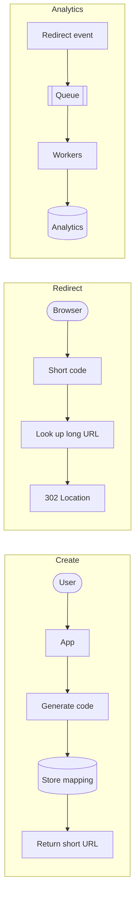
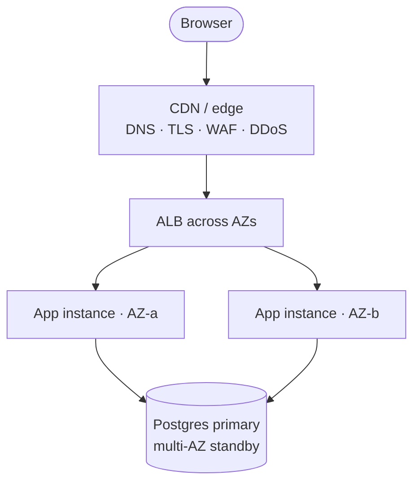
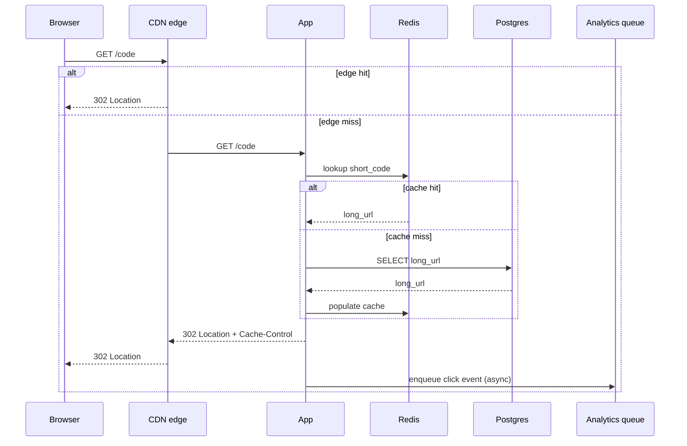
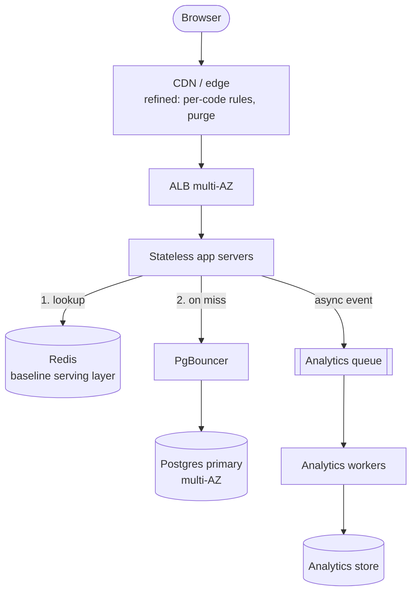
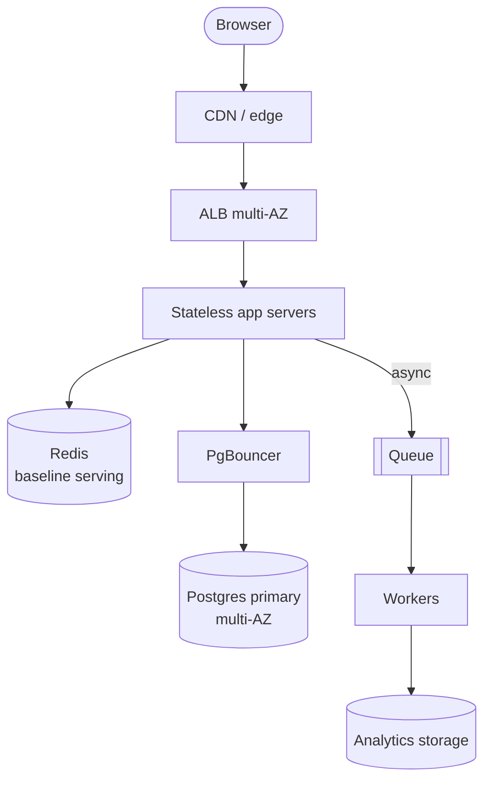
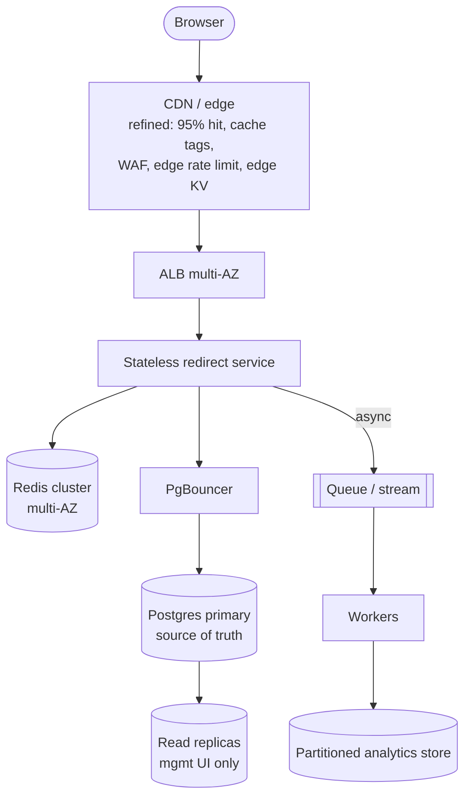
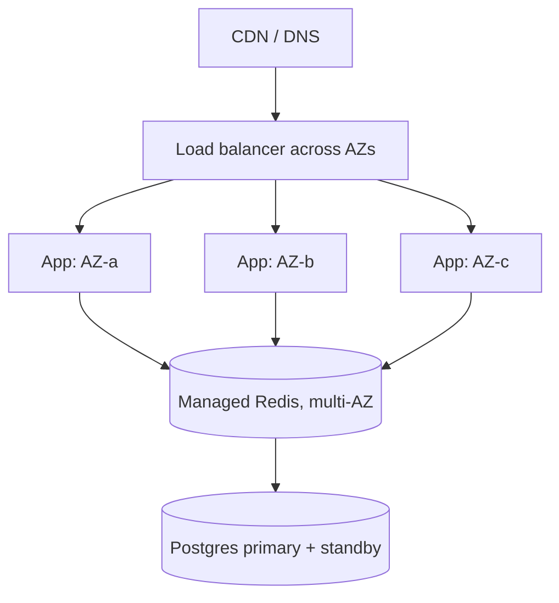
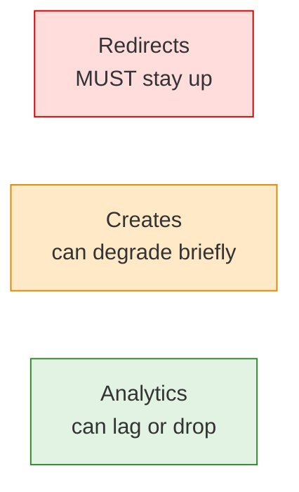

# TinyURL System Design: Interview Walkthrough

A complete, interview-ready playbook for the classic URL-shortener system
design problem. Built for the Reverb.com **Engineer II, Activation &
Retention** interview. Treat this as a script for a conversation, not a
monologue: keep asking, sizing, drawing, and evolving the design as you go.

The single most important idea to anchor every decision:

> **Redirects dominate writes (~100:1), so scale the read path first and keep
> the redirect path extremely fast and reliable.**

A complementary principle explains *why* every tool below works:

> **CPU is cheap; moving data is expensive.** Caches, replicas, CDNs, and
> queues all exist to avoid expensive data movement, network round trips, and
> distributed coordination.

## How to use this walkthrough

- **Lead with reasoning, not recall.** The interviewer is listening for
  engineering judgment. For every component, say *why* it exists and *what*
  problem it solves. The "why" callouts throughout this doc are the lines that
  separate a candidate who memorized a template from one who has judgment.
- **Drive the conversation in this order:** clarify requirements, size the
  load, sketch the simplest correct design, then evolve it only in response to
  a bottleneck you just identified out loud.
- **Time-box yourself** (for a 45-minute round):
  - 5 min: requirements and scope
  - 5 min: capacity math and the read/write ratio
  - 10 min: APIs, data model, code generation
  - 15 min: scale evolution (cache, queue, replicas, CDN)
  - 10 min: deep dives the interviewer steers toward (analytics, abuse, HA)
- **Resist premature complexity.** Naming a tool you are choosing *not* to use
  yet (sharding, multi-region) is a stronger signal than reaching for it.

## Table of contents

- [TinyURL System Design: Interview Walkthrough](#tinyurl-system-design-interview-walkthrough)
  - [How to use this walkthrough](#how-to-use-this-walkthrough)
  - [Table of contents](#table-of-contents)
  - [0. Opening move: clarify requirements first](#0-opening-move-clarify-requirements-first)
    - [Why clarify before architecting](#why-clarify-before-architecting)
    - [Deliberately out of scope, and why](#deliberately-out-of-scope-and-why)
  - [1. Core mental model](#1-core-mental-model)
  - [2. API design](#2-api-design)
    - [Why this API shape](#why-this-api-shape)
  - [3. Data model](#3-data-model)
    - [Why this data model](#why-this-data-model)
    - [URL normalization policy (foundational)](#url-normalization-policy-foundational)
  - [4. Short-code generation](#4-short-code-generation)
    - [Why Base62 and a sequence](#why-base62-and-a-sequence)
  - [5. Back-of-the-envelope toolkit](#5-back-of-the-envelope-toolkit)
    - [Why the math matters](#why-the-math-matters)
  - [6. Scenario A: 100K to 1M DAU](#6-scenario-a-100k-to-1m-dau)
    - [6.1 Starting point: 100K DAU](#61-starting-point-100k-dau)
      - [Why start with the boring architecture](#why-start-with-the-boring-architecture)
    - [6.2 Growing to 1M DAU](#62-growing-to-1m-dau)
      - [Why Redis, specifically](#why-redis-specifically)
      - [Why async analytics](#why-async-analytics)
  - [7. Scenario B: 1M to 10M DAU](#7-scenario-b-1m-to-10m-dau)
    - [7.1 Starting point: 1M DAU](#71-starting-point-1m-dau)
    - [7.2 Scaling to 10M DAU](#72-scaling-to-10m-dau)
      - [Zipfian workload math (why CDN+Redis is the dominant lever)](#zipfian-workload-math-why-cdnredis-is-the-dominant-lever)
      - [Why CDN refinement matters at 10M](#why-cdn-refinement-matters-at-10m)
      - [Edge-caching a redirect: mechanics and configuration](#edge-caching-a-redirect-mechanics-and-configuration)
      - [Why read replicas, and the consistency catch](#why-read-replicas-and-the-consistency-catch)
      - [Read-after-write consistency: the complete strategy set](#read-after-write-consistency-the-complete-strategy-set)
  - [8. Capacity reasoning in plain English](#8-capacity-reasoning-in-plain-english)
  - [9. Analytics design](#9-analytics-design)
  - [10. Abuse resistance and security](#10-abuse-resistance-and-security)
  - [11. Redirects: 301 vs 302](#11-redirects-301-vs-302)
  - [12. Failure modes](#12-failure-modes)
  - [13. Closing summary](#13-closing-summary)
  - [14. Addendum: scaling beyond 10M DAU](#14-addendum-scaling-beyond-10m-dau)
    - [Stage 1: same region, multiple availability zones](#stage-1-same-region-multiple-availability-zones)
    - [Stage 2: multi-region reads, single-region writes](#stage-2-multi-region-reads-single-region-writes)
    - [Stage 3: multi-region active-passive](#stage-3-multi-region-active-passive)
    - [Stage 4: multi-region active-active reads, constrained writes](#stage-4-multi-region-active-active-reads-constrained-writes)
    - [Stage 5: multi-region writes](#stage-5-multi-region-writes)
    - [When to choose each level](#when-to-choose-each-level)
    - [High availability by criticality](#high-availability-by-criticality)
    - [Advanced caching hierarchy](#advanced-caching-hierarchy)
    - [The optimization ladder: the exact order before sharding](#the-optimization-ladder-the-exact-order-before-sharding)
    - [Database partitioning and sharding: when and how](#database-partitioning-and-sharding-when-and-how)
    - [Final addendum summary](#final-addendum-summary)
  - [15. Decision rationale cheat sheet](#15-decision-rationale-cheat-sheet)
  - [16. One-page cheat sheet](#16-one-page-cheat-sheet)
  - [17. Advanced feature: branded / custom domains](#17-advanced-feature-branded--custom-domains)
    - [Domains as first-class resources](#domains-as-first-class-resources)
    - [Hostname-aware redirect lookup](#hostname-aware-redirect-lookup)
    - [Domain onboarding flow](#domain-onboarding-flow)
    - [API surface (deferred from section 2)](#api-surface-deferred-from-section-2)
    - [Cache, CDN, and purge implications](#cache-cdn-and-purge-implications)
    - [Security and abuse considerations](#security-and-abuse-considerations)
    - [Why this stays out of the core](#why-this-stays-out-of-the-core)

## 0. Opening move: clarify requirements first

Open with a sentence that frames the whole problem and shows you know the
design space:

> "Before I draw anything, I'd like to clarify the requirements and scale. A
> URL shortener can be a single app plus Postgres, or it can become a
> read-heavy edge/caching problem depending on traffic, analytics, and abuse
> requirements. Let me pin down which version we're building."

Then ask targeted questions, grouped by category.

- **Functional scope:** "Do users only create and resolve short URLs, or do we
  also need custom aliases, expiration, deletion, editing, user accounts,
  analytics, private links, or campaign attribution?"
- **Generated links versus aliases:** "Do we distinguish a *canonical generated
  link* (system-minted, immutable, one per destination) from *aliases*
  (human-managed, many-to-one, marketing-friendly)? My default is yes —
  generated links are deduplicated by the destination URL so creation is
  naturally idempotent, and aliases are a separate mutable surface on top."
- **URL normalization policy:** "How aggressively should we normalize the
  destination URL before deduping? My default is *conservative*: lowercase
  host, drop default ports, normalize encoding, and otherwise preserve query
  parameters, fragments, casing in the path, and the scheme. UTM/campaign
  variants should be treated as different destinations, not collapsed."
- **Redirect behavior:** "Should redirects be permanent or temporary? My
  default is `302`, because it preserves analytics, attribution,
  experimentation, and destination control. I'd reserve `301` for truly
  immutable public links where aggressive client and search caching is
  desired."
- **Scale and growth:** "What order of magnitude should I design for, and
  should I show how it evolves? For example, are we starting around 100K DAU
  growing to 1M, or starting at 1M growing to 10M?"
- **Non-functional priorities:** "What matters most: redirect latency,
  availability, analytics accuracy, abuse resistance, cost, or simplicity?"
- **Security and abuse:** "Are these public marketing/product links, or can
  they point to sensitive resources? If sensitive, the short code can't be the
  only security mechanism; we'd need auth, authorization, and expiration."
- **Branded/custom domains (advanced scope):** "Do customers bring their own
  domains (e.g. `go.brand.com` in addition to `rvb.ly`)? If yes, the lookup key
  becomes `(hostname, short_code)` rather than just `short_code`, and we need a
  domain onboarding/verification flow. I treat this as an advanced feature
  layered on top of the core design rather than baked in."

### Why clarify before architecting

- **You can't design for unknown constraints.** The architecture is completely
  different at 100 QPS versus 100K QPS, or with hourly expiry versus permanent
  links. Jumping straight to a solution signals you optimize before you
  understand the problem, which is the cardinal engineering sin.
- **It buys you a contract.** Once the interviewer agrees to assumptions, you
  can defend the design against "what about X?" with "we scoped that out,
  happy to add it." This is exactly how scope works on real teams.
- **Functional versus non-functional matters** because functional requirements
  tell you *what* to build, while non-functional ones drive *how*. Caching
  exists because of "low redirect latency"; replicas exist because of "high
  read volume." List only functional needs and you'll design something that
  works at 10 QPS and collapses at 10K.

### Deliberately out of scope, and why

Naming what you are *not* building is as much a judgment signal as what you
are. For a URL shortener specifically:

- **No object storage (S3/R2/GCS) or media pipeline.** TinyURL is the canonical
  *"text and metadata are cheap"* case — a `long_url` is a few hundred bytes.
  Media is what forces object storage and a thumbnail/transcode pipeline; we
  have none, which is also why Postgres stays comfortable as the source of
  truth.
- **No dedicated search engine.** If "search my links" comes up later, Postgres
  indexes or full-text search cover it; I wouldn't reach for
  OpenSearch/Elasticsearch until requirements force it.
- **No server-side session store.** If we add accounts, signed-cookie
  (client-side) sessions suffice; a shortener doesn't need Redis-backed
  sessions.
- **No response compression on the hot path.** A `302` is tiny and carries no
  payload to gzip; compression pays off for HTML/JSON/JS, not redirects.
- **No real-time transport or LLM/vector work.** There's nothing to stream
  (WebSockets/SSE) and nothing to embed or generate; noting that I know these
  exist but don't fit a shortener is itself a scoping signal.

The meta-point to voice: I add a tool only when a measured bottleneck or
requirement demands it, not because it's standard elsewhere.

## 1. Core mental model

The system has three paths. Say this out loud; it organizes the entire
interview.

- **Create path:** `User -> App -> generate code -> store mapping -> return
  short URL`
- **Redirect path:** `Browser -> short code -> look up long URL -> 302
  Location header`
- **Analytics path:** `Redirect event -> queue -> workers -> analytics
  storage`



The key insight, stated explicitly:

> "Redirects dominate writes, so I scale the read path first. URL creation is
> usually modest; redirects can become very large and latency-sensitive."

A second conceptual split worth saying out loud, because it ripples through
the API, data model, caching, and analytics:

- **Generated (canonical) links** are *system-minted*, **deduplicated by
  destination URL**, and treated as **immutable**. `POST /urls` for the same
  scoped destination returns the same short code, so creation is naturally
  idempotent and the canonical identity of a destination is stable.
- **Aliases** are *human-managed*, **many-to-one** against a generated link
  (e.g. `email-sale`, `ig-sale`, `sms-sale` all pointing to the same product),
  and **mutable**. They are a separate product surface for campaigns and
  marketing, not a different shape of the same primitive.

This split is what makes most of the design decisions later coherent:

- caching and CDN invalidation are dramatically easier when canonical generated
  links don't change destination,
- mutation/purge concerns concentrate at the alias layer, and
- analytics attribution is stable because the canonical identity doesn't move.

Conversion rules you'll reuse all interview:

- `daily redirects / 86,400` = average read QPS
- `daily new URLs / 86,400` = average write QPS
- `peak QPS ≈ average QPS × 10` — state the multiplier you assume: ~10× is a
  conservative allowance for spiky/viral bursts, while steadier consumer
  traffic is often only 2–3×

## 2. API design

Keep the surface tiny but complete. The redirect is the single hot endpoint;
everything else is owner-side management. The core surface splits into two
groups:

- **Resolve** — the one public, latency-sensitive endpoint.
- **Manage** — owner-facing CRUD over generated links and aliases.

Resolve and redirect (the hot path):

```http
GET /X7mP9Q

302 Found
Location: https://reverb.com/item/12345
```

Create a generated, canonical short URL:

```http
POST /urls
Content-Type: application/json

{
  "longUrl": "https://reverb.com/item/12345",
  "expiresAt": null
}
```

```json
{
  "shortUrl": "https://rvb.ly/X7mP9Q",
  "code": "X7mP9Q",
  "longUrl": "https://reverb.com/item/12345",
  "normalizedUrl": "https://reverb.com/item/12345",
  "createdAt": "2025-01-01T00:00:00Z",
  "reused": false
}
```

- The response carries the full canonical mapping, so the UI never has to
  re-read to render it. The cheapest read-after-write fix is to eliminate the
  immediate follow-up read.
- A second `POST /urls` for the same scoped normalized destination returns the
  **same** `code` with `reused: true`. Creation is naturally idempotent on the
  URL itself.
- `Idempotency-Key` is optional, used only for network-retry safety. It protects
  against a partial create that did not yet land in the database; the primary
  dedupe key is the normalized destination URL.

List my links (cursor-paginated):

```http
GET /urls?limit=50&cursor=eyJjcmVhdGVkX2F0IjoiMjAyNS0w...
```

```json
{
  "items": [
    {
      "code": "X7mP9Q",
      "shortUrl": "https://rvb.ly/X7mP9Q",
      "longUrl": "https://reverb.com/item/12345",
      "createdAt": "2025-01-01T00:00:00Z",
      "expiresAt": null,
      "disabled": false,
      "aliasCount": 3
    }
  ],
  "nextCursor": "eyJjcmVhdGVkX2F0IjoiMjAyNC0xMi0z..."
}
```

- Uses a keyset cursor (`WHERE created_at < ? AND owner_id = ?`), not `OFFSET`.
- Supports filters (`?q=`, `?status=`, and later `?domain=`) without changing
  the cursoring scheme.

Fetch a single link's metadata (owner-side, not redirect):

```http
GET /urls/{code}
```

- Returns destination, expiry, status, alias count, and recent click totals —
  whatever the management UI needs without scraping the redirect endpoint.

Mutate a generated link's lifecycle metadata:

```http
PATCH /urls/{code}
Content-Type: application/json

{
  "expiresAt": "2025-12-31T23:59:59Z",
  "disabled": false
}
```

- Generated canonical links are immutable in destination; the writable surface
  here is lifecycle metadata such as expiry, disable, or owner notes.
- Retargeting a destination is an alias operation, not a canonical-link
  operation.
- Every successful mutation performs a write-through cache update on Redis and,
  if the redirect may be edge-cached, an explicit CDN purge.

Soft-delete a link:

```http
DELETE /urls/{code}
```

- Sets `deleted_at`; resolution starts returning `410 Gone` (or a configured
  fallback) instead of the destination.
- Idempotent: repeated `DELETE` returns the same `204` and does not error.

Aliases, the human-managed surface on top of canonical links:

```http
POST   /urls/{code}/aliases        # attach a new alias
GET    /urls/{code}/aliases        # list aliases for a generated link
PATCH  /aliases/{aliasCode}        # rename, retarget, disable
DELETE /aliases/{aliasCode}        # remove the alias
```

- Aliases live in their own table and namespace (see section 3), but resolve
  through the same `GET /{code}` redirect path.
- Aliases are explicitly many-to-one: several aliases can point at the same
  canonical generated link to support campaign/channel naming (`email-sale`,
  `ig-sale`, `sms-sale`).

Fetch click analytics for a code (deliberately off the critical redirect path):

```http
GET /urls/{code}/analytics
```

Branded/custom domain endpoints (`POST /domains`, `POST /domains/{id}/verify`,
etc.) are deferred to section 17 so they do not pollute the core API surface.

### Why this API shape

- **The redirect is a lookup-and-forward, not a destination.** HTTP redirects
  are the native primitive for "go somewhere else," so the resolve endpoint
  returns a status code plus a `Location` header rather than proxying content.
- **Analytics is a separate endpoint** so it never sits in the hot redirect
  path. This foreshadows the async analytics decision in section 9.
- **Natural idempotency by normalized URL is the primary dedupe.** A repeated
  `POST /urls` for the same scoped destination returns the existing code, so a
  flaky client does not accidentally mint duplicate canonical links. The
  `Idempotency-Key` header is a secondary safety net for the narrow case where
  a previous create did not reach the database at all.
- **Generated links are immutable in destination; aliases are the mutable
  surface.** `PATCH /urls/{code}` covers lifecycle (expiry, disable). Anything
  that retargets goes through the alias endpoints. This keeps caching, CDN
  invalidation, and analytics attribution tractable.
- **`GET /urls` is its own endpoint, not a side-effect of the redirect.**
  Management UIs need a list, but the redirect path must stay a single point
  lookup. Listing uses cursor/keyset pagination (`WHERE created_at < ?`), not
  `OFFSET`, so deep pages stay fast.
- **`DELETE` is soft and idempotent.** Hard-deleting a link breaks any link
  that was already shared; a soft delete plus `410 Gone` keeps the surface
  honest while preserving analytics history.

## 3. Data model

Start with the minimum that satisfies correctness, and say that you're doing so
deliberately. The core model has two tables: canonical generated links and
human aliases. Branded-domain tables are deferred to section 17.

Canonical generated links:

```sql
CREATE TABLE urls (
  id              BIGSERIAL PRIMARY KEY,
  short_code      VARCHAR(12) NOT NULL,
  long_url        TEXT NOT NULL,
  normalized_url  TEXT NOT NULL,
  owner_id        BIGINT NULL,
  created_at      TIMESTAMP NOT NULL,
  expires_at      TIMESTAMP NULL,
  disabled_at     TIMESTAMP NULL,
  deleted_at      TIMESTAMP NULL
);
```

Indexes and constraints:

- `UNIQUE(short_code)` for the redirect lookup and global resolution correctness.
- `UNIQUE(owner_id, normalized_url)` (partial: `WHERE deleted_at IS NULL`) for
  per-owner dedupe of generated links. Two `POST /urls` calls with the same
  scoped normalized destination return the same canonical short code; this is
  the database guarantee that makes creation naturally idempotent on the URL.
- `INDEX(owner_id, created_at)` for cursor-paginated `GET /urls`.
- `INDEX(expires_at)` for expiry sweeps.

Human aliases (the mutable surface on top of canonical links):

```sql
CREATE TABLE aliases (
  id            BIGSERIAL PRIMARY KEY,
  alias_code    VARCHAR(64) NOT NULL,
  target_url_id BIGINT NOT NULL REFERENCES urls(id),
  owner_id      BIGINT NULL,
  created_at    TIMESTAMP NOT NULL,
  expires_at    TIMESTAMP NULL,
  disabled_at   TIMESTAMP NULL,
  deleted_at    TIMESTAMP NULL
);
```

Indexes and constraints:

- `UNIQUE(alias_code)` so aliases share the same global resolution namespace as
  generated codes. (Section 17 generalises this to `UNIQUE(domain_id,
  alias_code)` once branded domains exist.)
- `INDEX(target_url_id)` to list aliases attached to a generated link.
- Many aliases can share one `target_url_id` (many-to-one), which is exactly the
  campaign/channel pattern.

Analytics events, while still small enough to live in Postgres:

```sql
CREATE TABLE click_events (
  id          BIGSERIAL PRIMARY KEY,
  short_code  VARCHAR(12) NOT NULL,
  clicked_at  TIMESTAMP NOT NULL,
  referrer    TEXT NULL,
  user_agent  TEXT NULL,
  ip_hash     TEXT NULL
);
```

At larger scale, analytics moves to append-only/event storage or
time-partitioned tables (see sections 9 and 14).

### Why this data model

- **Two foundational tables, not one.** `urls` holds the canonical, immutable,
  destination-deduped identity. `aliases` holds the mutable, many-to-one,
  human-managed surface. Collapsing them into one table is what makes most
  shortener designs incoherent about caching, invalidation, and analytics.
- **`UNIQUE(short_code)` pushes correctness into the database.** Two long URLs
  mapping to the same code is silent data corruption: someone's link redirects
  to the wrong place. A database constraint enforces this atomically, instead
  of racy application-side checks.
- **`UNIQUE(owner_id, normalized_url)` is the idempotency engine.** Natural
  dedupe by the destination URL belongs in the database, not the application.
  Per-owner scoping is deliberate: two different users posting the same URL
  should get two different canonical short links because their analytics,
  ownership, and lifecycle are independent. (Once branded domains exist, the
  scope generalises to `(owner_id, domain_id, normalized_url)`; see section 17.)
- **`normalized_url` is stored separately from `long_url`.** `long_url` is what
  we redirect to (and what we show the user); `normalized_url` is what we
  dedupe on. Storing both keeps the displayed URL faithful to the user's input
  while letting uniqueness use the normalized form.
- **Don't store `click_count` on the row.** It's the simplest V1 option, but it
  turns every redirect (a read) into a write on a hot row. Naming this tradeoff
  up front is exactly why analytics later moves to a queue.
- **Soft delete (`deleted_at`), disable (`disabled_at`), and `expires_at`** keep
  resolution logic simple and auditable, and let expiry be a sweep rather than
  a destructive path. `disabled_at` is separate from `deleted_at` because
  disabling is reversible and surfaces a `410 Gone`; deletion is the
  end-of-life state.

### URL normalization policy (foundational)

Normalization is part of the core design because it defines what "the same
URL" means for deduplication. The policy is intentionally **conservative** —
normalize only what is provably safe, because the shortener cannot infer which
bits of a URL are semantically meaningful to the destination.

Safe to normalize (apply before computing `normalized_url`):

- lowercase the host (DNS is case-insensitive),
- remove the default port (`:80` for http, `:443` for https),
- normalize percent-encoding (e.g. uppercase hex digits, drop unnecessary
  encodings of unreserved characters),
- collapse `//` runs inside the path (rare, but unambiguous).

**Do not** normalize away:

- query parameters of any kind — including `utm_*`, `gclid`, `fbclid`, `ref`,
  `coupon`, `variant`, and experiment flags. The shortener cannot safely tell
  which parameters are meaningful, and stripping them silently retargets
  campaigns.
- the URL fragment (`#…`) — single-page apps use it as routing state.
- path casing — many backends treat `/Item/12345` and `/item/12345` as
  different resources.
- the scheme — do not auto-upgrade `http` to `https`; the destination may not
  serve TLS at the same path.
- trailing slashes — `/path` and `/path/` can be different resources.

**UTM and campaign variants are different destinations.** Two URLs that differ
only by `?utm_source=email` versus `?utm_source=instagram` produce two
separate rows in `urls`, two separate canonical short codes, and (likely) two
separate sets of aliases. They represent different campaign intent, so the
idempotency engine treats them as different links by design.

> "I normalize conservatively: lowercase host, drop default ports, normalize
> encoding. I do not strip query parameters, force HTTPS, or touch path casing,
> because the shortener can't safely guess which differences matter to the
> destination. UTM variants are different destinations on purpose."

## 4. Short-code generation

This section is about **canonical generated codes** (`short_code` in `urls`),
which are immutable and deduped by destination. Human aliases live in a
separate table (section 3) and follow a different lifecycle: they may be
created, retargeted, disabled, or deleted by the owner, and the character
policy below applies only to system-minted codes — alias codes are
user-supplied strings (with their own validation: length, profanity, reserved
prefixes, etc.).

Recommended interview answer:

> "I'd start from a sequential internal ID because it's collision-free and
> simple, but I would not expose the raw sequence. I'd scramble or permute the
> ID before Base62-encoding it, so public codes aren't trivially enumerable."

Pipeline:

```text
DB sequence id  ->  secret scramble/permutation  ->  Base62  ->  short_code
```

Why not raw Base62 over a sequence: it's walkable.

```text
id 12345 -> 3d7
id 12346 -> 3d8
id 12347 -> 3d9
```

A scraper just increments and harvests your entire dataset. Scrambling first
breaks the adjacency:

```text
12345 -> scramble -> X7mP9Q
12346 -> scramble -> a2Zx81
```

Then add the honest caveat:

> "Scrambling is not cryptographic security; it prevents casual enumeration. If
> links are sensitive or guessing-resistance is a hard requirement, I'd switch
> to cryptographically random high-entropy codes with collision-retry and rate
> limiting. If the target content is private, the real fix is authentication,
> not obscurity."

### Why Base62 and a sequence

- **Base62 uses `[a-z][A-Z][0-9]` = 62 characters.** `62^7 ≈ 3.5 trillion`
  combinations in just 7 characters, so codes stay short (good UX) while the
  keyspace stays enormous (no near-term exhaustion).
- **Sequence over random, by default:** a dense sequential source needs no
  "does this code already exist?" read before every insert. Random generation
  requires a read-then-write check with retries on collision.
- **Acknowledge the downside (predictability)** and mitigate proportionally:
  scramble for casual abuse, go cryptographically random plus auth for real
  threats. Don't solve a threat you don't have yet.

## 5. Back-of-the-envelope toolkit

State your assumptions, then turn them into design pressure. The reusable
moves:

- read QPS = `daily redirects / 86,400` (since a day ≈ `10^5 s`, this is just
  `daily requests / 100,000`)
- write QPS = `daily new URLs / 86,400`
- peak ≈ average × 10 — **state the assumption**: ~10× is conservative for
  spiky/viral bursts; steady consumer traffic is often 2–3×
- provision for **peak**, not average

Keyspace and storage facts worth memorizing:

- `62^7 ≈ 3.5 trillion` codes (7 chars)
- `62^8 ≈ 218 trillion` codes (8 chars) — one extra char multiplies capacity
  by 62
- URL row ≈ 500 bytes with index overhead
- click-event row ≈ 200 bytes

Throughput rules of thumb:

- single Postgres: thousands to tens of thousands of simple queries/sec
- Redis: 100K+ ops/sec per instance
- read replicas multiply read capacity; object storage is effectively unlimited

Latency hierarchy worth memorizing (orders of magnitude) — this is what makes
"scale reads first" concrete:

| Operation | Latency |
| --- | --- |
| RAM | ~100 ns |
| Redis lookup | ~0.1–1 ms |
| Postgres query | ~1–10 ms |
| Service call | ~1–20 ms |
| Cross-region hop | ~70–150 ms |
| Intercontinental hop | ~100–250 ms |

The takeaway: a cache hit (sub-millisecond) replaces a 1–10 ms indexed query,
and every cross-region hop costs ~100 ms. CPU is cheap; moving data is
expensive, so the entire design is about avoiding round trips.

### Why the math matters

- **Numbers convert intuition into a forcing function.** "Reads exceed writes"
  is an opinion until you compute ~1,157 read QPS versus ~12 write QPS — a
  ~100:1 ratio that *forces* a read-optimized architecture. Every later choice
  (cache, replicas, CDN) is downstream of that one observation, so it's earned
  rather than cargo-culted.
- **Peak versus average matters** because you provision for the busiest hour.
  Designing for the mean means you're down exactly when traffic — and the cost
  of being down — is highest.

## 6. Scenario A: 100K to 1M DAU

### 6.1 Starting point: 100K DAU

Assumptions:

- 100K DAU
- 10K new URLs/day
- 1M redirects/day

Math:

| Metric | Average | Peak (×10) |
| --- | --- | --- |
| Read QPS | `1,000,000 / 86,400 ≈ 12` | `≈ 120` |
| Write QPS | `10,000 / 86,400 ≈ 0.12` | `≈ 1–2` |

Interpretation:

> "This is small. Postgres handles this easily with proper indexes. I'll keep
> the architecture deliberately simple — but a CDN and multi-AZ are foundational
> from day one, not optimisations."

Initial design (AWS-first, but the same shape works on any cloud):



Why two app instances and multi-AZ Postgres even at trivially small scale:

> "Not for throughput first, but for availability and safe deploys. Multi-AZ
> survives a zone failure or a routine maintenance event; a single-AZ database
> is one fault away from a full outage."

**CDN at 100K DAU is foundational, not optional.** It sits in front of the load
balancer from day one and is then *refined* at every later scenario, never
re-introduced.

- The reason isn't origin offload — 120 peak read QPS does not stress the
  origin. The reasons are **user-perceived latency for geographically
  distributed users**, **managed DNS**, **TLS termination**, **WAF**, **DDoS
  protection**, **bot mitigation**, and **operational simplicity**.
- A redirect is the textbook cacheable response: a `302` plus a `Location`
  header, no body. Even at this scale, edge hits give a measurable p99 win for
  users far from the origin.
- Picking the edge once and refining it later (rather than bolting it on at 10M
  DAU) avoids re-platforming DNS, certificates, and abuse rules during a
  scaling crunch.

> "I'd consider introducing a CDN from the beginning, even around 100K DAU. Not
> because the origin cannot handle the traffic, but because latency, geographic
> distribution, TLS, DNS, and DDoS protection are already valuable. The CDN
> solves user-to-origin latency years before it becomes a throughput
> requirement."

#### Why start with the boring architecture

- `CDN -> LB -> App -> Postgres` (multi-AZ) is correct, debuggable, and
  deployable on day one. Kafka, microservices, and multi-region add operational
  surface area (more failure modes, more on-call pages) for problems you don't
  yet have.
- **Premature distribution produces a "distributed monolith"** — all the
  complexity of microservices and none of the benefits. Starting simple says: I
  add complexity in response to measured pain, not anticipated glory.
- **Multi-AZ before read replicas.** Availability is solved before throughput,
  because a dead database hurts more than a busy one. Replicas come in section
  7.2 when read volume actually demands them.
- Modern Redis-class systems can serve roughly 100K simple GET/SET operations
  per second per core, so 120 peak lookups is nowhere near needing a complex
  cache tier yet. That's exactly why you don't add one here — Redis arrives in
  section 6.2.

### 6.2 Growing to 1M DAU

Assumptions:

- 1M DAU
- 100K new URLs/day
- 10M redirects/day

Math:

| Metric | Average | Peak (×10) |
| --- | --- | --- |
| Read QPS | `10,000,000 / 86,400 ≈ 116` | `≈ 1,160` |
| Write QPS | `100,000 / 86,400 ≈ 1.2` | `≈ 12` |

Interpretation:

> "Still not enormous in QPS terms, but redirect **latency and p99 stability**
> start to matter, and Postgres should stop being in the redirect hot path."

First reach for the cheapest lever, and say so: **scale Postgres vertically** (a
bigger instance) and confirm the indexes are right before adding new moving
parts. Vertical scaling buys real headroom for almost no operational cost. Only
once that's in hand do I add the next pieces:

- **Redis as part of the baseline serving path** (not an optional optimisation)
  for `short_code -> long_url` and `alias_code -> short_code`.
- **PgBouncer** in front of Postgres, because stateless app fan-out exhausts
  Postgres's few-hundred connection limit before it exhausts CPU or storage.
- **Async queue for analytics** so the click stream never blocks the redirect.
- **CDN refinement** — the CDN was already foundational at 100K DAU; here it
  gets tighter cache rules per code, explicit purge on alias mutation, short
  TTLs (60–300 s), and stricter origin `Cache-Control` headers.
- More app instances behind the existing multi-AZ ALB.

Redirect path with cache (write-through on create, cache-aside on miss):



Architecture:



Write-through is now the **primary** read-after-write strategy, not a secondary
fix:

- **Create** — write Postgres, write Redis (`short_code -> long_url`), return
  the canonical mapping in the response body. The creator's first click is a
  Redis hit regardless of replica state.
- **Alias mutation** (retarget, disable) — update Postgres, **overwrite Redis**
  for the affected alias key, **purge the CDN** entry for that code (or its
  cache tag). Redis can be overwritten in place; the CDN must be told.
- **Generated canonical links are immutable**, so their cache entries almost
  never need invalidation — invalidation work concentrates at the alias layer.
- The short "read from primary" window (a recent-write timestamp on the
  session) becomes a **backup** safeguard for dashboards and management views,
  not the primary path. The redirect path almost always hits Redis or the CDN.

#### Why Redis, specifically

- **Pre-empt the "that's just caching a tiny value" objection.** A good rule is
  *cache expensive work, not tiny values* — and `short_code -> long_url` is a
  tiny value. The point is that we are not caching for the value's size; we are
  caching to avoid the **repeated expensive work**: an indexed Postgres query
  (~1–10 ms) sitting on the hot path, multiplied by thousands of redirects per
  second. The cache exists to kill that round trip and to **protect Postgres**
  from the redirect firehose, not because the payload is large.
- **Zipfian traffic makes the cache punch above its weight.** A few popular
  links get most of the clicks, so a small cache absorbs a large share of reads
  at a very high hit rate. That's the textbook cache profile: an expensive,
  repeated lookup under load, not memoizing cheap static config.
- **Cache invalidation is trivial here** because short codes are immutable and
  the mapping almost never changes. You set on write/expiry and otherwise leave
  it alone. The easiest cache to operate is one whose entries don't change.
- **Name the strategy:** **cache-aside** on read (miss → read Postgres →
  populate) plus **write-through** on create (populate the cache when the link
  is made, which doubles as the read-after-write fix from section 7.2).
- **Guard against cache stampede (thundering herd).** When a viral link's entry
  expires, thousands of simultaneous misses can hammer Postgres at once.
  Mitigate with **jittered TTLs** (hot keys don't expire in lockstep),
  **request coalescing / a per-key lock** (one miss repopulates while others
  wait), and **`stale-while-revalidate`** (serve the slightly stale mapping
  while one worker refreshes). Track **cache hit rate** as the health metric — a
  low hit rate adds a network hop for nothing.
- **Redis is a p99 latency tool, not only a throughput tool.** Raw QPS at 1M DAU
  does not on its own force a cache — a well-indexed Postgres can serve it.
  What forces Redis is **tail latency**: at 70% DB load p99 starts rising, at
  90% it explodes. Redis keeps Postgres comfortably off the redirect critical
  path, so p99 stays flat even when traffic spikes. State this explicitly: the
  point of Redis here is to keep the database **out** of the p99, not to handle
  raw throughput.

#### Why async analytics

> "Redirect latency shouldn't wait on an analytics write. If analytics is down,
> redirects must still work."

- Inline analytics couples your fast, critical path (redirect) to a slow,
  non-critical path (analytics write). If the analytics store is slow or down,
  redirects fail — the least important feature taking down the most important
  one.
- A queue decouples them: the redirect fires a fire-and-forget event and
  returns immediately; a worker drains the queue later. **Never let a
  non-critical write block a critical read** is one of the most reused patterns
  in real systems, and it's a strong product-engineering point for an
  Activation & Retention role.
- A queue isn't only about background work — it also **smooths traffic spikes**
  and lets analytics scale independently. When a link goes viral, the redirect
  path keeps emitting events at a flat cost while workers drain the backlog at
  their own pace, so a click surge never overwhelms the analytics store.

## 7. Scenario B: 1M to 10M DAU

### 7.1 Starting point: 1M DAU

Because we already know how this scales, start with the CDN (foundational since
100K DAU), Redis as part of the baseline serving layer, PgBouncer, and async
analytics baked in from day one.

Assumptions and math are identical to the end of Scenario A:

| Metric | Average | Peak (×10) |
| --- | --- | --- |
| Read QPS | `≈ 116` | `≈ 1,160` |
| Write QPS | `≈ 1.2` | `≈ 12` |



### 7.2 Scaling to 10M DAU

Assumptions:

- 10M DAU
- 1M new URLs/day
- 100M redirects/day

Math:

| Metric | Average | Peak (×10) |
| --- | --- | --- |
| Read QPS | `100,000,000 / 86,400 ≈ 1,157` | `≈ 11,570` |
| Write QPS | `1,000,000 / 86,400 ≈ 11.6` | `≈ 116` |

Interpretation:

> "Still read-heavy; writes aren't scary. The real concerns are redirect reads,
> hot links, cache behavior, analytics volume, and abuse prevention. Redis and
> the CDN are the **serving layers**; Postgres remains the source of truth, off
> the redirect hot path."

At 10M DAU, **refine** (don't introduce) the foundations and add a few new
pieces:

- **Refine the CDN** — it has been foundational since 100K DAU. At 10M it gets
  higher cache-hit targets (95%+ for hot codes), per-code cache tags for
  surgical purge on alias mutation, edge rate limiting and abuse rules, edge
  bot mitigation, and optionally **edge functions** resolving codes against an
  edge KV so cache misses also stay off the origin.
- **Refine Redis** — move from a single managed Redis to a Redis cluster or a
  larger managed tier with multi-AZ replication.
- **Add read replicas** (now, not earlier) for non-critical reads such as the
  management UI (`GET /urls`, `GET /urls/{code}`); the redirect path should
  rarely touch the database at all.
- **Move analytics off OLTP entirely** — the click stream goes to a queue/stream
  and a partitioned analytics store or warehouse (see sections 8, 9, and 14).
- **WAF, abuse rules, and platform-level rate limiting** at the edge in addition
  to app-tier token-bucket limits (see section 10).

PgBouncer is already in place from 1M DAU, so it doesn't appear here as a new
component — it's part of the baseline.



**Target traffic split for the redirect path:**

- ~95% served at the CDN edge (no origin round trip),
- most remaining traffic served from Redis,
- only a small residue of cache misses reaches Postgres,
- Postgres primarily serves **writes** (creation, alias mutation, lifecycle)
  and an occasional cache miss — not routine redirects.

#### Zipfian workload math (why CDN+Redis is the dominant lever)

With ~11,570 peak redirect QPS and Zipfian traffic concentration, a small cache
absorbs most reads:

| Setup | Peak DB / origin pressure |
| --- | --- |
| No cache | ~11,570 DB lookups/sec |
| Redis only (98% hit) | ~231 DB lookups/sec |
| CDN only (95% edge hit) | ~579 origin requests/sec |
| **CDN + Redis (95% edge × 98% Redis)** | **~12 DB lookups/sec** |

The CDN+Redis combination reduces Postgres redirect lookups by roughly **three
orders of magnitude** versus no cache, which is why the read path is effectively
free at 10M DAU while Postgres stays unbothered.

> "At 10M DAU, Postgres should primarily serve writes and cache misses, not
> routine redirects. The CDN is foundational from 100K DAU; here it is refined
> with cache tags, edge rate limiting, and optional edge resolution. Redis and
> the CDN are serving layers; Postgres remains the system of record."

#### Why CDN refinement matters at 10M

- A CDN at this scale is **more than a cache**. It also delivers TLS, DNS, WAF,
  DDoS mitigation, edge rate limiting, bot mitigation, and edge compute. At 10M
  DAU the CDN is effectively the security and edge-infrastructure layer for the
  product.
- If a link goes viral, the hot key is absorbed at the edge instead of hammering
  your app and Redis. Same idea as Redis (cache hot, immutable data), pushed one
  layer outward closer to the user.
- The catch (ties back to redirect semantics): edge caching pulls clicks away
  from your origin, which undercuts `302`-based analytics. The honest answer is
  to cache aggressively only where analytics don't matter, keep TTLs
  controlled, use per-code cache tags so disable/retarget purge surgically, or
  reconstruct counts from CDN logs.
- **Edge functions take this further than caching.** Redirect resolution is a
  textbook edge-compute use case (Cloudflare Workers, Lambda@Edge): run the
  `short_code -> long_url` lookup at the edge against a replicated edge KV
  store, so even cache-miss redirects never round-trip to the origin region.
  This is the strongest form of "globalize reads" — compute *and* data sit near
  the user.

#### Edge-caching a redirect: mechanics and configuration

The "Why CDN refinement matters at 10M" point above is the concept; here is
*exactly* how the edge serves a redirect and how you'd configure it — the
concreteness that separates "add a CDN" hand-waving from a real answer. The
mechanics here apply equally to the foundational CDN at 100K DAU; at 10M DAU
they're just tuned more aggressively (higher hit targets, cache tags, edge
rules).

**A redirect is cacheable because it's just an HTTP response.** There's no body
to vary — only a status line and a `Location` header:

```http
GET /X7mP9Q
302 Found
Location: https://reverb.com/item/12345
Cache-Control: public, s-maxage=60
```

Cloudflare can store that `302` plus its `Location` at the edge and replay it
for the next visitor, so the request never reaches the origin.

Concrete flow:

```text
First request (cold):
  Browser -> Cloudflare -> Origin app -> Redis/Postgres
  Origin returns 302 + Location + Cache-Control
  Cloudflare stores the redirect response
  Browser follows Location

Second request (warm, edge hit):
  Browser -> Cloudflare
  Cloudflare returns the cached 302 + Location
  Browser follows Location
  (no origin app, no Redis, no Postgres)
```

**How you'd configure it** — three options, in order of preference:

- **Origin-controlled headers (default).** The app emits the cache policy
  itself: `Cache-Control: public, s-maxage=60, max-age=0`. `s-maxage=60` lets
  the edge (a shared cache) hold the redirect for 60 s; `max-age=0` tells the
  *browser* not to persistently cache, so clicks keep returning through your
  short link. Cloudflare honors this when **Origin Cache Control** is enabled.
  This is usually the best shortener default — the edge absorbs load while you
  keep control of the link.
- **A Cloudflare Cache Rule.** Dashboard → Rules → Cache Rules: match
  `hostname = rvb.ly AND URI path matches the short-code pattern AND method =
  GET`, then set *Eligible for cache*, an *Edge TTL* (e.g. 60 s–5 min), and
  *Browser TTL = respect origin* (or 0). Use this when you want caching policy
  in infrastructure rather than app code.
- **Status-code defaults (don't rely on these).** With no origin headers,
  Cloudflare's documented defaults are roughly `301 → 120 min`, `302/303 → 20
  min`, `404/410 → 3 min` — but defaults change and temporary redirects often
  aren't cached at all without an explicit rule. Be explicit with `s-maxage` or
  a Cache Rule.

**When NOT to edge-cache a redirect** — return `Cache-Control: no-store` when the
link is private/auth-dependent, points somewhere that changes often, is
expired/disabled, is pending abuse review, or when every click *must* be counted
at the origin. For public, stable links, `public, s-maxage=300, max-age=0` is a
reasonable start. This is the operational reason to default to `302` over `301`
(see section 11).

**Plan invalidation up front**, since edge caching trades freshness for speed:

- keep TTLs short (60–300 s) so disabled/expired links self-heal quickly, and
- purge on change — when a destination changes or a link is disabled, purge that
  URL or use a per-code **cache tag** so the edge drops it immediately instead
  of waiting out the TTL.

**The quantified win:** at a ~95% edge hit rate the origin (app + Redis +
Postgres) sees only ~5% of redirect traffic — roughly 20× less origin load — and
a redirect served from a nearby PoP turns a possible cross-region round trip plus
DB/cache lookup (tens to 100+ ms) into a single edge hop, tightening the p99.

> "Cloudflare caches the redirect response itself, including the `Location`
> header. On an edge hit it returns the `302` directly, so the request never
> reaches my app, Redis, or Postgres. I'd configure it with origin
> `Cache-Control` using `s-maxage` — plus `max-age=0` so browsers still come
> back through the short link — or a Cloudflare Cache Rule, and I'd only
> edge-cache public, stable redirects with short, controlled TTLs, because
> analytics and invalidation are the tradeoffs."

#### Why read replicas, and the consistency catch

- The ~100:1 read/write ratio means reads scale horizontally beautifully: add
  replicas, fan reads across them, keep writes on the primary.
- **Replica lag creates read-after-write inconsistency.** A user creates a link
  and immediately resolves it, but the replica hasn't received the row yet, so
  they get a 404 on their own link. Naming this is a senior-level tell.
- Two fixes, in order of preference:
  - **Redis write-through:** populate the cache on creation, so a new link
    resolves from cache instantly regardless of replica lag. Cleaner, and it
    reuses infrastructure you already added.
  - **Read-your-own-writes:** route a user's reads to the primary for a short
    window after they write.
- **Pick consistency per feature, not per system.** Redirect reads tolerate
  **eventual** consistency (a mapping is immutable once created), so replicas
  and global replication are safe there; only `short_code` uniqueness on create
  (especially custom aliases) needs **strong** consistency. That split is what
  lets the read path go global while writes stay simple — the CAP/PACELC
  tradeoff resolved per-path.

#### Read-after-write consistency: the complete strategy set

The general failure mode — *write to primary, read from a lagging replica, see
stale data* — is **narrow in this system** because a `short_code -> long_url`
mapping is **immutable** once created. It only bites at **create time** (the
user makes a link and immediately tests it, hitting a replica that doesn't have
the row yet → a 404 on their own link) and, if edits/disables exist, at
**mutation time** (a disabled link still resolves). It is not steady-state
churn like a social profile. The full toolkit, best-first:

1. **Return the write result in the response — don't read at all.** `POST /urls`
   already returns the canonical short URL; return the full mapping too, so the
   UI renders from the write response and there is no follow-up read to be
   stale. The cheapest fix is to *eliminate* the read, not to make it
   consistent.
2. **Write-through cache (the workhorse).** On create, write the primary *and*
   populate Redis (`short_code -> long_url`) in one operation. The redirect path
   is Redis-first, so a brand-new link resolves from cache instantly regardless
   of replica lag, and the hot path is pre-warmed. If the cache write fails,
   fall back to a primary read so there's no gap.
3. **Read-your-own-writes window (read from primary briefly).** For reads that
   *do* hit the DB (cache miss, or the "my links" list), route a user's own
   reads to the **primary** for a few seconds after they write — stamp a
   `last_write_at` in the session/cookie and read primary while
   `now - last_write_at < window`. This is the business-logic version of "read
   from primary after a write."
4. **Session affinity + monotonic reads.** Pin a session to one replica so the
   user doesn't bounce between a fresh and a stale replica and watch data go
   backwards. Mostly relevant to dashboard/"my links" views, not redirects, and
   lighter than full read-from-primary.
5. **Strong consistency only where writes demand it.** Uniqueness — especially
   custom aliases — is a write-side guarantee: enforce `UNIQUE(short_code)` on
   the single primary and use synchronous/quorum commit so a failover can't lose
   a just-confirmed code. (This is write-write consistency, adjacent to
   read-after-write.)
6. **Invalidate cache *and* edge on mutation.** The inverse bug: after a
   disable/edit, Redis or the CDN edge still serves the old mapping. Fix with
   **write-through on update** (overwrite the entry), an **edge purge** (per-code
   cache tag), and short TTLs — the same invalidation discipline as the CDN
   section above.

> "Read-after-write here is mostly a create-time concern because mappings are
> immutable. I'd return the mapping in the create response and write it through
> to Redis so the creator's first click is a cache hit; for DB reads I'd add a
> short read-from-primary window keyed on a recent-write timestamp. That's all
> business logic — I don't need synchronous replication on the read path."

## 8. Capacity reasoning in plain English

Talk through the numbers, don't just recite them:

- At 10M DAU and 100M redirects/day, peak read QPS around 12K is **serious
  product scale, but not internet-scale** like Google or Cloudflare. It's
  manageable with stateless app servers plus Redis. Cache systems are built for
  exactly this request rate.
- **Keep Postgres off the hot redirect path** at this scale, but keep it as the
  durable source of truth. Postgres throughput depends on workload, indexes,
  query latency, hardware, and schema; a useful sizing rule of thumb is
  `QPS ≈ (1 / average_query_seconds) × cores`.

The line to say:

> "I don't want Postgres serving every redirect at that point. I want Postgres
> as the durable source of truth and Redis/edge as the serving layer."

Storage sanity check (a common follow-up):

- URL rows: `1M/day × ~500 bytes ≈ 500 MB/day ≈ 180 GB/year` — modest.
- Click events: `100M/day × ~200 bytes ≈ 20 GB/day ≈ 7.3 TB/year` — this is why
  analytics needs partitioning and rollups long before the URL table does.

**URL mappings and click events scale very differently — treat them as separate
problems.** Conflating them is what makes most TinyURL discussions reach for
sharding too early.

| Dataset | Shape | Growth | Access pattern | Scaling lever |
| --- | --- | --- | --- | --- |
| `urls` (mappings) | Small rows, point lookups | Slow (linear in new links) | Read-heavy, mostly cache hits | Cache + replicas; partition rarely; shard almost never |
| `click_events` | Append-only, large volume | Fast (linear in redirects) | Write-heavy, range scans | Queue/stream + time-partitioning + retention; eventually a separate analytics store |

The first table you'll partition is `click_events`, not `urls`. The mapping
table may stay on a single Postgres node forever; the click stream almost
certainly will not.

> "The click stream becomes the scale problem before the URL table does. I'd
> partition analytics years before I'd shard URL mappings."

Latency and observability targets:

- **Design to a p99, not an average.** "Redirects are fast" should be a concrete
  SLO like *p99 < 50 ms*. Averages hide the tail, and the tail is what users
  feel — cold cache misses and stampedes are exactly where it spikes.
- The redirect critical path is deliberately **one hop** (cache lookup) to keep
  that tail tight; every added dependency widens it.
- You can't "measure first" without telemetry. Track the golden signals for the
  redirect path — **p99 latency, cache hit rate, QPS, error rate** — and set an
  SLO plus error budget so complexity is added against data, not vibes.

## 9. Analytics design

Evolve analytics with scale rather than designing the final form up front.
Analytics is the dataset that forces structural change first, so treat its
evolution as a first-class part of the design.

- **100K DAU:** a `click_events` table in Postgres, written synchronously
  in the simplest case. Volume is modest enough that this is fine.
- **1M DAU:** queue plus workers writing to Postgres or a dedicated analytics
  store. Redirects never block on the analytics write.
- **10M DAU and beyond:** an append-only **event stream** (Kafka, Kinesis, or
  equivalent) flowing into a partitioned analytics store or warehouse, with
  aggregate rollups. At this point analytics is **fully separated from OLTP** —
  no shared database, no shared partitions, no shared backup strategy. The URL
  mappings stay on Postgres; the click stream lives in its own world.

> "At 10M DAU the click stream is its own scaling problem. It doesn't belong on
> the same Postgres instance that resolves redirects — the workload shapes are
> opposite (append-heavy versus point-lookup), and the retention/partitioning
> rules are different."

Delivery semantics matter once a queue is involved: most queues are
**at-least-once**, so workers must be **idempotent** — dedupe on a click-event
ID so a redelivery doesn't double-count. Park repeatedly failing events in a
**dead-letter queue (DLQ)** rather than blocking the pipeline or silently
dropping them.

Useful event fields:

- `short_code`
- `clicked_at`
- `referrer`
- `user_agent`
- `country` / `region`
- `device_type`
- `campaign_id`

Privacy-aware defaults:

- hash IPs
- avoid raw PII where possible
- define a retention policy

Product framing for this role:

> "Because this is Activation & Retention work, analytics isn't an afterthought
> — it's how we measure engagement. But I would never let analytics failure
> block a redirect. Analytics can be eventually consistent; redirects can't."

## 10. Abuse resistance and security

A URL shortener is an abuse magnet: it's literally a tool for hiding a
destination, which is what phishers and malware distributors want. Treat abuse
controls as core, not polish.

**Where the security focus lives at each scale matters more than the list of
controls.** At small scale the security worries are correctness and basic
hygiene. At 10M DAU the dominant security problems are **abuse, enumeration,
phishing, bot traffic, and DDoS** — not exotic distributed-transaction or
consistency problems. URL shorteners become abuse magnets long before they
become write-scaling problems, so by 10M DAU the edge (WAF, bot mitigation,
rate limiting, abuse rules) and the destination scanner are doing more work
than the database.

> "At 10M DAU I'd expect abuse mitigation to become a bigger concern than
> database writes. The CDN/edge is part of the security boundary."

Layered defenses:

- scrambled (non-sequential) codes
- rate limiting — **token bucket** (allows bursts) in Redis/Valkey, keyed by
  IP / API key / user
- a larger keyspace
- WAF
- bot detection
- monitoring and IP reputation
- malware/spam scanning of destinations
- baseline hygiene: **TLS everywhere** and **parameterized queries** (the
  `long_url` is user input — never concatenate it into SQL), secrets in a
  manager

The keyspace line:

> "Scrambling stops easy sequential walking; rate limiting stops high-speed
> probing. Going from 7 to 8 Base62 characters multiplies the keyspace by 62 —
> from about 3.5 trillion to about 218 trillion — so valid codes get much
> rarer and brute-force scraping gets far more expensive."

Then stop. Don't over-engineer cryptography unless asked. If pushed:

> "Scrambling is obfuscation. Random high-entropy codes are stronger against
> guessing. For private resources, the real control is authentication and
> authorization — the code is never the security boundary."

## 11. Redirects: 301 vs 302

Default and reasoning:

> "I'd use `302`. This service cares about analytics, attribution,
> experimentation, and destination control. If browsers permanently cache a
> `301`, future clicks bypass our service entirely — analytics drop to zero and
> we lose the ability to change or expire the destination."

The crisp distinction:

- `301` permanent: browsers and CDNs may cache it indefinitely. Max
  performance, minimal control.
- `302` temporary: every click reaches us. Max control and visibility.

Nuance to add:

> "I'd consider `301` only for immutable public links where SEO value or
> permanent caching is explicitly desired and we've accepted losing per-click
> visibility."

## 12. Failure modes

Walk these quickly to show operational maturity. The theme: **degrade
gracefully, protect the redirect.**

- **Redis down:** fall back to Postgres, accept higher latency, shed load if
  the database is at risk.
- **Postgres primary down:** cached hot links still redirect; creates pause
  until failover (promote standby) completes.
- **Queue down:** redirects still work; buffer locally if safe, or drop
  low-value analytics events depending on business priority.
- **CDN issue:** bypass to the origin load balancer; higher load but still
  functional.
- **Stale CDN entry after alias mutation:** Redis is overwritten in place by
  the write-through update, but the **CDN is not write-through** — it must be
  told. Pair every alias mutation/disable with an explicit purge (per-code
  cache tag), keep edge TTLs short (60–300 s), and treat "old destination still
  serves from edge" as a known operational failure mode rather than a bug.
- **Data disaster (bad migration, accidental delete, app bug):** this is *not*
  an availability failure — a replica or standby faithfully copies the bad
  `DELETE`. The fix is **PITR (point-in-time recovery)**, built from backups
  plus WAL logs, which restores the database to the moment before the damage.

Make the distinction explicit: **HA and PITR solve different problems, and you
need both.** HA (replicas, failover, multi-AZ) protects against a node or
datacenter dying; PITR protects against destroying your own data.

Name the resilience patterns that make the graceful degradation above
automatic: **timeouts** on every network call, a **circuit breaker** around
Postgres so a slow primary fails fast instead of cascading, **load shedding**
under overload, and **retries with exponential backoff + jitter** (never a
retry storm). Pair these with the DLQ and idempotent consumers from section 9.

The line that lands:

> "I'd rather lose some analytics temporarily than break redirects."

## 13. Closing summary

Say this to wrap the core design:

> "Starting at 100K DAU, I'd keep it simple but not naive: stateless app
> servers and multi-AZ Postgres behind a CDN that's foundational from day one
> for latency, TLS, DNS, WAF, and DDoS. Generated links are deduplicated by
> normalized URL so creation is naturally idempotent, and aliases are a
> separate mutable layer. Growing to 1M DAU, I'd treat Redis as part of the
> baseline serving path with write-through caching as the primary
> read-after-write strategy, add PgBouncer, and refine the CDN — not introduce
> it. Scaling to 10M DAU, I'd refine Redis into a cluster, add read replicas
> for management reads only, move analytics off OLTP entirely into a stream
> plus partitioned store, and refine the CDN further as the security and edge
> platform (WAF, edge rate limiting, optional edge resolution). Postgres stays
> the system of record at every stage; Redis and the CDN are serving layers.
> I'd avoid sharding URL mappings until writes, storage, or operational
> maintenance actually become the bottleneck — analytics partitioning comes
> first. The core principle throughout: redirects dominate writes, so scale
> reads first and keep the redirect path extremely fast and reliable."

## 14. Addendum: scaling beyond 10M DAU

Attach this only if the interviewer pushes past 10M DAU. Don't jump straight to
global multi-region writes. First ask *what problem* we're solving: throughput,
latency, regional availability, disaster recovery, compliance, or global UX —
each pushes the architecture a different direction.

At 10M DAU (~1.2K average / ~12K peak read QPS), if Redis and CDN absorb most
reads, this is still manageable with same-region, multi-AZ infrastructure. Scale
in stages.

### Stage 1: same region, multiple availability zones

Use when you need high availability but most users are in one region and
single-region latency is acceptable.



> "My default production design is multi-AZ before multi-region. It gives
> strong availability without the complexity of cross-region consistency."

### Stage 2: multi-region reads, single-region writes

Use when users are spread across the country, redirect latency matters, but
writes are low enough to centralize. Likely sufficient for many US-scale
systems.

```text
Geo DNS / CDN
  -> regional edge/cache
  -> regional app services
  -> regional Redis cache
  -> primary DB in one write region
  -> read replicas / replicated cache in other regions
```

> "Because URL creation is far lower QPS than redirects, I'd keep a single
> write region as long as possible and scale global reads through CDN, edge
> caching, and replicated read paths."

### Stage 3: multi-region active-passive

Use when the business needs disaster recovery against a full region failure.
One region is primary; another is a warm standby with replicated DB and app
capacity ready.

> "I'd define RTO and RPO before designing DR. Tolerating 15 minutes of
> recovery and minimal data loss is a very different design from near-zero
> downtime and zero data loss."

Costs to acknowledge: replication lag, failover testing, DNS cutover, cache
warmup, split-brain risk.

### Stage 4: multi-region active-active reads, constrained writes

Use when users are global and redirect latency must be low everywhere. The
read path is ideal for this because `short_code -> long_url` rarely changes, so
mappings can be replicated globally and served near users. Writes still route
to a home region.

```text
US user   -> US edge/cache
EU user   -> EU edge/cache
Asia user -> Asia edge/cache

Regional click events -> regional queues -> regional workers
  -> central analytics warehouse / lake
```

> "Redirect serving can go globally distributed much earlier than URL creation,
> because reads tolerate eventual replication far better than writes."

### Stage 5: multi-region writes

The most complex; delay until genuinely required (global creation latency,
single-write-region bottleneck, regional independence, compliance/local-write
requirements). Now you need distributed ID generation instead of a central
auto-increment sequence:

- random high-entropy Base62 codes with a unique constraint and retry
- Snowflake-style IDs then Base62
- per-region key-generation service or pre-generated key pools

Custom aliases are the hard case, because humans expect `rvb.ly/sale` to be
globally unique:

> "I'd allow distributed generation for random system codes, but keep custom
> aliases coordinated through a single authority (or region-reserved
> namespaces), since users expect them to be globally unique."

### When to choose each level

| Need | Architecture |
| --- | --- |
| Normal production HA | Same region, multi-AZ |
| One-country users, high availability | Multi-AZ + CDN |
| Countrywide low latency | Multi-region reads, single write region |
| Region-failure resilience | Active-passive multi-region |
| Global low-latency redirects | Active-active read serving |
| Global low-latency creation | Multi-region writes |
| Compliance / data residency | Region-specific storage and routing |

### High availability by criticality

Pick a realistic target first. Most SaaS products aim for **99.9%–99.99%**, not
five nines — and each extra nine gets dramatically more expensive:

| Availability | Downtime/year |
| --- | --- |
| 99% | ~3.65 days |
| 99.9% | ~8.77 hours |
| 99.99% | ~52.6 minutes |
| 99.999% | ~5.26 minutes |

That target is *why* we defer multi-region: chasing 99.999% buys roughly 47
minutes a year over 99.99%, at a steep jump in complexity. Then separate the
system by how critical each path is, and design degradation accordingly.

**What you'll most likely be asked for.** For a consumer shortener, bet on
**99.9% (three nines)** as the baseline and **99.99% (four nines)** for the
must-not-fail redirect path — that's the realistic band, and interviewers almost
never push past 99.99%. If one *does* ask for five nines, treat it as a prompt
to discuss multi-region active-active and its cost, not a default to build.



> "I optimize availability around redirects first, because redirect failure
> breaks every existing short link. Analytics can be eventually consistent,
> creation can degrade temporarily, redirects need the strongest reliability."

### Advanced caching hierarchy

Beyond 10M DAU, caching becomes layered:

- **Browser cache:** limited on purpose, because of analytics and destination
  control (the `301`/`302` tension).
- **CDN/edge cache:** great for hot public links; you keep TTL, purge, and
  routing control.
- **Regional Redis:** fast shared lookup near the app.
- **Postgres:** durable source of truth, off the hot path.

> "I prefer CDN and Redis caching over permanent browser caching, because we
> keep operational control while still cutting latency and origin load."

### The optimization ladder: the exact order before sharding

Sharding is the **last** structural lever, not an early one. The order isn't
arbitrary — each phase fixes a *different* bottleneck, so you apply the one your
measurement points to: **multi-AZ is availability; Redis and read replicas are
read scaling; the CDN is foundational from 100K DAU and *refined* at each later
phase; partitioning is large-table maintainability; sharding is exceeding a
single primary's write/storage ceiling.** Introduce each only when a measured
bottleneck earns the added complexity.

- **Phase 0 — Measure.** Find the real bottleneck first — p99, the slow-query
  log, cache hit rate, replica lag, connection counts. Never optimize on a hunch.
- **Phase 1 — Eliminate inefficiency.** Right indexes (`UNIQUE(short_code)`,
  `UNIQUE(owner_id, normalized_url)`), tight queries, clean schema. Keep the
  redirect a single point lookup.
- **Phase 2 — Scale up.** A bigger Postgres instance and a connection pooler
  (PgBouncer) — the cheapest lever, taken before adding moving parts.
- **Phase 3 — High availability.** Multi-AZ primary + standby and a multi-AZ
  stateless app tier. (Availability, not throughput. This precedes read
  replicas: a dead database hurts more than a busy one.)
- **Phase 4 — Scale the read path. ← the dominant lever here.** Redis for
  `short_code -> long_url` and `alias_code -> short_code`, then read replicas
  for management reads. The CDN is **already in place from 100K DAU** — in this
  phase it gets *refined* with per-code cache tags, edge rate limiting, edge
  abuse rules, and optional edge resolution. Because redirects are ~100:1 reads
  of immutable rows, this phase absorbs almost all growth.
- **Phase 5 — Offload specialized workloads.** Move click analytics off the OLTP
  path to an event stream and a dedicated analytics store / warehouse; add a
  search service only if "search my links" demands it.
- **Phase 6 — Manage large tables.** Time-partition `click_events` (retention
  via `DROP`); the `urls` table only far later. (Detailed in the next
  subsection.)
- **Phase 7 — Shard.** Only when one primary can't hold the writes or storage —
  shard the mapping by `short_code` (lookup key = shard key).
- **Phase 8 — Global scale & DR.** Multi-region reads, then (rarely) multi-region
  writes — the Stages 1-5 above.

For a shortener the leverage is almost entirely **Phase 4** — Redis plus the
refined CDN — because the workload is read-heavy and the mapping is immutable;
you can ride Phases 1-5 to enormous scale.

**Will a shortener ever need to shard? Almost never — but not *categorically*
never.** Redis + replicas + CDN (Phase 4) carry the read-heavy, tiny-row
workload to tens or hundreds of millions of DAU, and the fastest-growing data —
click analytics — is solved by **offload (Phase 5) + time-partitioning
(Phase 6)**, not by sharding the primary. You'd reach Phase 7 only at an extreme
global tier where a single primary genuinely can't hold the mapping's *writes* or
*storage*, or where multi-region *writes* (globally-unique custom aliases) force
it — and even then it's clean, since the lookup key *is* the shard key.

> "Sharding is Phase 7, and for a shortener I'd bet I never get there. Reads
> scale on Redis and the CDN, the click table scales by partitioning and offload,
> and the mapping is tiny and immutable. I'd only shard at extreme global
> write/storage scale or for multi-region writes — and I'd say that rather than
> reach for it early."

### Database partitioning and sharding: when and how

First, the distinction most candidates blur — naming it cleanly is the signal:

- **Partitioning** splits one big table into smaller pieces *inside a single
  database* (e.g. Postgres declarative partitioning). Same server, one
  connection; the engine prunes to the relevant piece. The win is
  **maintainability**: smaller per-partition indexes, faster autovacuum, and
  bulk deletes that become metadata-only `DROP`s.
- **Sharding** spreads data across *multiple independent database nodes*, each
  its own server. The win is **capacity** — more write throughput and storage
  than one machine holds — at the cost of cross-shard queries, routing, and
  rebalancing.

> "Partitioning splits a table inside one database; sharding splits the data
> across many databases. I partition for maintainability long before I shard
> for capacity."

**When it's actually needed** — triggers, not milestones:

- a single table's rows/indexes grow large enough that index bloat, slow
  autovacuum, and worse query plans appear (often hundreds of millions to
  billions of rows) → **partition**;
- append-only time-series data grows without bound and needs cheap
  retention/archival → **partition by time**;
- writes saturate the primary, or total storage exceeds one node → **shard**;
- **not** because you crossed a user-count milestone.

> "Hitting 1M users doesn't mean you shard. Plenty of systems with tens or
> hundreds of millions of users never shard — they scale vertically, cache, add
> replicas, and partition first."

**Where it bites first here: analytics, not the URL table.** There's one `urls`
row per created link (~1M/day) but one `click_events` row per redirect. At 100M
redirects/day that's ~3B click rows/month, so the event store needs partitioning
long before the mapping table does.

> "The analytics store becomes a scale problem before the URL mapping table
> does."

**How — choose the scheme by access pattern:**

| Data | Scheme | Key | Why |
| --- | --- | --- | --- |
| `click_events` | Range partition by time (day/month) | `clicked_at` | Writes hit only the newest partition; retention is an instant `DROP`; date-range queries prune |
| `urls` (only if it reaches billions) | Hash partition, then shard | `short_code` | Redirects are point reads by code — hashing spreads load evenly and routes straight to one partition |
| Rollups | Aggregate by `short_code` / `campaign_id` | — | Pre-computed counters for dashboards instead of scanning raw events |

- **Range-by-time for events** is the high-value move: retention becomes a
  metadata-only `DROP TABLE old_partition` instead of a billion-row `DELETE`,
  the hot partition stays small, and time-bounded queries prune to a few
  partitions.
- **Hash on the lookup key for the mapping**, never on a monotonic `id` — a
  sequential key sends every new write to a single hot partition, recreating
  the bottleneck you were trying to remove.

**Sharding the mapping — the catches to name out loud:**

- **Shard key = the lookup key (`short_code`)**, so the redirect (the hot path)
  stays a single-shard point read. Sharding by `user_id` would scatter a
  redirect across shards, since resolution doesn't know the user.
- **Cross-shard queries are expensive** — "list my links" or global analytics
  must scatter-gather, or be served from a separate, differently-partitioned
  store.
- **Global uniqueness gets hard** — a cross-shard `UNIQUE(short_code)` doesn't
  exist for free; custom aliases need a single authority, a directory/lookup
  service, or reserved per-region namespaces (the same constraint as Stage 5
  multi-region writes).
- **Rebalancing hurts** with plain modulo hashing; **consistent hashing** or a
  directory table (code-range → shard) limits how much data moves when you add
  a shard.

> "Vertical scale → indexes → cache → read replicas → **partition** the large
> table → **shard** only when one node can't hold the writes or storage.
> Partitioning buys maintainability on one node; sharding buys capacity across
> nodes and costs me cross-shard joins, rebalancing, and global uniqueness."

### Final addendum summary

> "Beyond 10M DAU, I'd first harden same-region multi-AZ availability. Then I'd
> distribute reads through CDN, edge caching, and regional Redis before
> distributing writes. For DR, I'd add active-passive multi-region. For global
> low-latency redirects, I'd make redirect serving active-active while keeping
> writes centralized as long as possible. Only if URL creation itself needs
> global low latency or regional independence would I introduce multi-region
> writes, distributed ID generation, and conflict handling. The principle:
> globalize the read path first, because redirects dominate traffic, and keep
> writes simple until requirements force more complexity."

## 15. Decision rationale cheat sheet

One-line justifications to fire back when asked "why?".

| Decision | Why |
| --- | --- |
| Clarify requirements first | Architecture changes 100x with scale/expiry; defining the problem is the hard part |
| Separate functional vs non-functional | Functional = what to build; non-functional = how, and it drives every scaling choice |
| Back-of-envelope math | Turns "reads dominate" into a measured ~100:1 ratio that forces read-optimization |
| Provision for peak | You're down during your busiest, most expensive hour otherwise |
| Generated links vs aliases | Canonical immutable identity vs human mutable surface; rip-effect on caching, invalidation, analytics |
| Two-table core model | `urls` (immutable canonical) + `aliases` (mutable human); collapsing them muddles the design |
| `UNIQUE(short_code)` | Enforces correctness in the DB atomically, not in racy app code |
| `UNIQUE(owner_id, normalized_url)` | Natural URL idempotency at the DB layer; same scoped URL returns the same code |
| Conservative URL normalization | Lowercase host + drop default ports + normalize encoding only; preserve query params, fragments, path casing, scheme |
| Preserve UTM/campaign params | UTM variants are different destinations on purpose; never strip silently |
| Generated links immutable | Stable cache, stable CDN, stable analytics attribution; mutation happens on aliases |
| No `click_count` on row | Avoids a write-on-every-read hot row; that's what the queue is for |
| Base62 | 7 chars give ~3.5T codes: short for UX, huge keyspace |
| Sequence + scramble | Collision-free and dense, without exposing a walkable sequence |
| AWS-first `CDN -> LB -> App -> PG` start | Correct, multi-AZ, edge-protected day one; avoids a distributed monolith |
| CDN foundational at 100K, refined later | Added once for latency/DNS/TLS/WAF/DDoS; never re-introduced at 1M or 10M |
| Multi-AZ before read replicas | Availability before throughput; a dead DB hurts more than a busy one |
| Bigger Postgres before Redis | Vertical scaling + indexes is the cheapest lever; exhaust it first |
| Two app instances early | Availability and safe deploys, not throughput |
| Redis baseline at 1M DAU | Part of the serving layer, not an optimization; keeps Postgres off the hot path |
| Redis/CDN as p99 tools | Not just throughput; they keep the database out of the redirect tail latency |
| Cache-aside + write-through (primary) | Write-through on create is the workhorse read-after-write fix; cache-aside fills on miss |
| Read-from-primary as backup | Use a recent-write window for dashboards/management views; redirect path hits Redis first |
| Explicit CDN purge + short TTLs | CDN isn't write-through; per-code cache tags drop stale entries on alias mutation |
| Async analytics | Never let a non-critical write block a critical read; also smooths spikes |
| At-least-once + DLQ | Make analytics consumers idempotent; park poison events instead of blocking |
| Read replicas (10M, mgmt only) | The 100:1 ratio means reads scale horizontally; redirect path stays on Redis/CDN |
| Return write result in response | Cheapest read-after-write fix — render from the create response, so there's no re-read to be stale |
| Consistency per feature | Redirects tolerate eventual; only create/alias uniqueness needs strong |
| CDN as edge platform | Not just a cache: DNS, TLS, WAF, DDoS, edge rate limiting, optional edge resolution |
| `302` over `301` | Preserves analytics, attribution, and destination control |
| Scrambled codes + rate limit | Stop enumeration and probing without premature crypto |
| Security focus shift at 10M | Dominant problems are abuse/phishing/bots/DDoS, not distributed-transaction puzzles |
| Analytics partitioning before URL sharding | Click events grow much faster than URL mappings; partition the right table first |
| Postgres as source of truth | Redis and CDN are serving layers; Postgres stays authoritative at every stage |
| Defer sharding | Add only when writes/storage/ops actually hurt, not at a user milestone |
| Partition before sharding | Split a table within one DB (maintainability) before splitting across nodes (capacity) |
| HA + PITR both | HA survives a dead node; PITR survives a bad delete/migration |
| Target 99.9–99.99% | Each extra nine costs a lot; don't over-build for five nines |
| Multi-AZ before multi-region | Strong HA without cross-region consistency pain |
| Globalize reads before writes | Reads tolerate eventual replication; writes don't |
| Design to p99 + SLOs | Averages hide the tail; measure hit rate, p99, QPS, errors |
| Resilience patterns | Timeouts, circuit breaker, backoff + jitter, load shedding |
| Natural URL dedupe primary, Idempotency-Key optional | Dedupe by normalized URL is the engine; the header is a network-retry safety net |
| PgBouncer pooling (~1M DAU) | Stateless/serverless fan-out exhausts Postgres connections before CPU/storage |
| Branded domains as advanced scope | Hostname-aware lookup, domain onboarding, scoped uniqueness — layered on top, not baked in |

## 16. One-page cheat sheet

Numbers:

- read QPS = `daily redirects / 86,400` (≈ `daily requests / 100,000`); write
  QPS = `daily new URLs / 86,400`; peak ≈ avg × 10 (state it: ~10× spiky,
  2–3× steady)
- read:write ≈ **100:1** in every scenario here
- 100K DAU: ~12 / ~120 peak read QPS — `CDN -> ALB(multi-AZ) -> App -> PG`
- 1M DAU: ~116 / ~1,160 peak read QPS — add Redis (baseline) + PgBouncer +
  async analytics; **refine** the CDN, do not re-introduce it
- 10M DAU: ~1,157 / ~11,570 peak read QPS — refine Redis (cluster), add read
  replicas (mgmt UI only), move analytics to stream + partitioned store,
  **refine** the CDN as edge security platform; abuse becomes dominant concern
- Zipfian win at 10M: CDN+Redis cuts peak DB redirect lookups from ~11.6K/sec
  to ~12/sec
- `62^7 ≈ 3.5T`, `62^8 ≈ 218T`

Evolution ladder (the order, top to bottom):

1. `CDN -> ALB(multi-AZ) -> App -> Postgres(multi-AZ)` from day one
2. `Bigger Postgres + indexes` (cheapest lever before new moving parts)
3. `+ Redis` as baseline serving (write-through on create primary)
4. `+ PgBouncer` (around 1M DAU; before app-tier fan-out grows further)
5. `+ Queue + Workers` (async analytics off the hot path)
6. **Refine CDN** (per-code cache tags, edge rules, WAF/edge rate limit, optional edge KV)
7. `+ Read replicas` (management reads only; redirect stays on Redis/CDN)
8. Move analytics to stream + partitioned store (separate from OLTP)
9. Time-partition `click_events` long before considering URL partitioning
10. `Multi-region reads`, then (rarely) `multi-region writes`

Things to say out loud:

- "Redirects dominate writes, so I scale reads first."
- "CPU is cheap; moving data is expensive — so I avoid round trips."
- "Never let a non-critical write block a critical read."
- "I'd rather lose some analytics temporarily than break redirects."
- "HA and PITR solve different problems; I need both."
- "I add complexity in response to measured pain, not anticipated glory."
- "The short code is never the security boundary; auth is."
- "Design to p99, not the average — the tail is what users feel."
- "Pick consistency per feature: redirects eventual, alias uniqueness strong."
- "Generated links are canonical and immutable; aliases are the mutable surface."
- "The CDN is foundational from 100K DAU and refined at every later phase, not added at 10M."
- "Redis and the CDN are serving layers; Postgres is the system of record."
- "I partition analytics years before I shard URL mappings."

## 17. Advanced feature: branded / custom domains

This section is **optional advanced scope**. The core design (sections 0–13)
and the scaling addendum (section 14) do not require branded domains. Bring
this in only when the interviewer pushes on branded/custom domains (e.g.
`go.brand.com` in addition to `rvb.ly`) or asks how the core would extend.

Branded domains change the **lookup key** from `short_code` to `(hostname,
short_code)`. That ripples through the data model, the resolution path, the
cache keys, and the dedupe scope, but the core architectural shape (Redis,
CDN, multi-AZ, partitioning, etc.) is unchanged.

### Domains as first-class resources

Introduce a `domains` table that other tables reference:

```sql
CREATE TABLE domains (
  id                   BIGSERIAL PRIMARY KEY,
  owner_id             BIGINT NOT NULL,
  hostname             TEXT UNIQUE NOT NULL,  -- e.g. "go.brand.com"
  verification_status  TEXT NOT NULL,         -- pending | verified | failed | disabled
  tls_status           TEXT NOT NULL,         -- pending | active | failed
  created_at           TIMESTAMP NOT NULL,
  activated_at         TIMESTAMP NULL
);
```

- `UNIQUE(hostname)` because a hostname can only belong to one tenant on this
  platform.
- Lifecycle states make domain onboarding a managed workflow rather than a
  one-shot insert.

The canonical-link table gets a `domain_id` so codes can collide *across*
domains without ambiguity:

```sql
ALTER TABLE urls       ADD COLUMN domain_id BIGINT NOT NULL DEFAULT <platform_domain>;
ALTER TABLE aliases    ADD COLUMN domain_id BIGINT NOT NULL DEFAULT <platform_domain>;

ALTER TABLE urls       ADD CONSTRAINT urls_domain_code_unique
  UNIQUE (domain_id, short_code);
ALTER TABLE aliases    ADD CONSTRAINT aliases_domain_code_unique
  UNIQUE (domain_id, alias_code);
```

- `(domain_id, short_code)` and `(domain_id, alias_code)` replace the
  single-namespace `UNIQUE(short_code)` / `UNIQUE(alias_code)` constraints from
  the core model.
- The dedupe scope for natural URL idempotency generalizes from
  `(owner_id, normalized_url)` to `(owner_id, domain_id, normalized_url)`, so
  the same destination URL can produce different canonical short codes on
  different branded domains (each domain has its own analytics and lifecycle).

### Hostname-aware redirect lookup

Resolution becomes a two-tuple lookup. The `Host` header (or the SNI/host
routing at the edge) is part of the cache key, the database query, and the
edge cache configuration.

```text
Incoming request:
  Host: rvb.ly        Path: /sale   ->  lookup (rvb.ly, "sale")
  Host: go.brand.com  Path: /sale   ->  lookup (go.brand.com, "sale")
```

These may resolve to completely different destinations. The redirect handler
must **never** trust `short_code` alone once branded domains exist.

Redis keys must include the hostname so different domains can hold the same
code without collision:

```text
redis: rvb.ly:sale         -> https://reverb.com/sale-page
redis: go.brand.com:sale   -> https://brand.com/promotions
```

The CDN configuration must key on the host as well: cache rules and cache tags
are per `(hostname, code)` rather than per `code`, and purges target the
hostname-scoped key.

### Domain onboarding flow

The standard SaaS branded-domain pattern is a five-step workflow:

1. **Register**: the customer creates a domain record (`POST /domains` with
   `hostname`).
2. **Provide DNS target**: the platform returns a target (e.g.
   `cname.shortener.com`) and a verification token.
3. **Customer creates CNAME**: `go.brand.com  CNAME  cname.shortener.com`.
4. **Verify ownership**: the platform DNS-resolves the hostname, confirms the
   CNAME, and validates the verification token.
5. **Provision TLS**: typically via the CDN/edge (Cloudflare for SaaS,
   ACM-issued certs, or Let's Encrypt with HTTP-01/DNS-01 validation). The
   domain transitions to `active` only after TLS is in place.

Lifecycle states make this auditable:

```text
pending  -> verified  -> active
pending  -> failed    (verification failed)
active   -> disabled  (owner action or abuse takedown)
```

### API surface (deferred from section 2)

```http
POST   /domains                # register a new branded hostname
GET    /domains                # list domains for the owner
GET    /domains/{id}           # status, TLS, verification details
POST   /domains/{id}/verify    # trigger DNS/TLS verification
DELETE /domains/{id}           # disable / remove
```

Creation, listing, and lifecycle endpoints for `urls` and `aliases` extend to
accept an optional `domainId` (defaulting to the platform's own hostname when
omitted).

### Cache, CDN, and purge implications

- **Redis keys** must encode the hostname (`hostname:code`). The redirect
  handler reads `Host` and constructs the key; this is the single most
  important change.
- **CDN cache rules** apply per hostname, and cache tags must be scoped by
  hostname so a purge on `go.brand.com/sale` doesn't also clear `rvb.ly/sale`.
- **Edge resolution** (if you use it) loads from a hostname-scoped edge KV.
- **TLS termination** moves to the CDN/edge for branded domains; the origin
  doesn't manage per-customer certs.

### Security and abuse considerations

- Branded domains expand the attack surface: each customer's hostname is a
  separate trust boundary, and a verified branded domain inherits some of the
  platform's reputation.
- Abuse takedowns at the **domain** level (not just the link level) become a
  necessary operation — disabling a domain should stop all redirects under it
  immediately (Redis purge + CDN purge by hostname + DB flag).
- Domain verification prevents impersonation; without it, anyone could claim a
  hostname they don't own.

### Why this stays out of the core

- The vast majority of shortener interview questions don't require branded
  domains; bringing them in early adds tables, lookup complexity, and cache
  keying that obscure the core design points.
- The change is **structural but not architectural**: Redis, CDN, multi-AZ,
  partitioning, sharding, and analytics all stay the same; only the lookup key
  and dedupe scope shift.
- Calling this out as advanced scope is itself a design signal — it shows you
  know how the core extends without insisting that every shortener needs it.

> "Branded domains turn the lookup key into `(hostname, short_code)` and add a
> verification/TLS workflow, but they don't change the underlying caching,
> serving, or analytics architecture. I'd treat them as a layered feature on
> top of the core design rather than baking them in from day one."
