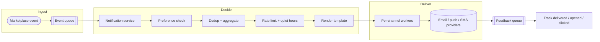
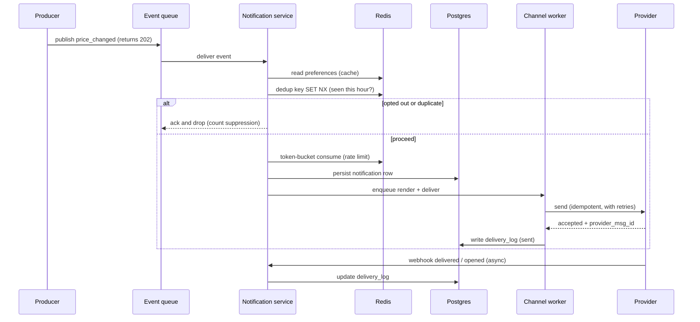
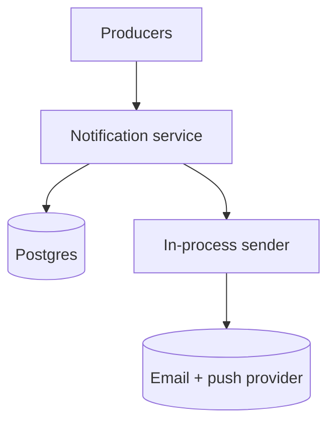
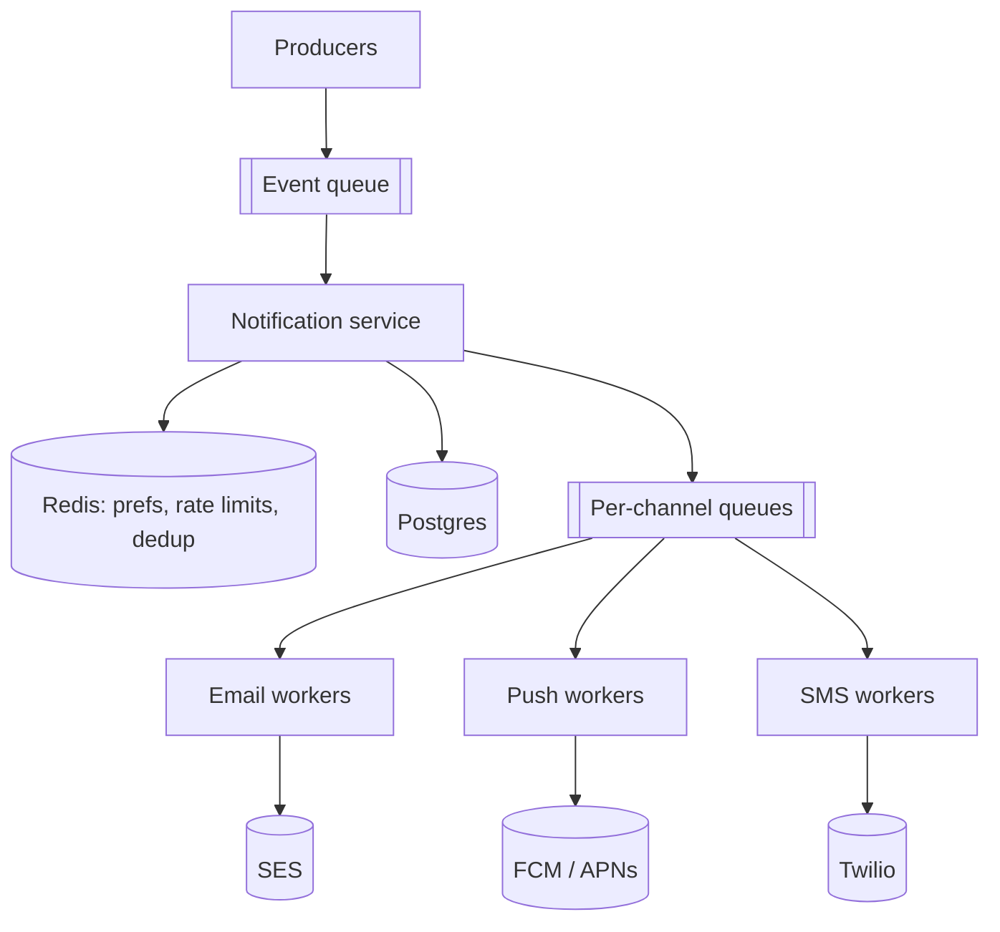
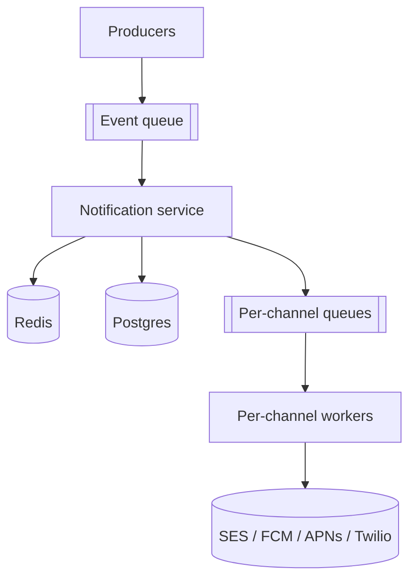
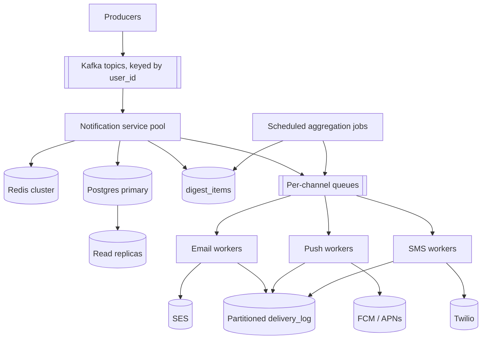
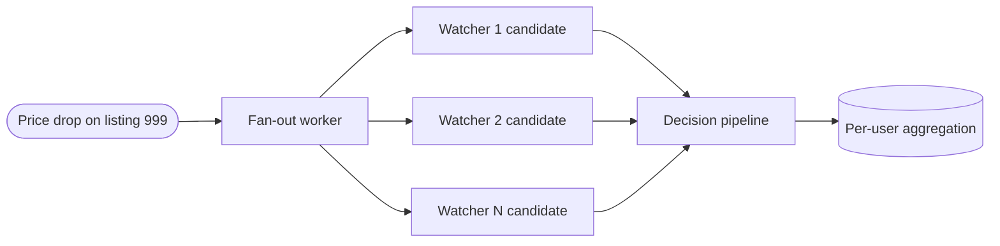
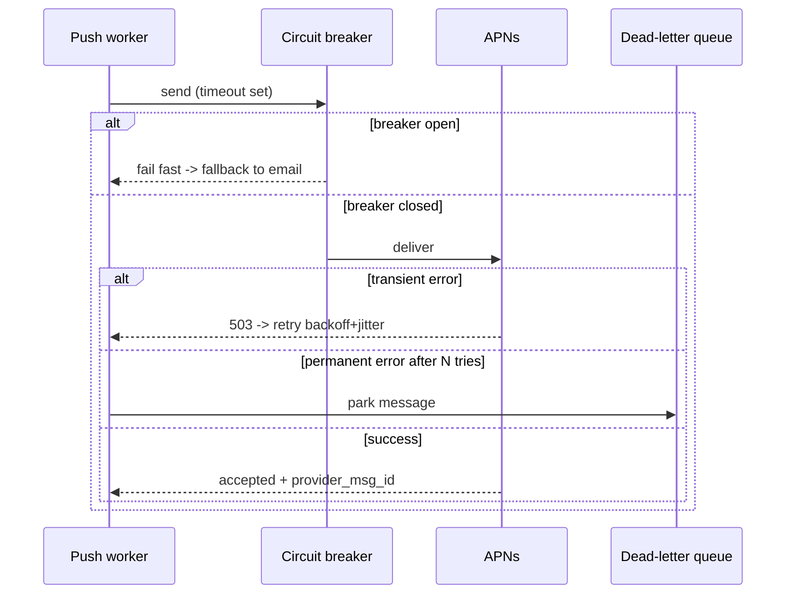
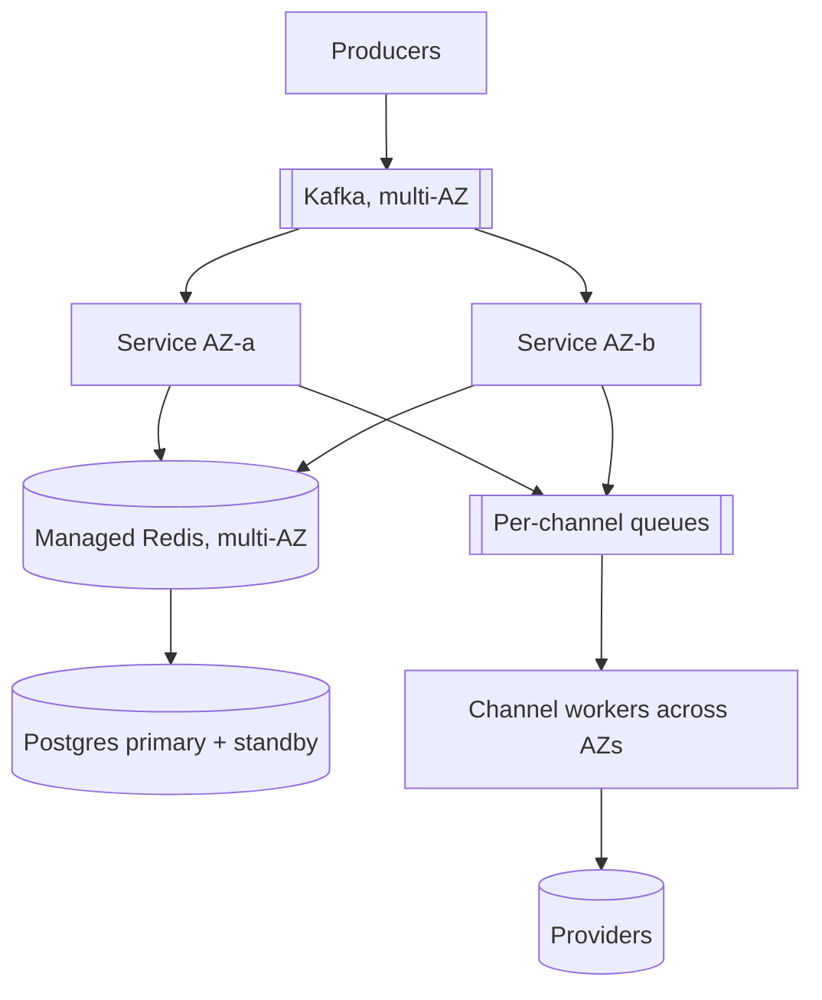
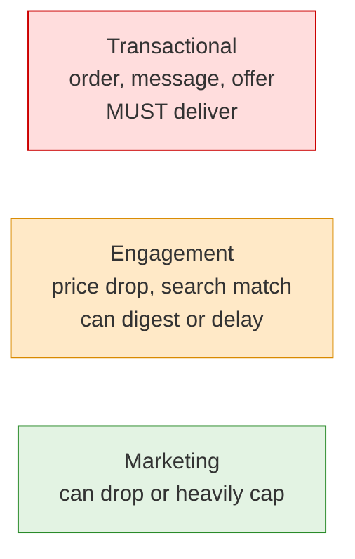

# Notifications System for Reverb: Interview Walkthrough

A complete, interview-ready playbook for designing a multi-channel
notifications system. Built for the Reverb.com **Engineer II, Activation &
Retention** interview, where notifications are one of the strongest retention
levers you own. Treat this as a script for a conversation, not a monologue:
keep clarifying, sizing, drawing, and evolving the design as you go.

The single most important idea to anchor every decision:

> **A notification is a promise to interrupt someone's life only when it's
> worth it.** Preferences, deduplication, aggregation, and rate limiting are
> therefore core design concerns, not afterthoughts — the system's first job
> is deciding what *not* to send.

A complementary principle explains *why* every tool below works:

> **CPU is cheap; moving data is expensive.** Queues, caches, fan-out workers,
> and batched digests exist to absorb spikes and avoid redundant work and
> round trips. And the cheapest, fastest notification of all is the one we
> correctly suppress before it ever reaches a provider.

## How to use this walkthrough

- **Lead with reasoning, not recall.** The interviewer is listening for
  engineering judgment. For every component, say *why* it exists and *what*
  problem it solves. The "why" callouts throughout this doc are the lines that
  separate a candidate who memorized a template from one who has judgment.
- **Drive the conversation in this order:** clarify requirements, size the
  load (including fan-out amplification), sketch the simplest correct design,
  then evolve it only in response to a bottleneck you just identified out loud.
- **Time-box yourself** (for a 45-minute round):
  - 5 min: requirements, channels, and scope
  - 5 min: capacity math, fan-out, and the candidate-vs-send ratio
  - 10 min: APIs, data model, the decision pipeline
  - 15 min: scale evolution (queue, per-channel workers, Redis, streams)
  - 10 min: deep dives the interviewer steers toward (dedup, delivery, abuse)
- **Resist premature complexity.** Naming a tool you are choosing *not* to use
  yet (Kafka, multi-region, exactly-once) is a stronger signal than reaching
  for it. Over-notifying is the real failure mode here, so restraint is the
  whole point — in the product *and* in the architecture.

## Table of contents

- [Notifications System for Reverb: Interview Walkthrough](#notifications-system-for-reverb-interview-walkthrough)
  - [How to use this walkthrough](#how-to-use-this-walkthrough)
  - [Table of contents](#table-of-contents)
  - [0. Opening move: clarify requirements first](#0-opening-move-clarify-requirements-first)
    - [Why clarify before architecting](#why-clarify-before-architecting)
    - [Deliberately out of scope, and why](#deliberately-out-of-scope-and-why)
  - [1. Core mental model](#1-core-mental-model)
  - [2. API design](#2-api-design)
    - [Why this API shape](#why-this-api-shape)
  - [3. Data model](#3-data-model)
    - [Why this data model](#why-this-data-model)
  - [4. The delivery decision pipeline](#4-the-delivery-decision-pipeline)
    - [Why this pipeline order](#why-this-pipeline-order)
    - [Read-after-write consistency: preferences and consent must never be stale](#read-after-write-consistency-preferences-and-consent-must-never-be-stale)
  - [5. Back-of-the-envelope toolkit](#5-back-of-the-envelope-toolkit)
    - [Why the math matters](#why-the-math-matters)
  - [6. Scenario A: 100K to 1M users](#6-scenario-a-100k-to-1m-users)
    - [6.1 Starting point: 100K users](#61-starting-point-100k-users)
      - [Why start with the boring architecture](#why-start-with-the-boring-architecture)
    - [6.2 Growing to 1M users](#62-growing-to-1m-users)
      - [Why a queue, specifically](#why-a-queue-specifically)
      - [Why Redis here](#why-redis-here)
  - [7. Scenario B: 1M to 10M users](#7-scenario-b-1m-to-10m-users)
    - [7.1 Starting point: 1M users](#71-starting-point-1m-users)
    - [7.2 Scaling to 10M users](#72-scaling-to-10m-users)
      - [Why Kafka or streams now](#why-kafka-or-streams-now)
      - [Why scheduled aggregation jobs](#why-scheduled-aggregation-jobs)
  - [8. Capacity reasoning in plain English](#8-capacity-reasoning-in-plain-english)
  - [9. Fan-out: the amplification problem](#9-fan-out-the-amplification-problem)
  - [10. Deduplication and aggregation](#10-deduplication-and-aggregation)
  - [11. Rate limiting, quiet hours, and timezones](#11-rate-limiting-quiet-hours-and-timezones)
  - [12. Delivery guarantees and provider failures](#12-delivery-guarantees-and-provider-failures)
    - [Edge caching: what's cacheable here and what isn't](#edge-caching-whats-cacheable-here-and-what-isnt)
  - [13. Abuse, compliance, and privacy](#13-abuse-compliance-and-privacy)
  - [14. Failure modes](#14-failure-modes)
  - [15. Closing summary](#15-closing-summary)
  - [16. Addendum: scaling beyond 10M users](#16-addendum-scaling-beyond-10m-users)
    - [Stage 1: same region, multiple availability zones](#stage-1-same-region-multiple-availability-zones)
    - [Stage 2: regional workers, single write region](#stage-2-regional-workers-single-write-region)
    - [Stage 3: multi-region active-passive](#stage-3-multi-region-active-passive)
    - [Stage 4: multi-region active-active delivery](#stage-4-multi-region-active-active-delivery)
    - [When to choose each level](#when-to-choose-each-level)
    - [High availability by criticality](#high-availability-by-criticality)
    - [The optimization ladder: the exact order before sharding](#the-optimization-ladder-the-exact-order-before-sharding)
    - [Advanced partitioning and retention](#advanced-partitioning-and-retention)
    - [Final addendum summary](#final-addendum-summary)
  - [17. Decision rationale cheat sheet](#17-decision-rationale-cheat-sheet)
  - [18. One-page cheat sheet](#18-one-page-cheat-sheet)

## 0. Opening move: clarify requirements first

Open with a sentence that frames the whole problem and shows you know the
design space:

> "Before I draw anything, I'd like to pin down the channels, the triggers,
> and how aggressively we're allowed to interrupt users. A notifications
> system can be a single worker that sends an email, or a multi-channel
> fan-out pipeline with preferences, dedup, digests, and rate limiting. The
> hard part isn't sending — it's deciding what's worth sending. Let me scope
> which version we're building."

Then ask targeted questions, grouped by category.

- **Channels:** "Which channels — email, mobile push, in-app feed, SMS? Each
  has different cost, latency, deliverability, and compliance rules. SMS is
  expensive and regulated; in-app is nearly free; push needs device tokens."
- **Triggers:** "Which events generate notifications? For Reverb I'd expect
  watched-item price drops, new listings matching a saved search or followed
  brand/seller, offers received, buyer/seller messages, and order/shipping
  updates. Are these all in scope, and do they differ in urgency?"
- **Timing:** "Real-time or batched? My default is *per-category*:
  transactional events (order shipped, offer received) go immediately;
  engagement events (price drops, new matches) default to a digest. Do we need
  quiet hours, and are users spread across timezones?"
- **Preferences:** "Can users customize per category and per channel, with a
  global opt-out? What are the defaults — opt-in or opt-out — for each
  category? Defaults dominate behavior far more than the settings screen does."
- **Scale and growth:** "What order of magnitude — and what's the *fan-out*? A
  price change on one popular listing might notify thousands of watchers. Are
  we at 100K users growing to 1M, or 1M growing to 10M?"
- **Delivery guarantees:** "Is at-least-once acceptable if senders are
  idempotent, or does any category need stronger guarantees? My default is
  at-least-once plus dedup so a retry never double-sends."
- **Compliance:** "Do we need CAN-SPAM one-click unsubscribe, GDPR consent and
  erasure, and SMS opt-in/STOP handling? These are legal requirements, not
  features, so I want them in the data model from day one."

### Why clarify before architecting

- **You can't design for unknown constraints.** A single-channel transactional
  email system and a multi-channel engagement engine with digests and quiet
  hours are completely different architectures. Jumping to a solution signals
  you optimize before you understand the problem.
- **It buys you a contract.** Once the interviewer agrees that, say, SMS is out
  of scope and engagement notifications can be digested, you can defend the
  design against "what about X?" with "we scoped that out, easy to add."
- **The product framing is the differentiator for this role.** Notifications
  drive activation and retention, but over-notifying drives unsubscribes and
  churn. Stating up front that the system's job is *restraint* — preferences,
  dedup, caps — is exactly the Activation & Retention instinct the interviewer
  is probing for.

### Deliberately out of scope, and why

Naming what you are *not* building is as much a judgment signal as what you
are. For a notifications system specifically:

- **No self-hosted SMTP, push, or SMS infrastructure.** We send through SES,
  FCM/APNs, and Twilio. Deliverability, IP reputation, and carrier
  relationships are their core competency, not ours; reinventing them is pure
  risk with no product upside.
- **No recommendation or ranking engine.** Deciding *which* items are worth
  recommending is the personalization team's system. We receive trigger events
  and decide *whether and when* to deliver them; we don't rank discovery
  content. We do, however, own frequency and fatigue.
- **No real-time chat transport.** "New message from a buyer" is a *trigger*
  into our pipeline; the actual messaging system (WebSockets, presence) is a
  separate service. We notify; we don't transport the conversation.
- **No search engine.** Saved-search *matching* is produced upstream; we
  consume "listing matched saved search N" events. Building OpenSearch here
  would be solving someone else's problem.
- **No media pipeline.** Notifications are short text plus small metadata; the
  gear photo in a push or email is a CDN URL we reference, never bytes we
  store or resize. This is why Postgres stays comfortable as the source of
  truth.

The meta-point to voice: I integrate a managed provider or a separate team's
service at the boundary, and I only build what is genuinely *our* problem —
the decision logic and the reliable, preference-aware delivery around it.

## 1. Core mental model

The system has three paths. Say this out loud; it organizes the entire
interview.

- **Ingest path:** `Marketplace event -> event queue` (fast, fire-and-forget;
  the producer never waits on delivery).
- **Decision + delivery path:** `queue -> notification service -> preferences
  -> dedup/aggregate -> rate limit/quiet hours -> render -> per-channel worker
  -> provider`.
- **Feedback path:** `provider receipts + opens/clicks -> queue -> workers ->
  delivery_log / analytics` (off the hot path entirely).



The key insight, stated explicitly:

> "Most events should *not* become a notification. The pipeline is mostly a
> series of filters — preferences, dedup, aggregation, rate limits — and only
> what survives gets rendered and delivered. So I optimize the *decision* path
> for cheap early rejection, and I keep delivery reliable and off the
> producer's critical path."

Conversion rules you'll reuse all interview:

- `candidate notifications / 86,400` = average decision QPS (post fan-out,
  pre-filter)
- `actual sends / 86,400` = average delivery QPS
- `peak QPS ≈ average QPS × 10` — **state the multiplier you assume**:
  notifications are spiky (flash sales, end-of-auction, popular price drops,
  business hours), so ~10× is a reasonable planning allowance; steadier
  user-facing reads like the in-app feed are often only 2–3×. Fan-out creates
  its own internal bursts on top of this, which is exactly what the queue
  absorbs.

## 2. API design

There are three audiences: internal producers (emit events), end users (manage
preferences, read the in-app feed), and providers (send delivery receipts).

Ingest a trigger event (internal, from a producer service):

```http
POST /v1/events
Content-Type: application/json
Idempotency-Key: evt_8f3a2b

{
  "type": "listing.price_changed",
  "entity": { "type": "listing", "id": 999 },
  "audience": "watchers",
  "data": { "oldPrice": 1299.00, "newPrice": 1149.00, "currency": "USD" },
  "occurredAt": "2026-06-15T20:01:00Z"
}
```

```json
{
  "eventId": "evt_8f3a2b",
  "status": "accepted"
}
```

The response is `202 Accepted`: we durably enqueued the event and will decide
and deliver asynchronously. We never deliver inside this request.

Manage preferences (per category, per channel):

```http
PUT /v1/users/42/preferences
Content-Type: application/json

{
  "category": "price_drop",
  "channels": {
    "push":  { "enabled": true,  "frequency": "immediate" },
    "email": { "enabled": true,  "frequency": "daily" },
    "sms":   { "enabled": false }
  }
}
```

Read the in-app notification feed (cursor pagination, never `OFFSET`):

```http
GET /v1/users/42/notifications?limit=20&cursor=eyJ0cyI6MTcxOH0

200 OK
```

```json
{
  "items": [
    {
      "id": 90871,
      "category": "price_drop",
      "title": "Price drop on a watched item",
      "body": "Fender Jazzmaster dropped to $1,149",
      "entity": { "type": "listing", "id": 999 },
      "readAt": null,
      "createdAt": "2026-06-15T20:01:05Z"
    }
  ],
  "nextCursor": "eyJ0cyI6MTcxNzk5fQ"
}
```

Register a device for push:

```http
POST /v1/devices
Content-Type: application/json

{
  "userId": 42,
  "platform": "ios",
  "pushToken": "a1b2c3d4",
  "locale": "en-US",
  "timezone": "America/Chicago"
}
```

One-click unsubscribe (CAN-SPAM compliant, signed token, no enumeration):

```http
GET /v1/unsubscribe?token=signed-opaque-token

302 Found
Location: /preferences?unsubscribed=marketing
```

Provider feedback webhook (bounces, complaints, delivery receipts):

```http
POST /v1/webhooks/ses
Content-Type: application/json

{ "eventType": "Bounce", "messageId": "ses-123", "recipient": "x@example.com" }
```

### Why this API shape

- **Ingest returns `202`, not `200` with a result.** Delivery is asynchronous
  by design. The producer's job is to record that something happened, not to
  wait for a push to land in Cupertino. This is the single most important API
  decision: it decouples the marketplace from notification latency and
  failures.
- **Every event carries an `Idempotency-Key`.** Producers retry on flaky
  networks. The same "price changed" event published twice must not become two
  notifications. The key lets us dedupe at the front door, before fan-out.
- **Preferences are addressed per `(category, channel)`.** That is the natural
  grain of user control and the grain the decision pipeline reads. Modeling it
  any coarser ("notifications on/off") guarantees over-notifying and churn.
- **The in-app feed uses cursor/keyset pagination.** `OFFSET` scans and
  discards rows and degrades on deep pages; a keyset cursor
  (`WHERE created_at < ?`) stays fast at any depth — and a heavy notifications
  user can have thousands of rows.
- **Provider receipts arrive by webhook, off the hot path.** Opens, clicks,
  bounces, and complaints flow back asynchronously into analytics and
  suppression logic; they never sit between a trigger and a send.

## 3. Data model

Start with the minimum that satisfies correctness, and say that you're doing so
deliberately. Everything here lives comfortably in Postgres at first.

A notification the system decided to (potentially) send:

```sql
CREATE TABLE notifications (
  id          BIGSERIAL PRIMARY KEY,
  user_id     BIGINT NOT NULL,
  category    TEXT NOT NULL,        -- price_drop, search_match, offer, message, order_update
  entity_type TEXT NOT NULL,        -- listing, search, offer, conversation, order
  entity_id   BIGINT NOT NULL,
  dedup_key   TEXT NOT NULL,        -- stable idempotency key (see below)
  payload     JSONB NOT NULL,       -- render inputs: item title, price, image URL
  priority    SMALLINT NOT NULL DEFAULT 5,
  created_at  TIMESTAMPTZ NOT NULL DEFAULT now(),
  read_at     TIMESTAMPTZ NULL,
  UNIQUE (dedup_key)
);
```

Per-user, per-channel, per-category preferences:

```sql
CREATE TABLE notification_preferences (
  user_id    BIGINT NOT NULL,
  category   TEXT NOT NULL,         -- price_drop, search_match, offer, message, order_update, marketing
  channel    TEXT NOT NULL,         -- email, push, in_app, sms
  enabled    BOOLEAN NOT NULL DEFAULT TRUE,
  frequency  TEXT NOT NULL DEFAULT 'immediate', -- immediate, hourly, daily, off
  updated_at TIMESTAMPTZ NOT NULL DEFAULT now(),
  PRIMARY KEY (user_id, category, channel)
);
```

Devices and push tokens:

```sql
CREATE TABLE devices (
  id           BIGSERIAL PRIMARY KEY,
  user_id      BIGINT NOT NULL,
  platform     TEXT NOT NULL,       -- ios, android, web
  push_token   TEXT NOT NULL,       -- APNs / FCM token
  locale       TEXT,                -- en-US, ja-JP
  timezone     TEXT,                -- IANA tz, e.g. America/Chicago
  active       BOOLEAN NOT NULL DEFAULT TRUE,
  last_seen_at TIMESTAMPTZ,
  created_at   TIMESTAMPTZ NOT NULL DEFAULT now(),
  UNIQUE (push_token)
);

CREATE INDEX idx_devices_user ON devices (user_id) WHERE active;
```

Per-attempt delivery log, time-partitioned because it grows fastest:

```sql
CREATE TABLE delivery_log (
  id              BIGSERIAL,
  notification_id BIGINT NOT NULL,
  user_id         BIGINT NOT NULL,
  channel         TEXT NOT NULL,
  provider        TEXT NOT NULL,    -- ses, fcm, apns, twilio
  status          TEXT NOT NULL,    -- queued, sent, delivered, bounced, failed, opened, clicked
  provider_msg_id TEXT,
  attempt         SMALLINT NOT NULL DEFAULT 1,
  error           TEXT,
  created_at      TIMESTAMPTZ NOT NULL DEFAULT now()
) PARTITION BY RANGE (created_at);
```

Localized templates, versioned:

```sql
CREATE TABLE templates (
  id       BIGSERIAL PRIMARY KEY,
  category TEXT NOT NULL,
  channel  TEXT NOT NULL,
  locale   TEXT NOT NULL,           -- en-US, ja-JP
  subject  TEXT,
  body     TEXT NOT NULL,           -- placeholders filled at render time
  version  INT NOT NULL,
  active   BOOLEAN NOT NULL DEFAULT TRUE,
  UNIQUE (category, channel, locale, version)
);
```

Pending digest items, drained by a scheduled job:

```sql
CREATE TABLE digest_items (
  id         BIGSERIAL PRIMARY KEY,
  user_id    BIGINT NOT NULL,
  channel    TEXT NOT NULL,
  window     TEXT NOT NULL,         -- 'daily:2026-06-15' or 'hourly:2026-06-15T20'
  category   TEXT NOT NULL,
  entity_id  BIGINT NOT NULL,
  payload    JSONB NOT NULL,
  created_at TIMESTAMPTZ NOT NULL DEFAULT now()
);

CREATE INDEX idx_digest_user_window ON digest_items (user_id, channel, window);
```

### Why this data model

- **`UNIQUE(dedup_key)` pushes dedup into the database.** The dedup key is a
  stable string like `42:price_drop:listing_999:2026-06-15T20`. A race or a
  retried event that produces the same key hits the constraint and is rejected
  atomically, instead of relying on racy application checks. Redis does the
  fast pre-check; the constraint is the correctness backstop.
- **Preferences keyed by `(user_id, category, channel)`** is the exact grain
  the pipeline queries, so the lookup is a single primary-key hit (and a single
  cache key). The `frequency` column is what lets one category be immediate and
  another a daily digest for the same user.
- **`devices` carries `timezone` and `locale`** because quiet hours and
  template rendering both need them, and the device is where they're freshest.
  `UNIQUE(push_token)` plus an `active` flag lets us deactivate dead tokens
  cleanly when a provider reports them invalid.
- **`delivery_log` is partitioned by time from the start of the design
  discussion.** It is append-heavy, read-recent, and the fastest-growing table
  by far — one row per channel attempt per notification. Partitioning by day
  makes retention (drop old partitions) and queries (recent windows) cheap.
- **`digest_items` is the aggregation buffer.** Batched notifications append
  here instead of sending; a scheduled job collapses them per user per window
  into a single message. This table is *why* a guitar whose price changes 10
  times in an hour produces one digest, not ten pushes.

## 4. The delivery decision pipeline

This is the heart of the system and where interviewers push hardest. For every
candidate notification produced by fan-out, run an ordered series of filters.
Most candidates die early; that's the point.

```text
1. Preference check   -> opted out of this category/channel? drop.
2. Channel resolution -> which of push/email/in_app/sms are enabled?
3. Deduplication      -> seen this dedup_key recently? drop or fold.
4. Aggregation        -> category is digested? append to digest bucket, stop.
5. Rate limiting      -> token bucket per user+channel exhausted? defer/drop.
6. Quiet hours        -> inside user's quiet window? defer or downgrade channel.
7. Render             -> fill localized template for the channel.
8. Deliver            -> per-channel worker -> provider (idempotent + retries).
9. Track              -> record delivery_log; opens/clicks arrive async.
```

A single notification's lifecycle, end to end:



### Why this pipeline order

- **Cheapest, most decisive filters first.** Preference check and dedup are a
  single cache hit each and can reject the *majority* of candidates. Doing them
  before rendering or provider calls embodies "moving data is expensive": never
  do downstream work for a notification you were always going to drop.
- **Aggregation before rate limiting.** A digest is *one* send no matter how
  many events it folds in. Collapsing first means the rate limiter sees the
  true outgoing volume, not the raw candidate count, so a watcher of a volatile
  listing doesn't burn their whole budget on near-duplicates.
- **Quiet hours before delivery, not before aggregation.** We still *collect*
  events during quiet hours; we just hold the *send*. Deferred engagement
  events naturally roll into the next digest or the morning window, which is
  better UX than either dropping them or buzzing someone at 3 a.m.
- **Render last, only for survivors.** Templating and localization are the most
  expensive per-item step (locale lookup, string building). Doing it after all
  filters means we render exactly what we deliver — nothing wasted.
- **Priority short-circuits the filters.** Transactional categories (order
  shipped, offer received) carry high priority and bypass aggregation, rate
  limits, and quiet hours. The pipeline is one code path with per-category
  policy, not two systems.

### Read-after-write consistency: preferences and consent must never be stale

Lead with the split, because almost everything here tolerates eventual
consistency and exactly one thing doesn't:

- **Tolerates eventual consistency (the majority):** the in-app feed, analytics,
  open/click counts, and delivery-log reads. A feed that's a second stale or a
  count that lags is harmless.
- **Demands read-your-writes (the dangerous case):** **preferences, consent, and
  unsubscribe**, and to a lesser degree **device tokens**. If a user opts out of
  a category — or hits one-click unsubscribe — the *very next* decision must see
  it. Reading a stale replica or a stale cache entry and sending anyway is a
  compliance violation (CAN-SPAM/GDPR/TCPA) and the fastest way to lose trust.

> "Almost everything here can be eventually consistent — except the preference
> and consent read in the decision pipeline. One more message after someone
> opted out isn't a stale dashboard; it's a broken promise and a legal problem."

The toolkit, best-first, adapted to this system:

1. **Write-through cache + invalidation (the workhorse).** The pipeline reads
   preferences from Redis on the hot path, so on a preferences `PUT`/unsubscribe
   write Postgres *and* overwrite-or-delete the cache key in the same operation.
   The next decision then reads the new value, never a TTL-stale one. This is
   the primary fix because preferences are already cached.
2. **Read-from-primary window (read-your-writes).** For a few seconds after a
   change, route that user's preference reads to the **primary**, not a replica
   — replica lag is exactly when a just-opted-out user would still get sent to.
   Cheap, because preference reads are keyed by `user_id` and easy to pin.
3. **Strong consistency on the write that demands it.** The consent change
   commits on the primary against `PRIMARY KEY (user_id, category, channel)` as
   a synchronous write, so a failover can't lose a just-confirmed opt-out.
   Bounce/complaint suppression deactivates the address or token the same way.
4. **Invalidate cache *and* edge on mutation.** Consent must never be served
   from a stale cache, and any cached preference-center or unsubscribe page is
   purged on change — the same invalidation discipline as the edge-caching
   subsection in section 12 (short TTLs + purge).
5. **Return the write in the response.** The preferences `PUT` returns the new
   preference object so the settings UI renders from the write, with no
   follow-up read to be stale.
6. **Session affinity / monotonic reads for the feed; nothing stronger.** The
   in-app feed and counts stay on replicas; at most pin a session to one replica
   so read/unread state doesn't bounce backwards (monotonic reads). Forcing
   strong consistency on feed, counts, or analytics is wasted complexity.

This is the dedup/idempotency discipline (section 10) one level up: dedup stops
the *same* notification twice; read-your-writes on consent stops *any*
notification the user just told us to stop. Evaluate the consent check against
fresh state at decision time, right alongside the dedup read.

> "I'd serve preferences from a write-through cache and, for a short window
> after any change, read that user from the primary. Consent is the one read I
> refuse to serve stale — every other read in the system can lag."

## 5. Back-of-the-envelope toolkit

State your assumptions, then turn them into design pressure. The reusable
moves:

- candidate QPS = `candidate notifications / 86,400` (a day ≈ `10^5 s`, so this
  is roughly `candidates / 100,000`)
- send QPS = `actual sends / 86,400`
- peak ≈ average × 10 — **state the assumption**: notifications are spiky
  (flash sales, end-of-auction, popular drops), so ~10× is a sane planning
  allowance; steady in-app reads are often 2–3×
- provision for **peak**, and remember fan-out adds bursts the queue must
  absorb on top of the 10×

The amplification that makes notifications different from a URL shortener:

- **fan-out factor** `F` = average notification candidates per source event.
  One price change on a listing watched by 5,000 people is `F = 5,000` for that
  event; a 1:1 message is `F = 1`. Across a marketplace, a blended `F` of ~5 is
  a reasonable starting assumption.
- **collapse ratio** `C` = candidates per actual send after preferences, dedup,
  and aggregation. A blended `C ≈ 3:1` (three candidates filtered or folded per
  send) is a defensible default and the lever retention cares about most.

Storage facts worth memorizing:

- notification row ≈ 500 bytes with index overhead
- delivery_log row ≈ 300 bytes
- preference row ≈ 100 bytes; a user has a handful per category

Throughput rules of thumb:

- single Postgres: thousands to tens of thousands of simple queries/sec
- Redis: 100K+ ops/sec per instance (preference cache, rate-limit counters,
  dedup sets all live here)
- managed providers (SES/FCM/APNs/Twilio): high throughput, but each call is a
  slow, variable network dependency — keep it off the hot path

Latency hierarchy worth memorizing (orders of magnitude):

| Operation | Latency |
| --- | --- |
| RAM | ~100 ns |
| Redis lookup | ~0.1–1 ms |
| Postgres query | ~1–10 ms |
| Internal service call | ~1–20 ms |
| Provider API call (SES/FCM/APNs/Twilio) | ~50–500 ms, variable |
| Cross-region hop | ~70–150 ms |

The takeaway: the trigger-to-enqueue step must be one fast write (sub-ms to a
few ms), because everything expensive — the provider call especially — is slow
and variable and therefore belongs behind the queue, retried by workers. CPU is
cheap; moving data to APNs is not.

### Why the math matters

- **Numbers turn intuition into a forcing function.** "Notifications fan out"
  is an opinion until you compute that 20M source events/day at `F = 5` is 100M
  candidates/day (~1,157/s average, ~11,570/s peak), collapsing to ~30M
  sends/day. That candidate firehose is *why* you need a queue and horizontal
  workers, and the collapse ratio is *why* dedup and aggregation are
  load-bearing, not nice-to-haves.
- **Peak versus average matters** because marketplace events cluster. A holiday
  sale or a viral price drop arrives in a burst; design for the busy minute, or
  you page on-call exactly when engagement (and revenue) is highest.
- **The collapse ratio is a product metric, not just a capacity one.** Driving
  `C` up (folding more aggressively) cuts both infrastructure cost *and*
  unsubscribe rate. Saying that out loud connects the architecture to
  retention, which is the job.

## 6. Scenario A: 100K to 1M users

### 6.1 Starting point: 100K users

Assumptions:

- 100K users
- 200K source events/day, blended fan-out `F = 5`
- ~1M candidate notifications/day, collapse `C = 3:1` → ~300K sends/day

Math:

| Metric | Average | Peak (×10) |
| --- | --- | --- |
| Candidate QPS | `1,000,000 / 86,400 ≈ 12` | `≈ 120` |
| Send QPS | `300,000 / 86,400 ≈ 3.5` | `≈ 35` |

Interpretation:

> "This is small. A single notification service plus Postgres handles it. I'll
> keep the architecture deliberately simple and send inline through one
> provider per channel, with retries."

Initial design:



#### Why start with the boring architecture

- `Producers -> service -> Postgres -> provider` is correct, debuggable, and
  deployable on day one. Kafka, per-channel worker fleets, and streams add
  operational surface area for problems you don't yet have.
- **Even at this size, keep one thing non-negotiable: the producer doesn't
  block on the provider.** Wrap the send in a local background job or a simple
  Postgres-backed queue so a slow APNs call never slows the marketplace. This
  is the one piece of "complexity" I'd insist on early, because it's cheap and
  it's load-bearing for everything later.
- Redis-class systems serve ~100K simple ops/sec, and we need ~35 sends/sec at
  peak. We are nowhere near needing a cache tier, a stream, or sharding — so I
  don't add one. Naming that restraint is the signal.

### 6.2 Growing to 1M users

Assumptions:

- 1M users
- 2M source events/day, `F = 5` → ~10M candidates/day, `C = 3:1` → ~3M
  sends/day

Math:

| Metric | Average | Peak (×10) |
| --- | --- | --- |
| Candidate QPS | `10,000,000 / 86,400 ≈ 116` | `≈ 1,160` |
| Send QPS | `3,000,000 / 86,400 ≈ 35` | `≈ 350` |

Interpretation:

> "Now fan-out bursts and provider latency matter. A popular price drop can
> create thousands of candidates in seconds, and I can't let that spike hit
> Postgres or the providers synchronously."

First reach for the cheapest levers and say so: **scale Postgres vertically**
and confirm indexes before adding moving parts. Then add the pieces the load
actually demands:

- a real **event queue** (SQS / Redis Streams) between producers and the
  service
- **per-channel worker pools** so a slow SMS provider can't back up email
- **Redis** for the preference cache, rate-limit counters, and dedup sets



#### Why a queue, specifically

- **It absorbs fan-out bursts.** When one listing's price drops to 5,000
  watchers, the producer enqueues one event and returns; a fan-out worker
  expands it and feeds the decision pipeline at a controlled rate. The spike
  becomes a queue depth, not an outage.
- **It decouples critical from non-critical.** The marketplace (critical) emits
  an event and moves on; delivery (non-critical, slow, failure-prone) happens
  behind the queue. **Never let a slow provider block a fast product action.**
- **It lets channels scale independently.** Email, push, and SMS have wildly
  different throughput, cost, and failure profiles. Separate per-channel queues
  mean Twilio rate limits don't stall password-reset emails, and you scale each
  worker pool to its own provider's limits.

#### Why Redis here

- **Preferences are read on the hot path of every candidate.** Caching
  `(user_id, category, channel) -> enabled/frequency` turns a Postgres query
  into a sub-millisecond lookup, and the preference set is small and rarely
  changes — an ideal cache. Invalidate on the preferences `PUT`.
- **Rate-limit counters belong in Redis.** A token bucket per `(user, channel)`
  is a couple of atomic ops; Postgres would be the wrong tool (write
  amplification on hot rows). This is a textbook "cache expensive coordination,
  not a tiny value" use.
- **Dedup uses `SET NX` with a TTL window.** The dedup key is checked once per
  candidate; Redis answers in microseconds and the TTL gives the "collapse
  within an hour" semantics for free. The Postgres `UNIQUE(dedup_key)` remains
  the durable backstop.
- **Guard against cache stampede.** If the preference cache for a hot segment
  expires in lockstep, misses pile onto Postgres. Use **jittered TTLs** and
  **request coalescing** so one miss repopulates while others wait. Track
  **cache hit rate** as a health signal.

## 7. Scenario B: 1M to 10M users

### 7.1 Starting point: 1M users

Because we know how this scales, start with the queue, per-channel workers, and
Redis baked in from day one. Assumptions and math match the end of Scenario A:

| Metric | Average | Peak (×10) |
| --- | --- | --- |
| Candidate QPS | `≈ 116` | `≈ 1,160` |
| Send QPS | `≈ 35` | `≈ 350` |



### 7.2 Scaling to 10M users

Assumptions:

- 10M users
- 20M source events/day, `F = 5` → ~100M candidates/day, `C = 3:1` → ~30M
  sends/day

Math:

| Metric | Average | Peak (×10) |
| --- | --- | --- |
| Candidate QPS | `100,000,000 / 86,400 ≈ 1,157` | `≈ 11,570` |
| Send QPS | `30,000,000 / 86,400 ≈ 347` | `≈ 3,470` |

Interpretation:

> "Now the candidate firehose is real, digests are doing heavy lifting, and the
> delivery_log is the fastest-growing thing in the system. I want a partitioned
> log-style stream, partitioned storage, and scheduled jobs that turn buckets
> of events into single digests."

At 10M users, add:

- **Kafka (or equivalent log-based stream)** for the event backbone, keyed by
  `user_id` so all of a user's events land on one partition
- a **horizontally scaled notification service** consuming those partitions
- a **Redis cluster** for prefs, rate limits, and dedup
- **read replicas** for the in-app feed and analytics reads
- a **partitioned `delivery_log`** with a rolling retention window
- **scheduled aggregation jobs** that drain `digest_items` per user per window



#### Why Kafka or streams now

- **Partition by `user_id` and per-user state stops moving.** All of a user's
  events land on one partition handled by one consumer, so that user's dedup
  window, rate-limit bucket, and aggregation state are *local*. This is the key
  scaling insight: it turns a distributed-coordination problem into a
  per-partition local one — the data-movement principle applied to control
  state, not just payloads.
- **A durable log gives replay and buffering.** If the decision pool falls
  behind during a flash sale, events sit durably in Kafka and drain when
  capacity recovers; nothing is lost. If a bug mis-renders a batch, you can
  reset offsets and reprocess.
- **It scales consumers independently of producers.** Add partitions and
  consumer instances to grow decision throughput without touching the
  marketplace services that emit events.

#### Why scheduled aggregation jobs

- **Digests are a batch problem, and batching is the whole value.** A job that
  wakes per window (hourly/daily, aligned to each user's timezone), reads that
  user's `digest_items`, and emits one rendered message is how "10 price
  changes in an hour" becomes one push. Doing this inline per event would
  defeat the purpose.
- **It smooths the send curve.** Instead of 30M sends scattered with the
  candidate firehose, digests deliberately cluster into controlled windows the
  per-channel workers and providers can pace, respecting provider rate limits.
- **It's the strongest retention lever in the system.** Fewer, denser, better-
  timed messages measurably lower unsubscribe and complaint rates while
  preserving the click-through that drives users back to the marketplace.

## 8. Capacity reasoning in plain English

Talk through the numbers, don't just recite them:

- At 10M users, ~100M candidates/day and ~30M sends/day means ~1.2K average /
  ~12K peak candidate QPS and ~350 average / ~3.5K peak send QPS. That is
  **serious product scale, not internet-scale.** A horizontally scaled service
  behind a stream, with Redis and per-channel workers, handles it.
- **Keep Postgres off the candidate hot path** (prefs and dedup are served from
  Redis), but keep it as the durable source of truth for preferences,
  notifications, and the delivery log. A useful sizing rule is
  `QPS ≈ (1 / average_query_seconds) × cores`.

The line to say:

> "Postgres is my system of record, Redis is my decision-time serving layer,
> and the stream is my shock absorber. The providers are slow third parties I
> always treat as unreliable."

Storage sanity check (a common follow-up):

- notification rows: `30M/day × ~500 bytes ≈ 15 GB/day ≈ 5.5 TB/year`
- delivery_log rows: `~40M/day × ~300 bytes ≈ 12 GB/day ≈ 4.4 TB/year` (more
  than one row per send once you count multi-channel and status updates)
- preferences: `10M users × ~6 categories × ~3 channels × ~100 bytes ≈ 18 GB`
  total — trivial, and cache-friendly

> "Two tables dominate growth — `notifications` and `delivery_log` — and both
> are time-series-shaped: write-once, read-recent. So I partition by day, serve
> the recent window from hot storage, and roll up or archive older partitions.
> Preferences and devices stay small forever."

Latency and observability targets:

- **Design to a p99 per category, not a global average.** Transactional (order
  shipped, offer received): trigger-to-provider-handoff p99 under a few
  seconds. Engagement digests: latency is irrelevant; *correctness and
  collapse* are the SLO.
- The trigger critical path is deliberately **one durable write** (enqueue) to
  keep producer latency flat; everything expensive is async.
- Track the golden signals plus product signals: **queue depth and consumer
  lag, delivery success rate, provider error rate, p99 decision latency**, and
  the retention guardrails — **open rate, click rate, unsubscribe rate, and
  complaint rate**. Set SLOs and an error budget so complexity is added against
  data, not vibes.

## 9. Fan-out: the amplification problem

Fan-out is the defining challenge of a notifications system, and it runs in two
directions.

- **One entity to many subscribers (the storm).** A price drop on a popular
  listing watched by 5,000 people produces 5,000 candidates from one event. A
  followed seller listing new gear notifies all their followers. These are
  bursty and unbounded.
- **One user with many subscriptions (the heavy user).** A power buyer watches
  1,000 items, follows 50 sellers, and has 30 saved searches. A nightly
  new-listing sweep can produce dozens of candidates for that single user — all
  of which should collapse into *one* digest.



Design responses:

- **Write-time (push) fan-out is the default**, because we must evaluate each
  subscriber's preferences and act. But we cap it: fan-out feeds the decision
  pipeline, which dedups and aggregates, so 5,000 candidates do not become
  5,000 immediate pushes for users who'd rather get a digest.
- **Batch the subscriber lookup.** "Who watches listing 999?" is paged and
  streamed (e.g., 1,000 watchers per page) into the pipeline, not pulled as one
  giant query — bounded memory, steady throughput.
- **Hot entities get special handling.** A celebrity seller or a viral drop is
  the notification equivalent of a hot key. Shard the fan-out across workers
  and let per-user aggregation absorb the rest, so one user watching ten
  changed items still gets one message.
- **Smooth the provider burst.** 5,000 simultaneous pushes must respect FCM/APNs
  rate limits; the per-channel queue paces them. The queue converts a spike
  into throughput.

> "Fan-out is why a queue and aggregation aren't optional here. The amplifying
> step and the collapsing step are two sides of the same coin: I let one event
> explode into candidates, then aggressively fold them back down per user
> before anything is sent."

## 10. Deduplication and aggregation

These are distinct problems that interviewers love to conflate. Separate them
explicitly.

**Deduplication** suppresses *the same* notification sent twice:

- caused by at-least-once requeues (a worker retried after a crash) or by
  duplicate triggers (a producer published the same event twice)
- enforced by a stable `dedup_key`, e.g.
  `42:price_drop:listing_999:2026-06-15T20`, checked with Redis `SET NX` (fast
  path) and backstopped by `UNIQUE(dedup_key)` in Postgres
- the time component in the key (`...T20` = the 20:00 hour) is what collapses a
  burst of identical triggers within a window into one notification

**Aggregation** combines *distinct but related* events into one message:

- "your watched Jazzmaster changed price 10 times this hour" → one digest with
  the *net/latest* price, not ten pushes
- "12 new listings match your saved search" → one summary
- implemented by appending to `digest_items` keyed by `(user, channel, window)`
  and draining with the scheduled job from section 7.2

Choosing the cadence, per category:

| Category | Default cadence | Why |
| --- | --- | --- |
| Order / shipping update | Immediate | Transactional; user is waiting on it |
| Offer received | Immediate | Time-sensitive; expires |
| Buyer/seller message | Immediate | Conversation; latency is the product |
| Watched-item price drop | Hourly/daily digest | Volatile; collapses beautifully |
| Saved-search match | Daily digest | Discovery; better as a curated list |
| Marketing | Capped, low frequency | Pure fatigue risk |

The canonical example, said out loud:

> "If a watched guitar's price changes ten times in an hour, the user gets one
> notification, not ten. Dedup collapses identical repeats by key; aggregation
> rolls genuinely distinct events into a single digest with the latest state.
> That single decision is the difference between a useful nudge and an
> unsubscribe."

The product payoff: aggregation is the lever that *raises* the collapse ratio
`C`, which simultaneously cuts cost and cuts churn. That is the Activation &
Retention thesis in one mechanism.

## 11. Rate limiting, quiet hours, and timezones

Even after dedup and aggregation, you need a hard ceiling on how often you
interrupt someone.

**Per-user, per-channel token bucket** in Redis:

```text
key:      ratelimit:{user_id}:{channel}
capacity: 4 tokens      (allow a small burst)
refill:   1 token / 30 min
on send:  consume(1) -> deliver; else -> defer into next digest
exempt:   transactional categories bypass the bucket
```

**Quiet hours by timezone**, read from the user's device/profile:

```text
user.timezone = America/Chicago, quiet 21:00-08:00 local
trigger at 02:00 local:
  - order shipped (transactional) -> deliver now
  - price drop (engagement)       -> hold, fold into 08:00 digest
```

Design points to voice:

- **Token bucket over fixed window** because it allows a small natural burst
  (two quick offers) while still capping sustained volume, and it has no
  boundary-spike pathology. It's a couple of atomic Redis ops per send.
- **Priority tiers, not a global cap.** Transactional notifications bypass rate
  limits and quiet hours; engagement is subject to both; marketing is the most
  constrained. One policy table, enforced in the pipeline.
- **Quiet hours defer, they don't drop.** Held engagement events roll into the
  next allowed window, which is also when open rates are best — a UX win and a
  metrics win at once.
- **Timezone correctness needs the user's IANA zone**, not a server offset, so
  "9 a.m. local" is right across DST and regions. Store it on the device and
  the profile; default sensibly from locale/IP when unknown.
- **Degrade by channel during quiet hours.** A held push can still appear
  silently in the in-app feed (zero interruption), so the information is there
  when the user looks, without a buzz at 3 a.m.

## 12. Delivery guarantees and provider failures

Providers are slow, third-party, and occasionally down. Treat delivery as
unreliable and design for it.

- **At-least-once plus idempotent senders.** Queues redeliver on worker crashes,
  so a send may be attempted twice. The dedup key plus a recorded
  `provider_msg_id` make a retry a no-op: we never double-send. **Exactly-once
  end-to-end is impractical** (the provider may deliver and we crash before
  recording it), so we engineer *effectively once* via dedup, and say so.
- **Retries with exponential backoff + jitter.** A transient provider 503 is
  retried on a backoff with jitter to avoid a retry storm; permanent failures
  are not retried.
- **Circuit breaker per provider.** If APNs starts failing or timing out, the
  breaker opens so workers fail fast instead of piling up blocked threads, then
  half-opens to probe recovery.
- **Dead-letter queue for poison messages.** A notification that repeatedly
  fails (malformed payload, permanently invalid recipient) is parked in a DLQ
  for inspection rather than blocking the pipeline or being silently dropped.
- **Fallback channels.** If push fails or the user has no active device token,
  fall back to email or the in-app feed for important categories. Channel is a
  preference *and* a resilience axis.
- **Bounce and complaint handling drives suppression.** SES hard bounces →
  deactivate that email; spam complaints → opt the user out of that category
  and protect sender reputation. FCM/APNs "invalid token" → mark the device
  inactive. Ignoring these silently destroys deliverability for *everyone*.



The line that lands:

> "I assume every provider call can be slow, fail, or be retried. So senders
> are idempotent, retries use backoff with jitter behind a circuit breaker,
> poison messages go to a DLQ, and bounces and complaints feed suppression.
> The user should never see a double-send, and a dead provider should degrade
> gracefully, not take the system down."

### Edge caching: what's cacheable here and what isn't

Be honest about scope: **the actual sends are not CDN-cacheable.** Email through
SES, push through FCM/APNs, and SMS through Twilio are per-recipient,
provider-bound calls — there's no shared response for an edge to replay, and
each one *must* reach the provider. A CDN does nothing for the delivery hot
path.

What *is* edge-cacheable is the **public, shared, static surface** around
notifications:

| Surface | Cacheable? | Why |
| --- | --- | --- |
| Template images / brand assets in emails & push | Yes — long TTL | Static, public, identical for everyone; fetched by every mail client |
| In-app notification-center shell / JS bundle | Yes — versioned, long TTL | Static SPA assets; cache-bust by filename hash |
| One-click unsubscribe & preference landing pages | Yes — short TTL | Public pages; cache the shell, keep the token action dynamic |
| Other hosted public assets (icons, fonts, CSS) | Yes — long TTL | Classic static-asset CDN use |
| Email **open-tracking pixel** | **No — `no-store`** | Its whole purpose is to record an open; a cached pixel records nothing |
| A send to a provider | **No** | Per-recipient, provider-bound; not an HTTP response we own |

The open-tracking pixel is the instructive case — never edge-cache a response
whose job is to record an event:

> "I'd serve template images and the in-app bundle from a CDN with long TTLs,
> because they're static and hit by every recipient. But the open-tracking pixel
> I'd return `no-store` — its entire job is to log an open, so caching it would
> silently zero out the metric."

**Config** — assets cache aggressively, dynamic/eventful responses opt out:

```http
# Static template image / hashed bundle asset
GET /assets/email/price-drop-hero.v7.png
Cache-Control: public, max-age=31536000, immutable

# Unsubscribe / preference landing page shell
GET /preferences
Cache-Control: public, s-maxage=300, max-age=0

# Open-tracking pixel — must reach origin to record the event
GET /t/open/evt_8f3a2b.gif
Cache-Control: no-store
```

**Purge on change.** Version asset URLs with a content hash so a template-image
change is a new key (immutable assets never go stale), or purge by **cache tag**
so the edge drops the old asset immediately instead of waiting out a year-long
TTL. Short `s-maxage` on the landing pages means a copy change self-heals in
minutes.

## 13. Abuse, compliance, and privacy

A notifications system touches inboxes, phones, and personal data, so legal and
trust constraints are core requirements, not polish.

Compliance, by channel:

- **CAN-SPAM (email):** every message carries a `List-Unsubscribe` header and a
  visible one-click unsubscribe, honored promptly; a valid physical mailing
  address; and accurate, non-deceptive subject lines. Unsubscribe tokens are
  signed and opaque so they can't be enumerated or forged.
- **GDPR / privacy:** explicit consent for marketing categories; right to
  erasure (purge preferences, tokens, and PII, retaining only minimal audit
  records); data minimization; and a defined retention policy on `delivery_log`
  (hot window, then archive or delete).
- **SMS (TCPA-style):** prior opt-in, automatic `STOP`/`UNSUBSCRIBE` keyword
  handling, and tight cost controls — SMS is the most expensive and most
  regulated channel, so it's opt-in and reserved for high-value categories.

Abuse and safety:

- **Internal abuse.** A buggy producer could flood the pipeline. Defend with
  per-producer event quotas, payload validation, and the front-door
  idempotency key so a retry loop can't amplify.
- **Authenticated producers only.** Publishing events is restricted to
  authenticated internal services; the event API is never public.
- **Notification content privacy.** Respect lock-screen preview settings — don't
  leak a message body or buyer identity in a push preview unless the user
  allows it. Hash or omit PII in logs.

Product guardrails (the Activation & Retention lens):

> "I'd treat unsubscribe rate and spam-complaint rate as first-class SLOs, on
> the same dashboard as delivery and open rates. A campaign that lifts clicks
> but spikes unsubscribes is a net loss for retention. The system should make
> the *responsible* default — fewer, well-timed, preference-respecting
> messages — the easy one."

## 14. Failure modes

Walk these quickly to show operational maturity. The theme: **degrade
gracefully, and always protect transactional delivery.**

- **A provider is down (APNs/SES/Twilio):** retries with backoff behind a
  circuit breaker; fall back to another channel for important categories;
  engagement sends wait in the queue. Never drop a transactional notification.
- **Redis is down:** fall back to Postgres for preferences (slower, but
  correct). For rate-limit counters, make a deliberate choice: **fail-closed
  for engagement** (better to under-notify than spam during an incident) and
  **fail-open for transactional** (an order-shipped email must still go out).
  Naming that split is a senior-level tell.
- **Postgres primary is down:** in-flight events sit durably in the
  queue/stream; persistence pauses; promote a standby. The stream's durability
  is what makes a brief database outage a delay, not data loss.
- **The stream/queue is down:** this is the backbone, so it gets the strongest
  HA (replicated, multi-broker). Producers buffer briefly or shed; this is the
  one component whose failure we engineer hardest against.
- **An aggregation job fails:** digests are delayed, not lost — items are
  durable in `digest_items`, so the job is safe to re-run. Idempotent by
  window key.
- **Data disaster (bad migration, accidental delete, app bug):** this is *not*
  an availability failure — a replica faithfully copies the bad `DELETE` of the
  preferences table. The fix is **PITR (point-in-time recovery)** from backups
  plus WAL logs, restoring to just before the damage.

Make the distinction explicit: **HA and PITR solve different problems, and you
need both.** HA (multi-AZ, standby, replicas) survives a node or datacenter
dying; PITR survives you destroying your own data — for example, a bug that
wipes everyone's preferences and starts over-notifying.

Name the resilience patterns that make graceful degradation automatic:
**timeouts** on every provider and service call, a **circuit breaker** per
provider, **retries with backoff + jitter**, **load shedding** under overload
(drop or delay marketing first, then defer engagement, always protect
transactional), a **DLQ** for poison messages, and **idempotent consumers** so
redelivery is safe.

The line that lands:

> "I'd rather delay or drop a price-drop nudge than fail to deliver an
> order-shipped notification. Degradation should always sacrifice the
> least-important category first."

## 15. Closing summary

Say this to wrap the core design:

> "Starting at 100K users, I'd keep it simple: one notification service,
> Postgres, and inline sending through managed providers — but with delivery
> already off the producer's critical path. Growing to 1M, I'd add an event
> queue to absorb fan-out bursts, per-channel worker pools, and Redis for the
> preference cache, rate-limit counters, and dedup sets. Scaling to 1M-10M, I'd
> move to a partitioned stream keyed by user_id so each user's dedup,
> rate-limit, and aggregation state stays local, add read replicas and a
> partitioned delivery log, and run scheduled jobs that turn buckets of events
> into single digests. Throughout, the system's real job is restraint:
> preferences, dedup, aggregation, and rate limiting decide what *not* to send.
> I'd defer Kafka, multi-region, and anything resembling exactly-once until a
> measured bottleneck or a real requirement forced it. The principle: a
> notification is a promise to interrupt only when it's worth it, so I make the
> decision path cheap and the delivery path reliable."

## 16. Addendum: scaling beyond 10M users

Attach this only if the interviewer pushes past 10M users. Don't jump to global
multi-region writes. First ask *what problem* we're solving: throughput,
regional availability, disaster recovery, or data residency/compliance — each
points a different direction.

At 10M users (~1.2K average / ~12K peak candidate QPS), if Redis and per-channel
workers absorb the load, this is still comfortable on same-region, multi-AZ
infrastructure. Scale in stages.

### Stage 1: same region, multiple availability zones

Use when you need high availability but most users are in one region.



> "My default production design is multi-AZ before multi-region. It gives
> strong availability without cross-region consistency pain, and the providers
> are already global, so my senders don't care where they run."

### Stage 2: regional workers, single write region

Use when users span regions and you want senders close to providers/users, but
write volume is fine to centralize.

```text
Geo-routed producers
  -> regional Kafka / event ingest
  -> regional notification service + Redis (dedup, rate limits)
  -> primary Postgres in one write region
  -> read replicas in other regions for the in-app feed
```

> "Because per-user state is partitioned by user_id, I can pin a user's
> processing to a home region and keep their dedup and rate-limit state local,
> while centralizing the source-of-truth writes."

### Stage 3: multi-region active-passive

Use when the business needs disaster recovery against a full region failure.
One region is primary; another is a warm standby with replicated data and
worker capacity ready.

> "I'd define RTO and RPO before designing DR. Tolerating 15 minutes of
> recovery and minimal data loss is a very different design from near-zero
> downtime and zero data loss."

Costs to acknowledge: replication lag, failover testing, and re-warming caches
and rate-limit state on cutover.

### Stage 4: multi-region active-active delivery

Use when users are global and you want resilient, low-latency sending
everywhere. Delivery workers are stateless consumers of partitioned topics, so
this is the natural part to make active-active. The coordination points are the
per-user dedup, rate-limit, and aggregation state.

```text
US user events  -> US partitions  -> US service + Redis -> providers
EU user events  -> EU partitions  -> EU service + Redis -> providers

Per-user state stays in the user's home region (partition by user_id),
so dedup and rate limiting remain correct without global coordination.
```

> "I keep each user's notification state in one region by partitioning on
> user_id. That avoids cross-region coordination on the hot path — the same
> 'don't move data you don't have to' idea, applied to control state, not just
> payloads. Data residency (EU users processed and stored in the EU) drops out
> of the same partitioning scheme."

### When to choose each level

| Need | Architecture |
| --- | --- |
| Normal production HA | Same region, multi-AZ |
| Users in one region, strong HA | Multi-AZ + managed Redis/Postgres |
| Senders near global users | Regional workers, single write region |
| Region-failure resilience | Active-passive multi-region |
| Global resilient delivery | Active-active delivery, user-partitioned state |
| GDPR data residency | Region-pinned storage and processing by user_id |

### High availability by criticality

Pick a realistic target — most SaaS aims for **99.9%-99.99%**, not five nines —
then separate the system by how critical each path is.

| Availability | Downtime/year |
| --- | --- |
| 99% | ~3.65 days |
| 99.9% | ~8.77 hours |
| 99.99% | ~52.6 minutes |
| 99.999% | ~5.26 minutes |



> "I optimize availability around transactional delivery first, because a
> missed order or offer notification is a broken promise to a paying user.
> Engagement can digest or delay; marketing can drop. I size reliability to the
> category, not the whole system."

**The number you'll most likely be asked for — and the bet I'd make:** target
**99.9%-99.99%** end to end, and bet the interviewer will *not* require beyond
99.99%. The table shows why: moving from 99.99% to 99.999% claws back only ~47
minutes of downtime a year, while **each extra nine costs disproportionately** —
multi-region writes, automated sub-minute failover, and far more operational
burden. For a notifications system that trade is almost never worth it, because
most of the work is already deferrable.

Map the target to the criticality of each path:

| Path | Target | Why |
| --- | --- | --- |
| **Event ingest** (durable enqueue) | **~99.99%, durable** | Dropping a trigger is unrecoverable — there's no source to replay from. At-least-once onto a replicated, durable queue; this is the one thing I never lose |
| **Decision pipeline** (transactional) | **~99.99%** | A missed order/shipping/security notification is a broken promise; size it like ingest |
| **Decision pipeline** (engagement/marketing) | **~99.9%** | Can lag, digest, or shed; the cheaper target is fine |
| **Delivery to providers** | best-effort + retry | Providers carry **their own SLAs**; we retry with backoff, so brief provider trouble is a delay, not our outage |

The asymmetry to state: **ingest must stay durable even when everything
downstream is degraded.** If the decision pool or a provider is down, events sit
safely in the durable queue and drain later — but a trigger we failed to accept
is gone forever. So I spend the reliability budget on *accepting and never
losing* events first, deliver with retries second, and let engagement degrade.

> "I'd target 99.9%-99.99% and bet we're not asked for five nines — each extra
> nine costs far more than it returns. The non-negotiable is durable ingest:
> never drop a trigger. Transactional decisions get the higher target,
> engagement can lag, and delivery rides the providers' own SLAs with retries."

### The optimization ladder: the exact order before sharding

Sharding is the **last** structural lever, not an early one. Each phase fixes a
*different* bottleneck, so apply the one your measurement points to: **multi-AZ
is availability; Redis and replicas are read scaling; the durable queue absorbs
spikes and decouples; partitioning is large-table maintainability; sharding is
exceeding a single primary's write/storage ceiling.** Add each only when a
measured bottleneck earns the complexity.

- **Phase 0 — Measure.** Queue depth and lag, send latency, provider error
  rates, Redis and DB load. Find the real constraint first.
- **Phase 1 — Eliminate inefficiency.** Indexes on the hot reads (preferences by
  `user_id`, dedup keys), tight pipeline queries, clean schema.
- **Phase 2 — Scale up.** Bigger Postgres + a connection pooler (PgBouncer) —
  the cheapest lever.
- **Phase 3 — High availability.** Multi-AZ DB and multi-AZ workers — and the
  **queue/stream gets the strongest HA**, because it's the backbone that makes a
  DB or provider blip a delay, not data loss.
- **Phase 4 — Scale the read path + the queue. ← the dominant lever here.** Redis
  for preferences, dedup sets, and rate-limit counters; replicas for the in-app
  feed. Structurally, the **queue partitioned by `user_id` plus stateless
  per-channel workers** is the real horizontal-scaling unit — add partitions and
  workers to scale throughput.
- **Phase 5 — Offload specialized workloads.** Opens/clicks and delivery
  analytics to a warehouse; the append-only `delivery_log` is telemetry, kept
  off the OLTP hot path.
- **Phase 6 — Manage large tables.** Time-partition `delivery_log`, inbound
  events, and `notifications` (retention via `DROP`). (Detailed in the next
  subsection.)
- **Phase 7 — Shard.** Only if a single primary can't hold durable write volume
  even after offload — shard the logs by `user_id`.
- **Phase 8 — Global scale, DR & residency.** Region-partition by `user_id` —
  which is also how data residency is satisfied — and the Stages 1-4 above.

The backbone here is the **partitioned queue + stateless workers**, not the
database: most "scaling" is adding stream partitions and workers and letting the
durable queue absorb spikes. The DB mostly holds small, hot preference/device
data plus append-only logs.

**Will notifications ever need to shard the database? Effectively no, for any
realistic scale.** The OLTP core — preferences, consent, device tokens — is
small, per-user, and point-read; it never outgrows one primary. The high-volume
**delivery_log and event** tables are handled by **offload (Phase 5) +
time-partitioning and retention (Phase 6)** and the stream itself, not by DB
sharding. The horizontal-scaling unit is the **`user_id`-partitioned queue and
the stateless worker fleet**, which scale out without touching Postgres. The
only realistic pushes to shard the logs are extreme sustained durable-write
volume that survives offload, or **data-residency** rules — and residency is
region-partitioning by `user_id`, a coarse shard adopted for legal, not
capacity, reasons.

> "The database here stays small and hot — preferences and tokens — so I almost
> never shard it. The scaling unit is the queue partitioned by `user_id` plus
> stateless workers, and the high-volume logs are time-partitioned and offloaded.
> I'd only 'shard' for data residency, which is region-partitioning for legal
> reasons, not capacity."

### Advanced partitioning and retention

First, the distinction most candidates blur — naming it cleanly is the signal:

- **Partitioning** splits one big table into smaller pieces *inside a single
  database* (Postgres declarative partitioning). Same server; the engine prunes
  to the relevant piece. The win is **maintainability**: smaller per-partition
  indexes, faster autovacuum, and retention that becomes a metadata-only `DROP`.
- **Sharding** spreads data across *multiple independent database nodes*. The
  win is **capacity** — more write throughput and storage than one machine holds
  — at the cost of cross-shard queries, routing, and rebalancing.

> "Partitioning splits a table inside one database; sharding splits the data
> across many databases. I partition the log and event tables for
> maintainability long before I shard for capacity."

**When it's actually needed — triggers, not a user count:**

- a single table's indexes bloat, autovacuum slows, and query plans degrade as
  it reaches hundreds of millions to billions of rows → **partition**;
- append-only, time-series data (`delivery_log`, inbound trigger events,
  `notifications`) grows without bound and needs cheap retention → **partition
  by time**;
- writes saturate the primary, or total storage exceeds one node → **shard**;
- **not** because you crossed a user-count milestone.

**Where it bites first here: the log and event tables, never preferences.**
There's one small `notification_preferences` row per user, but **one inbound
trigger-event row per source event and one `delivery_log` row per channel
attempt** — at 30M sends/day that's tens of millions of new log rows daily. The
high-volume tables are the delivery/notification **log** and the inbound
**event** stream; preferences and device tokens stay small and hot forever.

**How — choose the scheme by access pattern:**

| Data | Scheme | Key | Why |
| --- | --- | --- | --- |
| `delivery_log`, inbound events | Range partition by time | `created_at` / `occurred_at` | Writes hit only the newest partition; retention is an instant `DROP`; recent-window queries prune by date |
| `notifications` | Range partition by time | `created_at` | Feed reads recent rows; old partitions move to cheaper storage |
| Those tables, *only if one node can't hold the writes/storage* | Then **shard** | `user_id` / recipient | Co-locates a user's history and write volume on one shard; matches the stream's `user_id` partitioning |
| `notification_preferences`, `devices` | Neither — keep whole | — | Small, per-user, point-read by key; cache and move on |

- **Range-by-time is the high-value move:** retention becomes `DROP TABLE
  old_partition` instead of a billion-row `DELETE`, the hot partition stays
  small, and time-bounded analytics prune to a few partitions. It also makes
  data-residency retention windows cheap to enforce.
- **Shard by `user_id`/recipient, not by time**, when you finally shard — a
  time-based shard key sends every current write to one hot node, recreating the
  bottleneck. Sharding on `user_id` keeps a user's full history on one shard and
  lines up with the Kafka `user_id` partitioning (section 7.2), so per-user
  reads stay single-shard.

**Sharding catches to name out loud:**

- **Cross-shard queries are expensive** — "all sends in the last hour" or global
  analytics must scatter-gather, so serve those from a separate time-partitioned
  analytics store or warehouse, not the sharded operational tables.
- **Global uniqueness gets harder** — a cross-shard `UNIQUE(dedup_key)` isn't
  free. Embed `user_id` in the dedup key so dedup is decided *within* the user's
  shard and the constraint stays local.
- **Rebalancing hurts** with plain modulo hashing; use **consistent hashing** or
  a directory (user-range → shard) so adding a shard moves minimal data.

> "Vertical scale → indexes → cache → read replicas → **partition** the log and
> event tables by time → **shard** by user_id only when one node can't hold the
> writes or storage. Partitioning buys maintainability on one node; sharding
> buys capacity across nodes and costs me cross-shard queries and rebalancing —
> so I keep the dedup key user-scoped to keep uniqueness local."

### Final addendum summary

> "Beyond 10M users, I'd first harden same-region multi-AZ. Then I'd place
> senders and per-user state regionally, partitioning by user_id so dedup and
> rate limiting stay local and correct. For DR, active-passive multi-region;
> for global resilient delivery, active-active stateless workers over
> partitioned topics. Only data-residency or a genuine single-region bottleneck
> would push me further. The principle holds: keep each user's state in one
> place, keep delivery off the critical path, and add complexity only when a
> measurement demands it."

## 17. Decision rationale cheat sheet

One-line justifications to fire back when asked "why?".

| Decision | Why |
| --- | --- |
| Clarify channels and triggers first | Single-channel transactional vs multi-channel engagement are different systems |
| Frame restraint as the goal | Over-notifying drives unsubscribes and churn; suppression is the product |
| Ingest returns `202`, async delivery | Producer must never block on a slow, failure-prone provider |
| Idempotency key on events | A retried publish must not become a second notification |
| Preferences per (category, channel) | The grain of user control and of the decision pipeline |
| Read-your-writes for consent | Preference/unsubscribe reads must never be stale: write-through + brief read-from-primary; everything else tolerates eventual |
| Cheapest filters first | Reject early; never render or send a notification you'd drop |
| Aggregate before rate limiting | A digest is one send; collapse before you count against the budget |
| Quiet hours defer, not drop | Held events roll into the next window, when open rates are best |
| `UNIQUE(dedup_key)` + Redis `SET NX` | Fast dedup path with a durable correctness backstop |
| Dedup vs aggregation are separate | Dedup kills identical repeats; aggregation folds distinct events |
| Token bucket per user+channel | Caps fatigue while allowing a small natural burst |
| Per-channel worker pools | A slow SMS provider can't stall password-reset emails |
| Event queue / stream | Absorbs fan-out bursts; decouples critical from non-critical |
| Partition stream by user_id | Per-user dedup/rate-limit/aggregation state stays local |
| Redis for prefs/counters/dedup | Cache expensive coordination, not tiny values; sub-ms hot path |
| Scheduled digest jobs | Batching is the whole value; smooths sends and cuts churn |
| At-least-once + idempotent senders | Exactly-once is impractical; engineer effectively-once via dedup |
| Backoff + jitter, circuit breaker, DLQ | Tolerate slow/failing providers without storms or blocking |
| Fallback channels | Push fails -> email/in-app for important categories |
| Bounce/complaint suppression | Protects deliverability and sender reputation for everyone |
| Fail-closed engagement, fail-open transactional | During incidents, under-notify nudges but still send receipts |
| HA + PITR both | HA survives a dead node; PITR survives a bad delete/migration |
| Target 99.9-99.99%, durable ingest | Each extra nine costs a lot; never drop a trigger — ingest stays fully durable |
| Partition delivery_log by time | Fastest-growing table; cheap retention and recent-window reads |
| Partition before sharding | Split a table within one DB (maintainability) before across nodes (capacity); shard by user_id, not time |
| Edge-cache static assets, not the pixel | CDN template images, the in-app bundle, and unsubscribe pages; never cache the open pixel or a per-recipient send |
| Compliance in the data model | CAN-SPAM/GDPR/SMS opt-in are requirements, not features |
| Track unsubscribe + complaint rates | Retention guardrails; a clicky but spammy campaign is a net loss |
| Defer Kafka/multi-region | Add only when a measured bottleneck or requirement forces it |

## 18. One-page cheat sheet

Numbers:

- candidate QPS = `candidates / 86,400`; send QPS = `sends / 86,400`; peak ≈
  avg × 10 (state it: notifications are spiky; in-app reads ~2-3×)
- fan-out factor `F ≈ 5` blended; collapse ratio `C ≈ 3:1` (candidates per send)
- 100K users: ~1M candidates/day → ~12 / ~120 peak QPS; ~300K sends/day —
  service + Postgres only
- 1M users: ~10M candidates/day → ~116 / ~1,160 peak QPS; ~3M sends/day — add
  queue + per-channel workers + Redis
- 10M users: ~100M candidates/day → ~1,157 / ~11,570 peak QPS; ~30M sends/day —
  add stream (partition by user_id), replicas, partitioned log, digest jobs
- storage: notifications ~15 GB/day; delivery_log ~12 GB/day — partition by time

Evolution ladder:

1. `Producers -> service -> Postgres -> provider` (delivery already async)
2. `+ Event queue` (absorb fan-out bursts; decouple from providers)
3. `+ Per-channel workers` (email/push/SMS scale and fail independently)
4. `+ Redis` (preference cache, rate-limit counters, dedup sets)
5. `+ Stream partitioned by user_id` (per-user state stays local)
6. `+ Read replicas + partitioned delivery_log` (feed reads, retention)
7. `+ Scheduled digest jobs`, then `multi-AZ`, then (only if forced)
   `multi-region`

Things to say out loud:

- "A notification is a promise to interrupt only when it's worth it."
- "The system's first job is deciding what *not* to send."
- "CPU is cheap; moving data is expensive — the cheapest send is one I suppress."
- "Never let a slow provider block a fast product action."
- "Dedup kills identical repeats; aggregation folds distinct events into one."
- "Ten price changes in an hour become one digest, not ten pushes."
- "Partition by user_id so dedup and rate limiting stay local and correct."
- "I'd rather delay a price-drop nudge than fail to deliver an order update."
- "At-least-once plus idempotent senders gives me effectively-once."
- "HA and PITR solve different problems; I need both."
- "Unsubscribe rate is an SLO — a spammy campaign that lifts clicks still loses."
- "Consent is the one read I refuse to serve stale; everything else can lag."
- "Never drop a trigger — accept the event durably, then deliver with retries."
