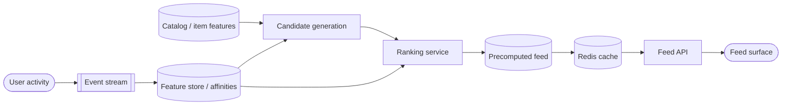
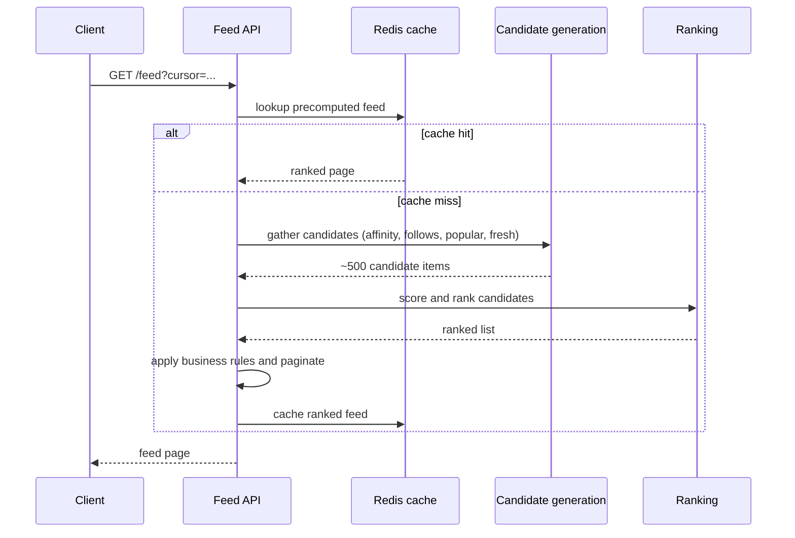
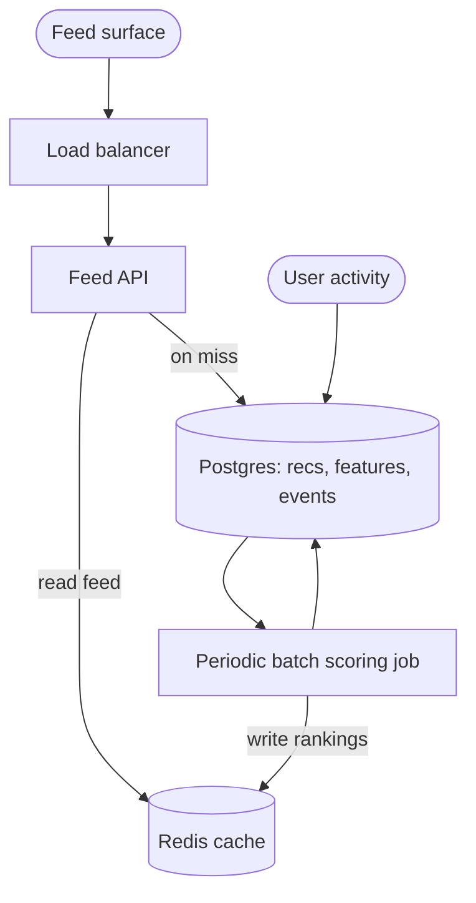
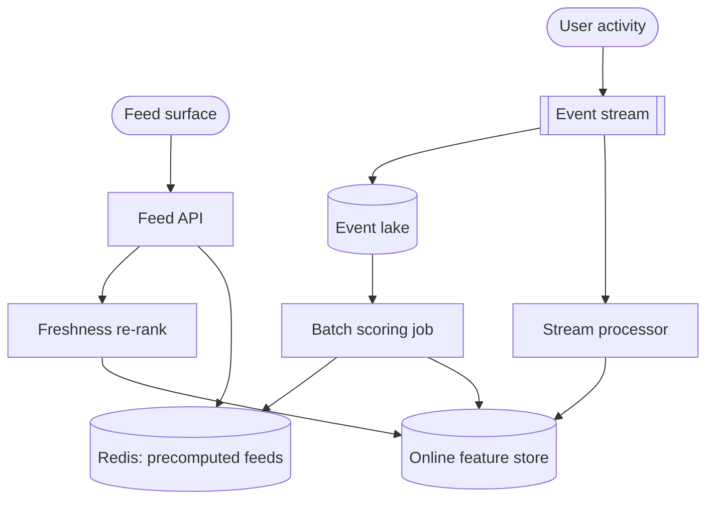
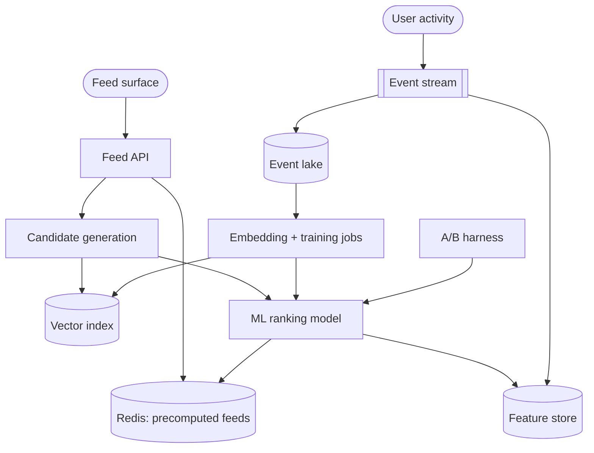
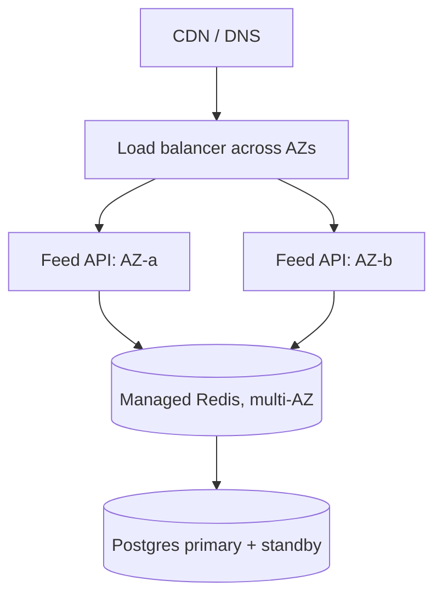
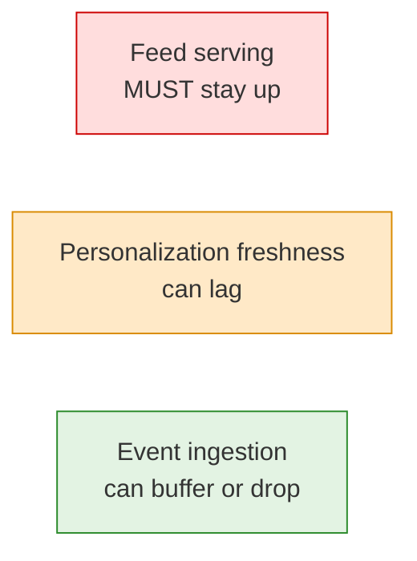

# Personalized Feed and Recommendations: Interview Walkthrough

A complete, interview-ready playbook for the personalized feed and
recommendation system problem, built for the Reverb.com **Engineer II,
Activation & Retention** interview. This is the most Reverb-specific question
in the set: a gear marketplace lives or dies on whether buyers, sellers, and
musicians keep coming back, and the feed is the surface that decides that.
Treat this as a script for a conversation, not a monologue: keep clarifying,
sizing, drawing, and evolving the design as you go.

The single most important idea to anchor every decision:

> **A feed is a ranking problem on a read-heavy path. Precompute and cache the
> expensive scoring so the request stays a fast lookup, and start with a
> transparent weighted score before reaching for any ML.**

A complementary principle explains *why* every tool below works:

> **CPU is cheap; moving data is expensive.** Caches, precomputed feeds,
> feature stores, and queues all exist to avoid recomputing scores and moving
> data on the hot request path.

## How to use this walkthrough

- **Lead with reasoning, not recall.** The interviewer is listening for
  engineering judgment. For every component, say *why* it exists and *what*
  problem it solves. The "why" callouts throughout this doc are the lines that
  separate a candidate who memorized a recsys diagram from one who has
  judgment.
- **Drive the conversation in this order:** clarify requirements, size the
  load, sketch the simplest correct design (a weighted score plus a cache),
  then evolve it only in response to a bottleneck you just named out loud.
- **Resist the urge to start with ML.** The strongest signal you can send on a
  recommendations question is to build a transparent, tunable baseline first
  and explain exactly when a learned model would earn its complexity.
- **Time-box yourself** (for a 45-minute round):
  - 5 min: requirements and scope
  - 5 min: capacity math and the read/write split
  - 10 min: API, data model, the weighted score, two-stage retrieval
  - 15 min: scale evolution (precompute, cache, pipeline, feature store,
    embeddings)
  - 10 min: deep dives the interviewer steers toward (cold start, metrics,
    diversity, reliability)
- **Resist premature complexity.** Naming a tool you are choosing *not* to use
  yet (a vector database, a learned ranker, OpenSearch) is a stronger signal
  than reaching for it on slide one.

## Table of contents

- [Personalized Feed and Recommendations: Interview Walkthrough](#personalized-feed-and-recommendations-interview-walkthrough)
  - [How to use this walkthrough](#how-to-use-this-walkthrough)
  - [Table of contents](#table-of-contents)
  - [0. Opening move: clarify requirements first](#0-opening-move-clarify-requirements-first)
    - [Why clarify before architecting](#why-clarify-before-architecting)
    - [Deliberately out of scope, and why](#deliberately-out-of-scope-and-why)
  - [1. Core mental model](#1-core-mental-model)
  - [2. API design](#2-api-design)
    - [Why this API shape](#why-this-api-shape)
  - [3. Data model](#3-data-model)
    - [Why this data model](#why-this-data-model)
  - [4. The ranking score: start simple before ML](#4-the-ranking-score-start-simple-before-ml)
    - [Why a transparent weighted score first](#why-a-transparent-weighted-score-first)
    - [How each signal is computed](#how-each-signal-is-computed)
    - [How the weights evolve](#how-the-weights-evolve)
  - [5. Two-stage retrieval: candidates then ranking](#5-two-stage-retrieval-candidates-then-ranking)
    - [Why two stages exist](#why-two-stages-exist)
  - [6. Pull vs push: when to precompute the feed](#6-pull-vs-push-when-to-precompute-the-feed)
    - [Why precompute plus a freshness pass](#why-precompute-plus-a-freshness-pass)
  - [7. Back-of-the-envelope toolkit](#7-back-of-the-envelope-toolkit)
    - [Why the math matters](#why-the-math-matters)
  - [8. Scale evolution: V1 to V3](#8-scale-evolution-v1-to-v3)
    - [8.1 V1: precomputed rankings in Postgres and Redis](#81-v1-precomputed-rankings-in-postgres-and-redis)
      - [Why start here](#why-start-here)
    - [8.2 V2: event pipeline, feature store, freshness re-rank](#82-v2-event-pipeline-feature-store-freshness-re-rank)
      - [Why a streaming pipeline and feature store](#why-a-streaming-pipeline-and-feature-store)
    - [8.3 V3: embeddings, vector search, learned ranking](#83-v3-embeddings-vector-search-learned-ranking)
      - [Why embeddings and a learned ranker](#why-embeddings-and-a-learned-ranker)
  - [9. Capacity reasoning in plain English](#9-capacity-reasoning-in-plain-english)
  - [10. Cold start: new and anonymous users](#10-cold-start-new-and-anonymous-users)
  - [11. Caching and precompute](#11-caching-and-precompute)
    - [CDN and edge caching: what's cacheable](#cdn-and-edge-caching-whats-cacheable)
    - [Read-after-write consistency: what needs it](#read-after-write-consistency-what-needs-it)
  - [12. Evaluation and metrics](#12-evaluation-and-metrics)
  - [13. Diversity, business rules, and freshness](#13-diversity-business-rules-and-freshness)
  - [14. Reliability and failure modes](#14-reliability-and-failure-modes)
  - [15. Abuse, privacy, and trust](#15-abuse-privacy-and-trust)
  - [16. Closing summary](#16-closing-summary)
  - [17. Addendum: scaling beyond the largest tier](#17-addendum-scaling-beyond-the-largest-tier)
    - [Stage 1: same region, multiple availability zones](#stage-1-same-region-multiple-availability-zones)
    - [Stage 2: multi-region reads, single-region writes](#stage-2-multi-region-reads-single-region-writes)
    - [Stage 3: multi-region active-passive for disaster recovery](#stage-3-multi-region-active-passive-for-disaster-recovery)
    - [High availability by criticality](#high-availability-by-criticality)
    - [The optimization ladder: the exact order before sharding](#the-optimization-ladder-the-exact-order-before-sharding)
    - [Database partitioning and sharding: when and how](#database-partitioning-and-sharding-when-and-how)
    - [Final addendum summary](#final-addendum-summary)
  - [18. Decision rationale cheat sheet](#18-decision-rationale-cheat-sheet)
  - [19. One-page cheat sheet](#19-one-page-cheat-sheet)

## 0. Opening move: clarify requirements first

Open with a sentence that frames the whole problem and shows you know the
design space:

> "Before I draw anything, I'd like to pin down what 'feed' means here and at
> what scale. A marketplace feed can be a simple popularity ranking refreshed
> nightly, or a fully personalized, real-time recommendation system with a
> learned ranker. Those are very different builds, so let me clarify which one
> we're targeting and what signals we have."

Then ask targeted questions, grouped by category.

- **Personalization depth:** "Is this a personalized per-user feed, or a
  generic 'trending on Reverb' surface? My default for an Activation &
  Retention team is personalized, because a relevant feed is the core return
  loop, but I want to confirm."
- **Freshness:** "How fresh must the feed be? Is a ranking recomputed every few
  hours acceptable, or must a brand-new listing or a price drop on a watched
  item show up within seconds? That single answer decides how much we
  precompute versus compute at request time."
- **Latency budget:** "What's the feed-load latency target? I'd aim for
  something like p99 under ~200 ms so the home screen feels instant, which
  pushes the expensive scoring off the request path."
- **Available signals:** "What can I personalize on? Searches, item views,
  likes and watches, saved searches, purchases, followed brands and sellers,
  cart adds, and offers are all strong signals on a gear marketplace. Which are
  available, and how clean are they?"
- **Cold start:** "How do we treat a brand-new or logged-out visitor with no
  history? And do we track anonymous activity so personalization carries over
  when they sign up?"
- **Scale and catalog:** "How many daily active users, how many feed loads per
  user, and how large is the active catalog? Millions of live listings means I
  cannot score the whole catalog per request."
- **Read vs write volume:** "I expect feed reads to dominate the serving path,
  while raw activity events are an even higher-volume but asynchronous write
  stream. I'll design those as two separate paths."

### Why clarify before architecting

- **The design changes completely with the answers.** A nightly popularity
  ranking is a cron job and a table; a real-time personalized feed with a
  learned ranker is an event pipeline, a feature store, and a serving model.
  Jumping straight to the second is the cardinal engineering sin of optimizing
  before you understand the problem.
- **Freshness is the pivotal axis.** "Recompute every few hours" lets you
  precompute everything cheaply; "new listings in seconds" forces a real-time
  re-rank pass. Naming this early shows you understand what actually drives the
  architecture.
- **Functional versus non-functional matters** because functional needs say
  *what* to rank, while non-functional ones drive *how*: the latency budget
  forces precompute and caching, the freshness requirement forces a real-time
  path, and the cold-start requirement forces a non-personalized fallback.

### Deliberately out of scope, and why

Naming what you are *not* building is as much a judgment signal as what you
are. For a Reverb feed specifically:

- **Not the search or catalog service.** Keyword search, faceted filtering, and
  the listing source of truth are a separate system; the feed *consumes* item
  features and links into listings. Search has its own design problem and I
  wouldn't conflate them.
- **Not checkout, payments, or inventory.** Those are strongly-consistent
  transactional systems. The feed only links to a listing; it never moves
  money or decrements stock, so it can be eventually consistent.
- **Not the notification delivery pipeline.** The team also owns notifications,
  and the *same* ranking powers "price drop on a watched amp" emails and push,
  but the transport (queues, push providers, email) is a separate build. I'd
  reuse the ranking, not the delivery plumbing.
- **Not the media/image pipeline.** Listing photos live in object storage
  behind a CDN, served by the catalog. The feed returns image URLs; it doesn't
  resize or transcode anything on the request path.
- **Not a full MLOps platform on day one.** No model registry, GPU serving, or
  per-keystroke retraining in V1. I'll name where those arrive (V3) and refuse
  to build them before a measured need.

The meta-point to voice: I add ML and vector infrastructure only when the
transparent weighted baseline stops improving, not because recommendation
systems "are supposed to" use them.

## 1. Core mental model

The system has two paths that must be kept separate. Say this out loud; it
organizes the entire interview.

- **Write path (activity ingestion):** `User activity -> event stream ->
  feature store / affinities`. High volume, append-only, asynchronous, never on
  the hot path.
- **Read path (feed serving):** `Feed request -> precomputed ranking + cache ->
  light freshness re-rank -> paginated page`. Latency-sensitive and must always
  return something.

Between them sits the **scoring pipeline**: candidate generation narrows the
catalog, then ranking scores the candidates. The expensive work is done ahead
of time and cached, so the request is a lookup.



The key insight, stated explicitly:

> "Feed loads massively outnumber the events that change a feed, so I scale the
> read path first. I precompute the expensive ranking and serve it from cache,
> and I keep ingestion on a separate asynchronous path so a click storm never
> slows down a feed load."

A feed request, end to end. This shows the logical flow even though, in
production, candidate generation and ranking run mostly ahead of time (see
section 6):



Conversion rules you'll reuse all interview:

- `daily feed loads / 86,400` = average feed read QPS
- `daily activity events / 86,400` = average event ingest QPS
- `peak QPS ≈ average QPS × 10` — state the multiplier you assume: ~10× is a
  conservative allowance for spiky bursts (app opens cluster around mornings,
  evenings, paydays, and gear-sale events), while steadier traffic is often
  only 2–3×

## 2. API design

Keep the serving surface tiny and keep ingestion separate from reads.

Fetch a page of the personalized feed:

```http
GET /feed?cursor=eyJvIjowfQ&limit=20
Authorization: Bearer <token>
```

```json
{
  "items": [
    {
      "itemId": "li_88231",
      "title": "Fender American Pro II Stratocaster",
      "priceCents": 169900,
      "imageUrl": "https://img.reverb.example/li_88231.jpg",
      "reason": "Because you watch Electric Guitars",
      "score": 0.82
    }
  ],
  "nextCursor": "eyJvIjoyMH0",
  "source": "personalized"
}
```

Record explicit feedback (a strong negative or positive signal):

```http
POST /feed/feedback
Content-Type: application/json

{
  "itemId": "li_88231",
  "action": "dismiss"
}
```

Ingest activity events on a separate, high-volume path (batched,
fire-and-forget):

```http
POST /events
Content-Type: application/json
Idempotency-Key: batch_9f12c7

{
  "events": [
    { "type": "view",  "itemId": "li_88231", "ts": "2026-06-15T20:00:00Z" },
    { "type": "watch", "itemId": "li_90011", "ts": "2026-06-15T20:00:05Z" }
  ]
}
```

### Why this API shape

- **`GET /feed` is a paginated read** and uses **cursor/keyset pagination**, not
  `OFFSET`. Users scroll deep into the feed; `OFFSET` scans and discards rows
  and degrades on deep pages, while a cursor stays fast at any depth.
- **The feed returns hydrated cards plus a human-readable `reason`.** "Because
  you watch Electric Guitars" is the user-facing payoff of a transparent score
  (section 4). Explainable recommendations build trust, and trust drives
  engagement, which is the whole point for an Activation & Retention team.
- **The `source` field is honest about degradation.** It reports
  `personalized`, `cold_start`, or `fallback` so clients and dashboards can see
  when we are serving the safety-net feed (section 14).
- **Events post to a separate endpoint, off the read path.** Ingestion is the
  highest-volume traffic in the system; it is batched client-side and
  fire-and-forget so it never blocks or slows a feed load. **Never let a
  non-critical write block a critical read.**
- **`Idempotency-Key` on the event batch** makes at-least-once ingestion safe:
  a client retry on a flaky network must not double-count a watch and inflate
  an affinity.
- **Explicit feedback (`dismiss`, `not interested`) is a first-class signal.**
  It improves personalization and gives the user control, which is itself a
  retention and trust feature.

## 3. Data model

Start with the minimum that satisfies correctness and keeps everything in
Postgres, and say you're doing so deliberately.

Raw activity, append-only and time-partitioned:

```sql
CREATE TABLE events (
  id          BIGSERIAL PRIMARY KEY,
  user_id     BIGINT NULL,        -- NULL when logged out
  anon_id     TEXT NULL,          -- device/cookie id before signup
  session_id  TEXT NOT NULL,
  item_id     BIGINT NULL,
  event_type  TEXT NOT NULL,      -- view, watch, search, offer, purchase, follow
  category    TEXT NULL,
  brand       TEXT NULL,
  metadata    JSONB NULL,
  created_at  TIMESTAMPTZ NOT NULL DEFAULT now()
) PARTITION BY RANGE (created_at);
```

The catalog (source of truth for what can be recommended):

```sql
CREATE TABLE items (
  id          BIGSERIAL PRIMARY KEY,
  seller_id   BIGINT NOT NULL,
  title       TEXT NOT NULL,
  category    TEXT NOT NULL,
  brand       TEXT NULL,
  condition   TEXT NOT NULL,      -- new, used, b-stock
  price_cents BIGINT NOT NULL,
  status      TEXT NOT NULL,      -- active, sold, removed
  listed_at   TIMESTAMPTZ NOT NULL,
  updated_at  TIMESTAMPTZ NOT NULL
);
```

Derived features, computed by the pipeline:

```sql
CREATE TABLE item_features (
  item_id          BIGINT PRIMARY KEY REFERENCES items(id),
  popularity_score REAL NOT NULL DEFAULT 0,
  views_7d         BIGINT NOT NULL DEFAULT 0,
  watches_7d       BIGINT NOT NULL DEFAULT 0,
  sales_velocity   REAL NOT NULL DEFAULT 0,
  updated_at       TIMESTAMPTZ NOT NULL
);

CREATE TABLE user_affinities (
  user_id        BIGINT NOT NULL,
  dimension      TEXT NOT NULL,   -- 'category' or 'brand'
  value          TEXT NOT NULL,   -- e.g. 'Electric Guitars', 'Fender'
  affinity_score REAL NOT NULL,   -- 0..1, time-decayed
  updated_at     TIMESTAMPTZ NOT NULL,
  PRIMARY KEY (user_id, dimension, value)
);
```

The explicit follow graph and the precomputed per-user feed:

```sql
CREATE TABLE follows (
  user_id     BIGINT NOT NULL,
  target_type TEXT NOT NULL,      -- 'brand' or 'seller'
  target_id   TEXT NOT NULL,
  created_at  TIMESTAMPTZ NOT NULL,
  PRIMARY KEY (user_id, target_type, target_id)
);

CREATE TABLE precomputed_recommendations (
  user_id       BIGINT PRIMARY KEY,
  item_ids      BIGINT[] NOT NULL, -- ranked, highest score first
  scores        REAL[]   NOT NULL,
  model_version TEXT     NOT NULL,
  generated_at  TIMESTAMPTZ NOT NULL
);
```

Indexes that matter:

- `events`: `INDEX(user_id, created_at)` and `INDEX(anon_id, created_at)` for
  building affinities; partition by day so retention is a partition drop.
- `items`: `INDEX(category, status, listed_at)` and
  `INDEX(brand, status, listed_at)` for candidate generation; `INDEX(seller_id)`
  for the per-seller diversity cap.
- `precomputed_recommendations`: the `user_id` primary key *is* the feed lookup.

### Why this data model

- **`events` is append-only and partitioned by time.** It's the highest-volume
  table and never gets updated, so time partitioning makes retention a cheap
  `DROP PARTITION` instead of a giant `DELETE`. This is the same instinct as
  TinyURL's click-events table, just larger.
- **Derived tables separate raw events from features.** `user_affinities` and
  `item_features` are materialized by the pipeline; keeping them apart from raw
  events is the seed of a feature store and lets the read path touch small,
  indexed tables instead of scanning history.
- **`precomputed_recommendations` is the push model in one table.** Storing each
  user's ranked `item_ids` as an array keeps it to one compact row per user, so
  a feed read is a single primary-key lookup, not a scoring job.
- **`follows` is a high-precision, nearly free signal.** A followed brand or
  seller is an explicit declaration of interest and a cheap candidate source —
  no inference required.
- **`items.status` enforces a correctness rule at serve time.** Recommending a
  sold or removed guitar is a terrible experience; filtering on `status =
  'active'` is non-negotiable.
- **`anon_id` makes anonymous cold start work.** We track logged-out activity by
  device/cookie id and backfill `user_id` by `anon_id` on signup, so
  personalization doesn't reset to zero (section 10).
- **It's all Postgres.** Arrays, JSONB, and partitioning cover V1 and V2 with no
  new datastore — "Postgres until it hurts."

## 4. The ranking score: start simple before ML

This is the heart of the problem, and the place most candidates over-reach.
Lead with a transparent weighted score, not a model:

```text
score(user, item) =
    0.4 * category_affinity(user, item.category)
  + 0.3 * brand_affinity(user, item.brand)
  + 0.2 * popularity(item)
  + 0.1 * freshness(item.listed_at)
```

State the headline clearly:

> "My V1 ranker is a transparent weighted sum of four signals — category
> affinity, brand affinity, popularity, and freshness. It needs no training
> data and no model-serving infrastructure, I can explain every recommendation,
> and it gives me a strong baseline that any future ML model has to beat to
> justify its cost."

### Why a transparent weighted score first

- **It's interpretable.** I can tell the user *and myself* exactly why an item
  ranked where it did, which powers the "Because you watch Electric Guitars"
  label and makes debugging a bad feed tractable.
- **It's tunable without retraining.** Weights are config. I can change them per
  experiment, per segment, or per surface and ship in minutes — no training
  pipeline, no model deploy.
- **It needs no ML infrastructure.** No labeled data, no offline training, no
  GPU serving, no feature freshness contract between training and serving. That
  is a huge amount of complexity I get to defer.
- **It's a baseline, not a dead end.** A learned model only earns its keep if it
  beats this score on real metrics. Starting here gives me the yardstick and
  prevents me from shipping complexity that doesn't move the numbers.
- **It degrades cleanly.** If affinities are missing (a new user), the score
  naturally falls back toward popularity and freshness — the cold-start feed
  drops out of the same formula.

### How each signal is computed

Each affinity is time-decayed engagement, normalized to `0..1`:

```text
decayed_engagement(u, x) =
  Σ over events e of user u touching x:
      weight(e.type) * exp(-age_days(e) / HALF_LIFE)

weight:  view=1, search_click=2, watch=4, offer=8, follow=10, purchase=12
HALF_LIFE ≈ 14 days
```

```text
category_affinity(u, c) = decayed_engagement(u, c) / max_c' decayed_engagement(u, c')
brand_affinity(u, b)    = decayed_engagement(u, b) / max_b' decayed_engagement(u, b')
popularity(i)           = log(1 + views_7d + 3*watches_7d + 10*sales_7d) / NORM
freshness(i)            = exp(-age_hours(i) / TAU)        -- TAU ≈ 72 h
```

The reasoning to narrate:

- **Stronger actions weigh more.** A purchase or a follow says far more than a
  passing view, so the event weights reflect intent. This also blunts abuse:
  cheap-to-fake views count for little, expensive-to-fake purchases count for a
  lot.
- **Recency decay keeps the feed current.** A 14-day half-life means last
  month's binge on drum machines fades as this week's interest in pedals grows.
- **Popularity is log-scaled** so a few viral listings don't dominate every
  feed, and it doubles as social proof and a cold-start signal for items.
- **Freshness rewards new inventory** with an exponential decay by listing age,
  which matters on a marketplace where new gear arrives constantly and the best
  deals move fast.

### How the weights evolve

> "I'd treat the weights as hypotheses and let experiments move them. Ship the
> initial vector, then A/B test variants — more freshness for highly active
> buyers, more popularity for thin-history users — and keep whatever lifts
> retention and conversion without hurting guardrails."

The evolution path is explicit and incremental:

1. Hand-tuned weights, validated by A/B tests (V1).
2. Per-segment weights (new vs power users) once experiments justify it.
3. Replace the hand-tuned sum with a **learned ranker** (logistic regression,
   then gradient-boosted trees, then a neural ranker) that learns the weights
   and feature interactions from labeled engagement data — same score shape,
   learned coefficients (V3).

The point: the architecture doesn't change when the model does. The ranker is a
function `candidates -> scores`; how it computes scores can grow from a weighted
sum to a neural net behind the same interface.

## 5. Two-stage retrieval: candidates then ranking

You cannot score the entire catalog for every request. The universal recsys
pattern is two stages:

- **Stage 1 — candidate generation (recall).** Cheaply narrow millions of
  listings to a few hundred using simple, indexed lookups and set operations.
- **Stage 2 — ranking (precision).** Apply the more expensive score (section 4)
  to just those candidates, sort, apply business rules, and paginate.

Candidate sources, unioned and de-duplicated:

```text
candidates(user) = dedupe(union(
  top categories by affinity   -> recent active listings in those categories,
  followed brands and sellers  -> their recent active listings,
  saved searches               -> new matches since last visit,
  watchlist                    -> price drops / back-in-stock,
  popular-in-category          -> trending where the user has affinity,
  recently listed              -> fresh inventory in affinity categories
))[:500]
```

### Why two stages exist

- **Scoring the whole catalog is infeasible.** With ~5M active listings, scoring
  every one at even ~1 µs costs ~5 s of CPU per feed request; at ~1,150 feed
  QPS that's roughly **5,800 cores doing nothing but scoring**. That's absurd,
  so recall must come first.
- **Two stages collapse the cost.** Scoring ~500 candidates at ~1 µs is ~0.5 ms
  per request — under **one core** for the same QPS. Cheap recall plus
  expensive-but-tiny ranking is what makes personalized feeds tractable.
- **The stages optimize for different things.** Candidate generation optimizes
  recall (don't miss anything relevant) with cheap heuristics; ranking
  optimizes precision (order the shortlist well) with the real score. Conflating
  them is what makes naïve designs fall over.
- **Candidate sources map straight onto Reverb signals.** Followed brands,
  saved-search matches, and watchlist price drops are high-intent recall sources
  that are basically free index lookups — exactly the cheap recall the pattern
  wants.

## 6. Pull vs push: when to precompute the feed

This is the central architecture decision, and the interviewer will press on
it. Lay out both models honestly.

- **Pull (fan-out-on-read, query-time).** Build the feed when the user asks for
  it: candidate generation plus ranking on the request. Always fresh, no
  storage, no wasted work for inactive users — but expensive per request, slow
  on the hot path, and hard to cache when fully personalized.
- **Push (fan-out-on-write, precomputed).** Compute each user's ranked feed
  ahead of time with a batch job, store it in `precomputed_recommendations`, and
  serve it as a lookup. The request is fast and the scoring cost is amortized —
  but you pay storage per user, the feed is as stale as the last run, you waste
  compute on users who don't return, and brand-new listings are missed until
  the next run.

For a gear marketplace, the strong answer is a **hybrid**:

> "I'd precompute per-user rankings periodically and serve them from cache, then
> run a lightweight real-time re-rank at request time that injects brand-new
> listings, watchlist price drops, and very recent session signals on top of the
> precomputed base. Precompute gives me a fast, cheap read path; the re-rank
> gives me freshness where it matters."

### Why precompute plus a freshness pass

- **Reads dominate, so precompute wins the base feed.** Browsing is the dominant
  activity; users load the feed far more often than their relevant inventory
  meaningfully changes. Precomputing moves the expensive scoring off the hot
  path and turns a feed load into a lookup — the data-movement principle in
  action.
- **Pure push misses freshness, which a marketplace can't afford.** A new
  listing of a sought-after guitar, or a price drop on a watched amp, should
  surface in minutes, not at the next nightly run. The real-time re-rank handles
  exactly that time-sensitive slice that precompute would miss.
- **It's not social-network fan-out.** On Twitter or Instagram, a new post is
  fanned out on write to followers' feeds because the follow graph is the feed.
  On Reverb the relationship is affinity-based and inventory churns constantly,
  so per-user precompute plus freshness injection fits better than writing every
  new listing into millions of follower feeds.
- **It bounds wasted work.** Precompute only active users frequently and
  inactive users rarely (or lazily on their next visit), so we don't burn CPU
  ranking feeds nobody loads.

## 7. Back-of-the-envelope toolkit

State your assumptions, then turn them into design pressure.

Assumptions for the target scale:

- 10M DAU
- ~10 feed reads per user per day (a few sessions, each with some scrolling) →
  **100M feed reads/day**
- ~30 tracked activity events per user per day → **300M events/day**
- ~5M active listings in the catalog

Feed read QPS (the serving path):

| Metric | Average | Peak (×10) |
| --- | --- | --- |
| Feed read QPS | `100,000,000 / 86,400 ≈ 1,157` | `≈ 11,570` |

Event ingest QPS (the asynchronous write path):

| Metric | Average | Peak (×10) |
| --- | --- | --- |
| Event ingest QPS | `300,000,000 / 86,400 ≈ 3,472` | `≈ 34,720` |

The reusable moves:

- feed read QPS = `daily feed loads / 86,400` (since a day ≈ `10^5 s`, this is
  roughly `daily loads / 100,000`)
- event ingest QPS = `daily events / 86,400`
- peak ≈ average × 10 — **state the assumption**: ~10× is conservative for spiky
  app-open and sale-event bursts; steady traffic is often 2–3×
- provision for **peak**, not average

The scoring cost that forces the architecture:

- score the whole catalog per request: `5,000,000 items × ~1 µs ≈ 5 s` of CPU →
  at ~1,157 QPS that's `~5,785` cores. Infeasible.
- score ~500 candidates per request: `500 × ~1 µs ≈ 0.5 ms` → `< 1` core at the
  same QPS. This is *why* two-stage retrieval and precompute exist.

Storage facts worth stating:

- precomputed feeds: `10M users × ~300 ids × 8 bytes ≈ 25 GB` (plus scores) —
  modest; fits in Redis/Postgres comfortably.
- events: `300M/day × ~300 bytes ≈ 90 GB/day ≈ 33 TB/year` — this is the big one
  and the reason events need partitioning, retention, and eventually a data
  lake, long before the feed table does.
- item features: `5M × ~1 KB ≈ 5 GB` — trivial; fits in RAM.

Latency hierarchy worth memorizing (orders of magnitude) — this is what makes
"precompute and cache" concrete:

| Operation | Latency |
| --- | --- |
| RAM | ~100 ns |
| Redis lookup | ~0.1–1 ms |
| Postgres query | ~1–10 ms |
| Service call | ~1–20 ms |
| Cross-region hop | ~70–150 ms |

The takeaway: serving a precomputed feed from Redis is a sub-millisecond
lookup, versus seconds to score the catalog live. CPU is cheap; moving and
recomputing data on the request path is expensive, so we precompute once and
serve thousands of times.

### Why the math matters

- **Numbers convert intuition into a forcing function.** "We can't score
  everything" is an opinion until you compute ~5,800 cores per request-second.
  That single number forces two-stage retrieval and precompute, so they're
  earned rather than cargo-culted.
- **The read/write split is the headline.** ~1,150 feed QPS to serve versus
  ~3,500 events/sec to ingest tells you to build two paths: a fast cached read
  path and a high-throughput asynchronous write path. They scale independently.
- **Peak versus average matters** because you provision for the busiest hour —
  the evening browse session or the Black Friday gear sale — not the quiet
  average when nobody is shopping.

## 8. Scale evolution: V1 to V3

Mirror the modern scaling ladder: start boring, add complexity only against a
measured bottleneck, and stay on Postgres until it hurts.

### 8.1 V1: precomputed rankings in Postgres and Redis

The simplest correct design: a batch job scores the weighted sum and writes
per-user rankings; the feed API serves them from Redis with Postgres behind it.



What runs where:

- The **batch job** (every few hours, plus a nightly full pass) reads recent
  events, updates `user_affinities` and `item_features`, runs candidate
  generation and the weighted score per user, and writes
  `precomputed_recommendations` plus warms Redis.
- The **feed API** is stateless: look up the user's ranked ids in Redis, filter
  out sold/dismissed items, hydrate from `items`, paginate.
- **Cold start** is the same pipeline with no affinities: the score collapses to
  popularity and freshness, and we serve curated/popularity shelves
  (section 10).

#### Why start here

- `Batch -> Postgres -> Redis -> API` is correct, debuggable, and deployable on
  day one. There's no event streaming, no feature store, and no model serving to
  operate — none of which a weighted score needs.
- **It already embodies the core principle:** the expensive scoring is
  precomputed and cached, so the read path is a lookup. That's most of the win,
  with almost none of the complexity.
- **Postgres is plenty here.** Tens of GB of features and recs, a few thousand
  events/sec ingested in batches, and primary-key feed lookups are squarely
  within a single well-indexed Postgres plus Redis. Adding Kafka or a vector DB
  now would be a distributed monolith solving problems we don't have.

### 8.2 V2: event pipeline, feature store, freshness re-rank

The bottleneck that triggers V2: features are stale between batch runs, and
brand-new listings don't surface fast enough. Add a streaming pipeline, an
online feature store, and a real-time re-rank.



What changes:

- Events flow through a **stream** (a managed queue/log) instead of landing
  straight in Postgres. A **stream processor** updates online features (recent
  session activity, fresh listings) within seconds.
- A **feature store** serves features two ways: offline (for the batch scorer)
  and online (for the request-time re-rank), with the same definitions to avoid
  training/serving skew.
- The **freshness re-rank** runs at request time on the precomputed base: it
  pulls just-listed items in the user's affinity categories, applies watchlist
  price drops, and blends very recent session signals into the top of the feed.

#### Why a streaming pipeline and feature store

- **A queue decouples and smooths.** Ingestion spikes (a sale event) hit the
  stream at a flat cost while processors drain at their own pace, so a click
  surge never overwhelms Postgres. The queue also lets ingestion, feature
  computation, and scoring scale independently.
- **The feature store kills training/serving skew.** Computing an affinity one
  way in the batch job and another way at request time silently corrupts
  rankings. One definition serving both paths is what keeps the model honest.
- **The re-rank buys freshness without abandoning precompute.** We keep the
  cheap cached base feed and spend a few milliseconds injecting the
  time-sensitive slice — the hybrid from section 6 made real.
- **Delivery semantics are explicit.** The stream is **at-least-once**, so
  feature consumers must be **idempotent** (dedupe by event id) and repeatedly
  failing events go to a **dead-letter queue** instead of blocking the pipeline
  or double-counting a watch.

### 8.3 V3: embeddings, vector search, learned ranking

The bottleneck that triggers V3: heuristic candidate generation misses relevant
gear ("similar vibe, different brand") and the hand-tuned score plateaus. Add
embeddings with vector search for recall and a learned ranker for precision,
all behind an experimentation harness.



What changes:

- **Embeddings** represent items (and users) as vectors learned from
  co-engagement and content. **Approximate nearest-neighbor** search over a
  vector index becomes a powerful candidate source: "items similar to what you
  engage with," beyond exact category/brand matches.
- **A learned ranker** (gradient-boosted trees, then a neural ranker) replaces
  the hand-tuned weighted sum, learning feature interactions from labeled
  engagement. Same interface, smarter scores.
- **An A/B harness** assigns users to model/weight variants, tracks metrics and
  guardrails, and makes "ship the model that lifts retention" a measured
  decision (section 12).

#### Why embeddings and a learned ranker

- **They earn their place only after the baseline plateaus.** Vector search and
  ML add real infrastructure — training pipelines, an index to keep fresh,
  model serving and monitoring. I add them when experiments show the weighted
  score has stopped improving, not before.
- **Postgres until it hurts, even here.** I'd start vector search with
  **`pgvector`** inside the Postgres I already run, and only move to a dedicated
  vector database (such as Pinecone) when index size, recall, or query latency
  actually forces it. Same discipline as not starting with OpenSearch for
  search.
- **The architecture is stable across the change.** Candidate generation and
  ranking are the same two stages from section 5; V3 swaps heuristic recall for
  ANN recall and a weighted sum for a learned model. That stability is the
  payoff of designing the interfaces well in V1.

## 9. Capacity reasoning in plain English

Talk through the numbers, don't just recite them:

- At 10M DAU, ~1,150 average and ~11,600 peak feed read QPS is **serious
  product scale, but not internet-scale**. Served from precomputed rankings in
  Redis, it's a sub-millisecond lookup per request — comfortable for stateless
  app servers plus a cache.
- **Ingestion is the higher-throughput path** at ~3,500 average and ~35,000 peak
  events/sec, but it's asynchronous and append-only. A stream plus batched
  writes absorbs it without ever touching the feed read path.
- **Keep Postgres as the durable source of truth, off the hot read path.** Feed
  loads hit Redis; Postgres holds events, features, the catalog, and the
  precomputed recs, and feeds the batch scorer.

The line to say:

> "I don't want Postgres scoring feeds on the request. I want Postgres as the
> source of truth and the batch job's workspace, Redis as the serving layer, and
> the event stream as the firehose that never touches a feed read."

Storage sanity check (a common follow-up):

- Precomputed recs: `10M × ~300 ids × 8 bytes ≈ 25 GB` — fits in memory; cheap
  to refresh.
- Events: `300M/day × ~300 bytes ≈ 90 GB/day ≈ 33 TB/year` — partition by day,
  set a retention window, and roll older data to a lake/warehouse for training.
- Item features: `5M × ~1 KB ≈ 5 GB` — trivial.

Latency and observability targets:

- **Design to a p99, not an average.** "The feed is fast" should be a concrete
  SLO like *p99 < 200 ms* for a feed load. The tail is what users feel — a cold
  cache miss that triggers live candidate generation is exactly where latency
  spikes.
- The read critical path is deliberately short: a cache lookup plus a light
  re-rank. Every added dependency widens the tail.
- Track the golden signals for the feed: **p99 latency, cache hit rate, QPS,
  error rate, and fallback rate** (how often we serve the degraded feed), each
  with an SLO and error budget so complexity is added against data, not vibes.

## 10. Cold start: new and anonymous users

A feed that's empty or irrelevant on the first visit kills activation. Handle
cold start as a first-class case, not an afterthought.

- **Anonymous and brand-new users get curated and popularity feeds.** With no
  history, serve editorially curated and trending shelves: "Trending in Electric
  Guitars," "New arrivals," "Best sellers," "Staff picks," optionally
  geo/seasonal. These come straight out of the weighted score with affinity set
  to zero, so the score naturally falls back to popularity and freshness.
- **Personalize progressively within the session.** The moment a logged-out
  visitor views a couple of tube amps or searches "Telecaster," blend
  session-based affinity into the feed immediately — even before any batch run.
  A few signals are enough to move off the generic feed.
- **Track anonymous activity and merge it on signup.** Record events under an
  `anon_id` (device/cookie), and when the visitor signs up or logs in, backfill
  those events to their `user_id`. Personalization carries over instead of
  resetting to zero — the difference between a great and a hollow first
  logged-in feed.
- **Seed affinities during onboarding.** Ask new users to pick favorite
  categories and brands (the team owns onboarding too); that instantly seeds
  `user_affinities` and produces a relevant first feed before any behavior
  exists. This is the most direct activation lever in the system.
- **New *items* have a cold start too.** A brand-new listing has no engagement,
  so popularity can't rank it. Rely on content features (category, brand, price)
  plus the freshness boost and a guaranteed slice of candidate slots for recent
  listings, so new gear gets exposure to build signal.

The framing to say out loud:

> "Cold start is an activation problem. A logged-out musician should still see a
> compelling feed, a few clicks should visibly personalize it, and signing up
> must never throw that learning away. Curated and popularity feeds are the
> floor; the floor is never empty."

## 11. Caching and precompute

Caching is the mechanism that makes a personalized feed fast, but it has sharp
edges worth naming.

- **What to cache.** The per-user ranked `item_ids` (the precomputed feed),
  candidate sets for popular segments, and hydrated item cards. The feed lookup
  should be a single cache hit.
- **Hit rate is the health metric.** For active users with a precomputed feed,
  the hit rate is near 100%; a low hit rate means we're recomputing on the
  request path, adding latency for nothing.
- **Staleness versus freshness is a dial, not a binary.** A longer precompute
  interval is cheaper but staler; the real-time re-rank (section 8.2) covers the
  freshness gap so the base feed can refresh on a relaxed schedule.
- **Guard against cache stampede (thundering herd).** Don't let every user's
  cached feed expire at once. Mitigate with **jittered TTLs and staggered
  regeneration** (precompute on a rolling schedule, not a single cron spike),
  **request coalescing / a per-user lock** (one miss rebuilds while others
  wait), and **`stale-while-revalidate`** (serve the slightly stale feed while
  one worker refreshes it). A stale feed beats a slow or empty one.

Name the strategy:

> "It's precompute plus cache-aside: a scheduled job populates feeds ahead of
> time, and on a miss the API lazily rebuilds and repopulates. Jittered,
> staggered regeneration keeps a viral moment or a mass expiry from stampeding
> the scorer."

### CDN and edge caching: what's cacheable

Everything in section 11 so far is *origin-side* caching — Redis sitting next to
the app. A CDN pushes caching out to edge PoPs near the user, but be honest about
the hard limit: **a fully personalized per-user feed is not edge-cacheable as a
whole.** It's unique per viewer, sits behind auth, and shifts with every action,
so there's no shared response for the edge to replay — caching it at a shared
edge would either leak one user's feed to another or sit at a ~0% hit rate.

What *is* edge-cacheable is the shared, non-personalized surface — and it happens
to be the cold-start path (section 10) and the degradation fallback (section 14):

| Surface | Edge-cacheable? | Why |
| --- | --- | --- |
| Personalized per-user feed | No | Per-user, auth-gated, mutates constantly — no shared response to cache |
| Anonymous "trending"/popular feed | Yes, aggressively | Identical for everyone (or per coarse geo/category segment); the cold-start feed |
| Shared "Trending in Electric Guitars" shelves | Yes | One list shared across many users; vary by segment, not by user |
| Item cards / listing metadata | Yes, briefly | Shared by every feed containing the item; short TTL because price and `status` change |
| Listing images | Yes, for a long time | Immutable objects in object storage behind the CDN (section 0) — the biggest byte saver |

**The logged-out trending feed is the big win.** It's identical for everyone and
it's exactly what cold-start users see, so it can live at the edge with a short
TTL:

```http
GET /feed/trending
200 OK
Cache-Control: public, s-maxage=60, max-age=0
ETag: "trending-8123"
```

`s-maxage=60` lets the shared edge serve the trending feed for 60 s, so a spike
(a sale event, a homepage link) is absorbed at the edge instead of hammering the
ranker; `max-age=0` keeps browsers revalidating. **`ETag` plus conditional
requests** (`If-None-Match`) let a client that already holds the current trending
feed get a cheap `304 Not Modified` instead of re-downloading it.

**Listing images dominate feed bytes**, and they're immutable objects in object
storage — serve them through the CDN with long TTLs and content-hashed URLs.
That's the single biggest origin-bandwidth saver, and it sidesteps the
personalization problem entirely.

**Plan invalidation, because edge caching trades freshness for speed.** Keep
trending and shelf TTLs short (30–120 s) so a re-rank shows up quickly, and
**purge on change** — when the trending list is recomputed or a listing sells,
purge that URL or use a per-shelf / per-item **cache tag** so the edge drops it
immediately instead of waiting out the TTL. Item-card TTLs stay short for the
same reason: a sold item must leave the edge fast.

> "The personalized feed itself can't be edge-cached — it's per-user and
> auth-gated. But the logged-out trending feed, shared category shelves, item
> cards, and especially listing images are all edge-cacheable. I'd push those to
> a CDN with short `s-maxage` TTLs and `ETag` revalidation, and purge on re-rank
> or when a listing sells — and the cached trending feed doubles as the
> cold-start and degradation fallback."

### Read-after-write consistency: what needs it

Lead with the honest default: **the feed overwhelmingly tolerates eventual
consistency.** A brand-new view, search, or watch does *not* need to change the
ranking on the very next load — affinities are time-decayed aggregates, and a
signal that lands minutes later (after the stream and the next precompute) is
precisely the eventual consistency the read path is built around (section 14).
Forcing the whole feed to reflect every event synchronously would throw away
precompute and the cached read path for no user-visible gain.

The exceptions are the handful of **explicit, intentional actions where the user
is watching for the result** — here a stale feed reads as a broken product:

| Action | Tolerates lag? | Required behavior |
| --- | --- | --- |
| Passive signal (view, search, dwell) | Yes | Folds into affinities by the next precompute; no immediacy needed |
| "Not interested" / hide | No | The item must not reappear on the next load |
| Unfollow / mute a brand or seller | No | That content must drop out immediately |
| Just saved / watched / followed | No | The user expects to see it reflected right away |

Two cheap mechanisms cover every must-be-immediate case without making the
system synchronous:

1. **Write-through to the per-user feed cache.** On the mutating action, update
   the cached `item_ids` in place — drop the hidden or unfollowed items, or
   splice the just-saved item toward the top — so the very next read reflects it.
   This reuses the cache from this section and needs no replica-consistency
   guarantee.
2. **A session-level overlay applied at read time.** Keep a small per-session set
   of suppressions (hidden/blocked ids) and recent positives, and apply it as a
   filter/boost over whatever the cache returns. Even when the precomputed feed
   is stale, the overlay guarantees a hidden item never shows and a just-saved
   item surfaces — *read-your-own-writes* as a thin read-time layer, instead of
   routing reads to the primary.

Everything else stays eventual: passive signals flow through the stream and get
folded in at the next precompute or re-rank. Strong consistency is reserved for
where a *write* demands it — the `follows` row and explicit feedback are
committed to the Postgres primary so the action is durable, even though its
effect on ranking is allowed to propagate lazily.

> "Almost the whole feed tolerates eventual consistency — a new view changing my
> ranking minutes later is fine. The cases that don't are explicit actions the
> user is watching: hide/not-interested must not reappear, unfollow must drop
> that content, and a just-saved item should show. I handle those with a
> write-through to the per-user feed cache plus a session-level suppression/boost
> overlay at read time, and leave everything else eventual."

## 12. Evaluation and metrics

For an Activation & Retention team, measuring the feed *is* the job. Separate
offline from online evaluation and lead with the product metrics.

- **Offline (before shipping):** replay historical engagement to estimate
  ranking quality with precision@k, recall@k, and NDCG. Cheap and fast, but only
  a proxy — it can't capture how users react to a feed they've never seen.
- **Online (the truth):** A/B test variants, randomizing by user, and measure
  lift with proper significance testing. Online behavior is the real signal.
- **Engagement metrics:** feed click-through rate, add-to-watchlist rate,
  follow rate, message-seller and offer rate, scroll depth.
- **Activation and retention metrics (the north star):** time-to-first
  meaningful action for new users, first-session engagement, **return-visit rate
  and DAU/WAU**, and feed-attributed conversion and GMV. Retention is the goal;
  clicks are a means.
- **Guardrail metrics (must-not-break):** overall conversion, seller diversity,
  notification opt-out/unsubscribe rate, report/"not interested" rate, and feed
  latency. A variant that lifts CTR but tanks conversion or trust is a
  regression, not a win.

The framing to say out loud:

> "I'd be suspicious of optimizing CTR alone — it rewards clickbait listings and
> can erode trust and conversion. For an Activation & Retention team the real
> targets are first-session activation and return visits, with conversion and
> seller diversity as guardrails. Ship V1, then let experiments move the
> weights and models against those metrics."

## 13. Diversity, business rules, and freshness

A raw score is not a feed. A layer of business rules sits between ranking and
what the user sees, and the interviewer will want to hear it.

- **In-stock and active only.** Filter out sold, reserved, and removed listings
  before display. Recommending a guitar that's already gone is the fastest way
  to lose trust — this is a correctness rule, not a nicety.
- **Per-seller diversity cap.** Don't let one seller's inventory dominate the
  feed (e.g. cap to a few items per seller per page). It protects UX and
  marketplace fairness, and it's a simple post-ranking rule.
- **Category and brand diversity.** Use a diversity pass (such as maximal
  marginal relevance) so the feed isn't twenty near-identical Stratocasters.
  Variety keeps sessions longer and surfaces more of the catalog.
- **Avoid the filter bubble.** Reserve a slice of slots for exploration —
  adjacent categories, new brands — so users discover gear beyond their existing
  habits. This widens engagement and is good for long-term retention and
  marketplace breadth.
- **Respect explicit feedback.** Suppress dismissed and "not interested" items,
  and don't re-show items the user has already acted on.
- **Guarantee freshness slots.** Reserve part of every feed for just-listed
  inventory in the user's affinity categories and for saved-search matches, so
  brand-new gear and high-intent matches always have a path to the user even
  between precompute runs.

The line that lands:

> "The score decides relevance; business rules decide what's actually shippable.
> In-stock-only and a per-seller cap are non-negotiable, and a deliberate slice
> of diversity and freshness keeps the feed from collapsing into a narrow,
> stale loop."

## 14. Reliability and failure modes

The theme: **the feed must degrade gracefully and never be empty.** Walk these
quickly to show operational maturity.

- **Recommendation service down or slow:** time out fast and fall back to
  **cached curated/popularity shelves**. A non-personalized feed is a fine
  degradation; a spinner or an empty screen is not.
- **Feature store or stream lagging:** serve the last good precomputed feed
  (slightly stale) and skip the real-time re-rank. Freshness degrades; the feed
  still loads.
- **Redis down:** rebuild from `precomputed_recommendations` in Postgres at
  higher latency, and shed load to the curated feed if Postgres is at risk.
- **Postgres primary down:** cached feeds keep serving; precompute and feature
  updates pause until failover (promote standby) completes.
- **Bad scoring deploy or batch bug:** a model or job that writes nonsense
  rankings is **not** an availability failure — a replica faithfully copies the
  bad data. The fixes are **model/ranking versioning** (keep the previous
  `model_version` and roll back instantly) and **PITR (point-in-time
  recovery)** for the underlying tables.

Make the distinction explicit: **HA and PITR solve different problems, and you
need both.** HA (multi-AZ Postgres and Redis, failover) protects against a node
or zone dying; PITR plus model versioning protects against a deploy that
corrupts the recommendations themselves.

Name the resilience patterns that make the graceful degradation automatic:
**timeouts** on every call to the recsys, feature store, and cache; a **circuit
breaker** around the recommendation service so a slow model fails fast to the
curated fallback; **retries with exponential backoff + jitter** (never a retry
storm); **load shedding** to the cached feed under overload; and
**at-least-once delivery with idempotent consumers and a DLQ** on the event
pipeline. Recommendations are
**eventually consistent** — a brand-new view affecting the feed minutes later is
fine — which is exactly what lets the read path stay fast and always up.

The line that lands:

> "I'd never show an empty feed. If the recommender is down, I serve cached
> popularity and curated shelves. Recommendations can be eventually consistent;
> the feed being up cannot."

## 15. Abuse, privacy, and trust

A personalization system is built on behavioral data and is a target for
gaming. Treat privacy and abuse as core, not polish.

- **Activity data is sensitive.** A behavioral profile is PII-adjacent.
  Pseudonymize where possible, define a retention window on raw events, and
  honor opt-outs and "do not personalize" choices. Support data-subject
  deletion (GDPR/CCPA): a delete must purge the user from events, features, *and*
  precomputed recs.
- **Don't leak across users.** The feed must never expose another user's private
  activity; "reasons" should reference the viewer's own behavior only.
- **Resist popularity gaming.** Sellers may fake views or watches to boost their
  listings. Weight expensive-to-fake signals (purchases, offers) far above cheap
  ones (views), run anomaly detection on engagement velocity, and discount
  traffic from low-reputation or bot sources before it touches `item_features`.
- **Counter the rich-get-richer feedback loop.** Popular items get recommended,
  get more engagement, get more popular. Log-scale popularity, reserve
  exploration and freshness slots, and watch seller-exposure concentration so a
  few listings don't capture the feed.
- **Baseline hygiene.** TLS everywhere, parameterized queries (event payloads and
  search terms are user input — never concatenate into SQL), least-privilege DB
  roles, and secrets in a manager.

Then stop — don't over-engineer. The framing:

> "I'd weight hard-to-fake actions like purchases over cheap views, run anomaly
> detection on engagement spikes, and treat the behavioral profile as sensitive
> data with retention and deletion. The feed shouldn't be trivially gameable by
> sellers or leak one user's behavior to another."

## 16. Closing summary

Say this to wrap the core design:

> "I'd frame the feed as a ranking problem on a read-heavy path. V1 is a
> transparent weighted score — category and brand affinity, popularity, and
> freshness — with per-user rankings precomputed by a batch job into Postgres,
> served from Redis, plus curated shelves for cold start so the feed is never
> empty. As it grows, I'd add a streaming event pipeline and a feature store for
> fresher features and a real-time re-rank that injects brand-new listings and
> price drops, then embeddings with vector search for candidate generation and a
> learned ranker behind an A/B harness. Throughout: precompute and cache the
> expensive scoring, keep the request a fast lookup, degrade to popularity when
> the recommender is down, and let experiments — measured on activation and
> retention, not just CTR — drive every weight and model change. I'd stay on
> Postgres until it hurts and defer vector search and ML until the weighted
> baseline stops improving."

## 17. Addendum: scaling beyond the largest tier

Attach this only if the interviewer pushes past the single-region design. Don't
jump to global multi-region. First ask *what problem* we're solving:
throughput, latency, regional availability, disaster recovery, or compliance —
each pushes the architecture a different way. At ~1,150 average and ~11,600 peak
feed QPS served from cache, same-region multi-AZ is plenty; scale in stages.

### Stage 1: same region, multiple availability zones

Use when you need high availability but most users are in one region and
single-region latency is acceptable.



> "My default production design is multi-AZ before multi-region. It gives strong
> availability without the complexity of cross-region consistency, and the feed
> is read-mostly so replicas and a cache do the heavy lifting."

### Stage 2: multi-region reads, single-region writes

Use when users span the country, feed-load latency matters, but scoring and
ingestion can stay centralized. The read path is ideal for this: precomputed
feeds and item features are immutable snapshots that replicate cleanly and serve
near users, while events and the batch scorer stay in one home region.

```text
Geo DNS / CDN
  -> regional Feed API + Redis (serves precomputed feeds near users)
  -> primary Postgres + scoring pipeline in one home region
  -> precomputed recs and features replicated outward to regional caches
```

> "Because feed scoring and event ingestion are far lower urgency than feed
> reads, I'd keep a single write/scoring region and push the read path — cached
> precomputed feeds — close to users first."

### Stage 3: multi-region active-passive for disaster recovery

Use when the business needs resilience against a full region failure. One region
is primary; another is a warm standby with replicated data and ready capacity.

> "I'd define RTO and RPO before designing DR. Tolerating a few minutes of
> recovery and minor staleness in recommendations is a very different design —
> and far cheaper — than near-zero downtime and zero data loss. The feed
> tolerates staleness, so DR here is comparatively forgiving."

Costs to acknowledge: replication lag, failover testing, DNS cutover, cache
warmup, and split-brain risk.

### High availability by criticality

Pick a realistic target first, and say which one you're betting on. **The most
likely target you'll be asked for is 99.9%–99.99%, and I'd bet the interviewer
won't require anything beyond 99.99%** — each extra nine costs disproportionately
more for rapidly shrinking benefit:

| Availability | Downtime/year |
| --- | --- |
| 99% | ~3.65 days |
| 99.9% | ~8.77 hours |
| 99.99% | ~52.6 minutes |
| 99.999% | ~5.26 minutes |

Chasing 99.999% buys roughly 47 minutes a year over 99.99%, at a steep jump in
complexity — multi-region writes, near-instant automatic failover, and much
harder testing — so for a marketplace feed it's rarely worth it. Instead, **set
the target per path by criticality**, which the design already supports by
separating a critical read path from a lag-tolerant pipeline:

| Path | Target | Why |
| --- | --- | --- |
| Feed serving (read path) | **99.9%–99.99%** | The core engagement loop; an outage hits every user. It degrades to a cached, then trending, feed instead of erroring — which makes the high target cheap to hold |
| Scoring + feature pipeline | **lower (~99%–99.9%)** | Can lag with no user-visible failure — a late re-rank just serves a slightly stale but fine ranking |
| Event ingestion | **lowest** | Buffer or briefly drop events; affinities are aggregates and tolerate gaps |



> "I'd bet on a 99.9%–99.99% target and not over-build for five nines — the
> extra nines cost a lot for minutes a year. I put the high target on feed
> *serving*, because it degrades to a cached trending feed instead of erroring,
> and let the scoring pipeline and ingestion run lower, since stale-but-fine
> rankings never show the user a failure."

### The optimization ladder: the exact order before sharding

Sharding is the **last** structural lever, not an early one. Each phase fixes a
*different* bottleneck, so apply the one your measurement points to: **multi-AZ
is availability; precompute, Redis, replicas, and the CDN are read scaling;
partitioning is large-table maintainability; sharding is exceeding a single
primary's write/storage ceiling.** Add each only when a measured bottleneck
earns the complexity.

- **Phase 0 — Measure.** Feed p99, cache hit rate, scorer lag, stream lag. Find
  the real constraint before adding machinery.
- **Phase 1 — Eliminate inefficiency.** Indexes, tight queries, clean schema;
  keep the precomputed-feed read a single key lookup.
- **Phase 2 — Scale up.** Bigger Postgres + a connection pooler (PgBouncer) —
  the cheapest lever.
- **Phase 3 — High availability.** Multi-AZ DB + standby and a multi-AZ feed API.
- **Phase 4 — Scale the read path. ← the dominant lever here.** Precompute +
  Redis so the feed is a cache hit, read replicas, and the CDN for the trending
  feed, item cards, and images. The serving path rides this phase.
- **Phase 5 — Offload specialized workloads.** The activity stream → feature
  store / lake; the scorer runs offline; embeddings and vector search as a
  separate store (V3); analytics to a warehouse.
- **Phase 6 — Manage large tables.** Time-partition the `events` table (retention
  via `DROP`); partition the per-user feature store and precomputed feeds by
  `user_id`. (Detailed in the next subsection.)
- **Phase 7 — Shard.** The per-user feature store / precomputed feeds by
  `user_id`, only when one node can't hold them — often a property of a managed
  store, not hand-rolled Postgres.
- **Phase 8 — Global scale & DR.** Multi-region reads (precomputed feeds
  replicate cleanly) — the Stages 1-3 above.

The leverage is **Phase 4** — precompute + cache + CDN — because the feed is a
lookup. And the data that grows fastest (the event stream, feature store,
embeddings) lives in **systems that already partition horizontally by design** (a
partitioned log/Kafka, a feature store, a vector DB, Redis), so growth flows
*there*, not into the relational primary.

**Will the feed ever need to shard a relational primary? Largely no.** The
catalog is small (~5M listings) and fits one node indefinitely. The data that
actually grows — the **activity stream, feature store, embeddings, and
precomputed feeds** — lives in systems that are **horizontally partitioned by
design**, so "sharding" happens *there*, natively, by `user_id` or `item_id`,
without sharding Postgres. At the largest tier you may partition/shard the
per-user feature store and feeds by `user_id`, but that's typically a property of
a managed store rather than a hand-rolled Postgres shard; you keep the small
catalog replicated to every shard so hydration stays local.

> "I'd very likely never shard the relational primary. The catalog is small, and
> the data that grows — events, features, embeddings, precomputed feeds — lives
> in systems that shard natively by `user_id` or `item_id`. Growth flows into
> those, so Postgres stays a modest source of truth I scale up and replicate,
> not shard."

### Database partitioning and sharding: when and how

First, the distinction most candidates blur — naming it cleanly is the signal:

- **Partitioning** splits one big table into smaller pieces *inside a single
  database* (Postgres declarative partitioning, which `events` already uses,
  section 3). Same server, one connection; the planner prunes to the relevant
  piece. The win is **maintainability**: smaller per-partition indexes, faster
  autovacuum, and retention that's a metadata-only `DROP`.
- **Sharding** spreads data across *multiple independent database nodes*, each
  its own server. The win is **capacity** — more write throughput and storage
  than one machine holds — at the cost of cross-shard queries, routing, and
  rebalancing.

> "Partitioning splits a table inside one database; sharding splits the data
> across many databases. I partition for maintainability long before I shard for
> capacity."

**When it's actually needed — triggers, not milestones:**

- a single table's rows and indexes grow until index bloat, slow autovacuum, and
  worse query plans show up → **partition**;
- append-only time-series grows without bound and needs cheap retention →
  **partition by time**;
- writes or total storage outgrow one node → **shard**;
- **not** because you crossed a user-count milestone. Tens of millions of users
  are routinely served without sharding — vertical scale, cache, replicas, and
  partitioning come first.

**Where it bites first here: the activity stream and the feature store, not the
catalog.** The catalog is small (~5M listings, ~5 GB of features) and fits one
node indefinitely. The pressure comes from the **event stream** (~300M rows/day,
~33 TB/year) and the per-user **feature store** and **precomputed feeds**, which
grow with users and history.

> "The catalog is small. It's the activity firehose and the per-user feature
> store that force partitioning and eventually sharding — not the items table."

**How — choose the scheme by access pattern:**

| Data | Scheme | Key | Why |
| --- | --- | --- | --- |
| `events` | Range partition by time (day/month) | `created_at` | Writes hit only the newest partition; retention is an instant `DROP`; the batch scorer's date-range scans prune to a few partitions |
| `user_affinities`, `precomputed_recommendations` | Hash partition, then shard | `user_id` | Every read and write for a user is by `user_id`, so a user's data lands on one shard and a feed build or feed read stays single-shard |
| `item_features` | Hash partition | `item_id` | Point lookups by item; small enough that this is for parallelism, not capacity |

- **Range-by-time for events** is the high-value move: retention becomes a
  metadata-only `DROP TABLE old_partition` instead of a billion-row `DELETE`, the
  hot partition stays small, and the batch scorer's time-bounded reads prune to a
  handful of partitions. (`events` is already declared `PARTITION BY RANGE
  (created_at)` in section 3 for exactly this.)
- **Shard the per-user data by `user_id`**, the natural access key. A feed build
  reads one user's affinities and writes one user's precomputed feed, so keying
  on `user_id` keeps the whole operation **single-shard** — no scatter-gather on
  the hot path.

**Sharding the per-user store — the catches to name out loud:**

- **Shard key = `user_id`**, because every feed read and per-user batch score is
  by user. Sharding the feature store by `item_id` instead would scatter one
  user's affinities across every shard and turn a single feed build into a
  fan-out.
- **The catalog join goes cross-shard.** A ranked feed is `item_id`s that must
  be hydrated from `items` — sharded, if at all, by item, not user. Keep the
  small catalog and `item_features` **replicated to every shard** (or in Redis)
  so hydration is a local lookup, not a cross-shard join. A small table
  replicated everywhere is the standard escape hatch.
- **Cross-shard analytics scatter-gather.** "Top categories across all users"
  and global rollups must fan out across shards or run off the event
  lake/warehouse, not the live sharded store.
- **Rebalancing hurts** with plain `user_id % N` hashing — adding a shard
  reshuffles almost everything. Use **consistent hashing** or a directory
  (`user_id` range → shard) so adding capacity moves only a bounded slice of
  users.

> "Vertical scale → indexes → cache → replicas → **partition** events by time
> and the per-user tables by `user_id` → **shard** by `user_id` only when writes
> or storage outgrow one node. I'd keep the small catalog replicated to every
> shard so feed hydration never becomes a cross-shard join, and use consistent
> hashing so adding a shard moves only a bounded slice of users."

### Final addendum summary

> "Beyond the single-region design, I'd first harden same-region multi-AZ
> availability. Then I'd distribute the read path — cached precomputed feeds and
> item features — across regions before distributing scoring or ingestion, since
> recommendations tolerate eventual replication. For resilience I'd add
> active-passive multi-region with explicit RTO/RPO. I'd keep scoring and event
> ingestion centralized as long as possible, and only consider regional scoring
> or a dedicated vector database if catalog size, recall, or latency forced it.
> The principle: globalize the read path first, because feed loads dominate, and
> keep the scoring pipeline simple until requirements force more."

## 18. Decision rationale cheat sheet

One-line justifications to fire back when asked "why?".

| Decision | Why |
| --- | --- |
| Clarify requirements first | Personalization depth, freshness, and signals change the whole design |
| Separate read path from write path | Feed serving must be fast and always up; ingestion is high-volume and async |
| Transparent weighted score for V1 | Interpretable, tunable, no training/serving infra; the baseline ML must beat |
| Two-stage candidate gen + ranking | Can't score millions of listings per request; recall cheaply, rank precisely |
| Precompute per-user rankings | Moves expensive scoring off the hot path; a feed read becomes a lookup |
| Real-time freshness re-rank | Precompute misses brand-new listings and price drops; inject them at request time |
| Hybrid push + pull | Reads dominate so precompute the base; pull covers the freshness slice |
| Cursor pagination | Deep scroll stays fast; OFFSET scans and degrades |
| Postgres as source of truth | Arrays, JSONB, partitioning cover V1/V2; Postgres until it hurts |
| Append-only partitioned events | High-volume writes; retention becomes a partition drop |
| Redis cache of feeds | Avoids recompute and DB round trips on every load; protects Postgres |
| Edge-cache trending, not per-user feeds | Personalized feeds aren't edge-cacheable; logged-out trending, shelves, and images are |
| Curated/popularity cold start | New and anonymous users have no signals; never show an empty feed |
| Merge anon activity on signup | Personalization shouldn't reset to zero at signup |
| In-stock/active-only filter | Recommending a sold item destroys trust; a correctness rule |
| Per-seller diversity cap | Don't let one seller dominate; marketplace health and UX |
| Diversity + exploration slots | Avoid filter bubbles; aid discovery and long-term retention |
| A/B test weights and models | Weights and models are hypotheses; measure lift, not vibes |
| Guardrail metrics | Don't let CTR optimization tank conversion, trust, or latency |
| Measure activation + retention | The product goal is return visits, not raw clicks |
| Eventual consistency for recs | A new view affecting the feed minutes later is fine |
| Read-after-write only where it shows | Feeds tolerate lag; hide/unfollow/just-saved need a write-through or read-time overlay |
| Graceful degradation to curated | If the recommender is down, serve popularity; never empty |
| Timeouts + circuit breaker | A slow recsys/feature store must fail fast to the fallback |
| At-least-once + idempotent + DLQ | Dedupe events; park poison events instead of blocking |
| HA + PITR + model versioning | HA survives a dead node; PITR/versioning survives a bad scoring deploy |
| Defer vector DB and ML | pgvector before Pinecone; weighted score before a learned ranker |
| Partition before sharding | Split a table within one DB (maintainability) before splitting across nodes (capacity) |
| Shard per-user data by user_id | Feed reads/builds are by user, so each stays single-shard; replicate the small catalog to every shard |
| Multi-AZ before multi-region | Strong HA without cross-region consistency pain |
| Target 99.9–99.99% | Each extra nine costs a lot for minutes a year; serve high, scoring/ingestion lower |
| Design to p99 + SLOs | Track feed p99, cache hit rate, fallback rate, CTR |
| Weight strong actions over views | Purchases beat views for relevance and resist popularity gaming |

## 19. One-page cheat sheet

Numbers:

- feed read QPS = `daily feed loads / 86,400`; event ingest QPS =
  `daily events / 86,400`; peak ≈ avg × 10 (state it: ~10× spiky, 2–3× steady)
- 10M DAU × ~10 loads/day = 100M/day → **~1,157 avg / ~11,570 peak** feed read
  QPS
- ~30 events/user/day = 300M/day → **~3,472 avg / ~34,720 peak** ingest/sec
  (async, off the hot path)
- catalog ~5M active listings → candidate generation must cut ~5M to ~500
- scoring ~5M/request ≈ ~5,800 cores; scoring ~500 candidates ≈ < 1 core → why
  two-stage + precompute
- precomputed recs ≈ `10M × ~300 × 8 B ≈ 25 GB` → fits Redis/Postgres
- events ≈ `300M/day × ~300 B ≈ 90 GB/day ≈ 33 TB/yr` → partition + retention +
  lake
- weighted score = `0.4 category + 0.3 brand + 0.2 popularity + 0.1 freshness`
- feed load SLO: **p99 < ~200 ms**

Evolution ladder:

1. Batch scoring job → `precomputed_recommendations` in Postgres + Redis cache
   (weighted score)
2. `+ curated/popularity shelves` for cold start (never empty)
3. `+ streaming event pipeline + feature store` (fresher features)
4. `+ real-time freshness re-rank` (inject new listings, price drops)
5. `+ embeddings + pgvector candidate generation`
6. `+ learned ranking model + A/B harness` (a dedicated vector DB only if forced)
7. `+ multi-AZ HA`, then `multi-region reads` (only if needed)

Things to say out loud:

- "A feed is a ranking problem on a read-heavy path — precompute the scoring,
  keep the request a lookup."
- "CPU is cheap; moving data is expensive — so I precompute and cache, not
  recompute per request."
- "Start with a transparent weighted score, not ML — interpretable, tunable, no
  training infra."
- "Two stages: cheap candidate generation, then expensive ranking — you can't
  score the whole catalog per request."
- "Never show an empty feed — degrade to popularity and curated shelves."
- "Recommendations are eventually consistent; the feed read path must stay fast
  and always up."
- "Ship V1 and iterate via experiments; measure activation and retention, not
  just clicks."
- "Postgres until it hurts — pgvector before a dedicated vector DB, weighted
  score before a learned ranker."
- "Merge anonymous activity on signup so personalization doesn't reset to zero."
- "HA and PITR solve different problems; a bad scoring deploy is a data problem,
  so I version models and keep PITR."
